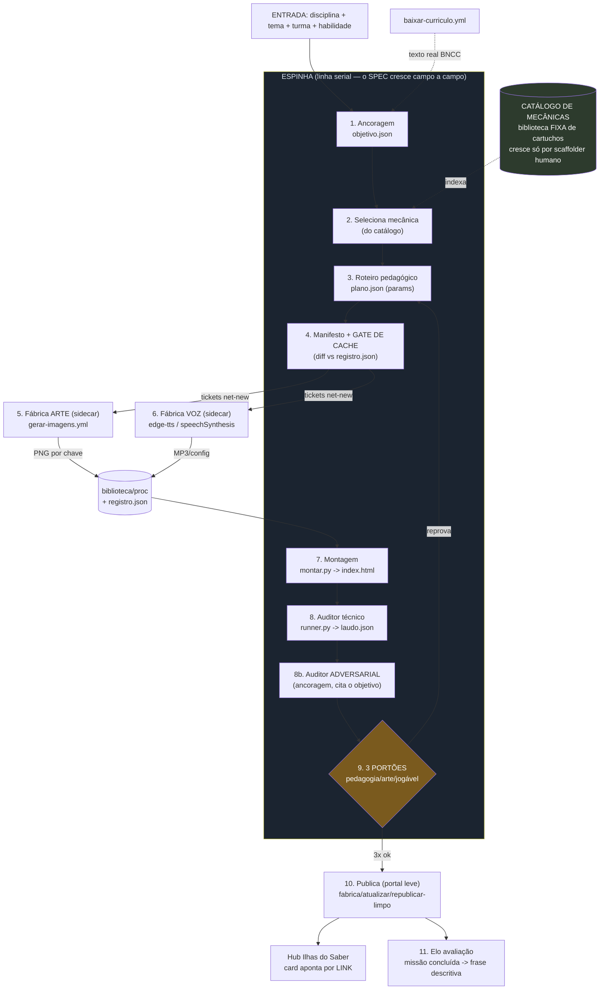

<!-- Gerado pela equipe de arquitetura (workflow eduverse-arquitetura-fabrica, jul/2026):
     6 profissionais em paralelo + arquiteto-chefe. Recomendacao FINAL para o Marcos decidir.
     Pilares inegociaveis do Marcos: (1) 2D tile + arte IA premium = qualidade 'quase real' que
     prende o aluno; (2) adequacao total por turma/idade; (3) rapido, funcional, sustentavel, vivo. -->

# EducaVerso — Arquitetura da Fábrica de Atividades (Recomendação Final)

*Arquiteto-chefe, conciliando as 5 análises. Escrito para o Marcos decidir.*

---

## 1. RESPOSTA DIRETA

**Não é "uma fábrica para cada coisa que entrega junto no fim", nem uma linha única monolítica — é um HÍBRIDO: uma ESPINHA (linha em fases) que conduz o conteúdo, com FÁBRICAS-SIDECAR (os workflows do GitHub) chamadas de lado, como funções puras e cacheadas, e um CATÁLOGO DE MECÂNICAS que é BIBLIOTECA fixa, não gerador.**

As 5 análises (engenharia, jogos, IA, ops, produto) **convergiram todas em "híbrido"** — a divergência foi só no acento de cada uma. Reconcilio assim:

- **Por que NÃO "uma fábrica para cada coisa que junta no fim" (fan-out puro):** juntar no fim exige um *JOIN distribuído* (esperar arte + voz + mundo prontos e casar tudo) e um orquestrador com fila/estado. Este repo **não tem isso** — tem `workflow_dispatch` fire-and-forget e uma pasta de staging única. Fan-out sem barramento = corrida e merge frágil, e **multiplica os pontos onde a cena contradiz o objetivo** (as "costuras 1-5" da `FABRICA-DE-MUNDOS.md`). Além disso, o **portão humano no meio obriga a serializar** de qualquer jeito.
- **Por que NÃO linha única pura:** arte e voz são **geração pesada, lenta, que só roda por workflow (secrets, sem internet no chat) e é REUTILIZÁVEL entre atividades** (o Byte veste o tema; tiles compartilhados). Prendê-las inline na esteira desperdiça paralelismo e **re-cobra a API por sprite que a biblioteca já tem**.
- **Por que o catálogo de mecânicas é BIBLIOTECA, não fábrica** (ponto do especialista de jogos, decisivo): se a IA gerar código de mecânica nova por atividade, quebra a compatibilidade ES5/Unicode-6.0, viola o "não inventar nada fora do modelo" e **cega o auditor** — ele só sabe "dirigir a mecânica" se o conjunto for FIXO e conhecido. Mecânica é **cartucho auditado UMA vez e reusado verbatim**; o catálogo só cresce por ato humano deliberado (um *scaffolder* de baixa frequência), nunca no caminho de produção diária.

**Topologia recomendada, em uma linha:** *espinha serial de conteúdo (um SPEC que cresce campo a campo) + sidecars de I/O idempotentes por hash + catálogo de mecânicas como biblioteca curada + 3 portões humanos + um auditor adversarial antes do humano.*

---

## 2. O DESENHO — fábricas/estágios, conexões e contratos

### 2.1 Os estágios

| # | Estágio | Tipo | Entrada → Saída | O que faz |
|---|---------|------|-----------------|-----------|
| 1 | **Briefing / Ancoragem** | espinha (chama sidecar) | (disciplina + tema + turma + habilidade) → `objetivo.json` | Puxa o **texto REAL** da habilidade via `baixar-curriculo.yml` (BNCC/Blumenau) — nunca de memória. Decompõe em 2-4 **critérios verificáveis** e trava a **adequação por faixa** (pré/1-2 = só ícone+voz+cor; 3-5 = leitura simples; 6-9 = multi-etapa). É a **fonte da verdade** que todo o resto cita. |
| 2 | **Seleção de mecânica** | espinha (cérebro) | `objetivo.json` + catálogo → `mecanica_id` + justificativa | Escolhe do **CATÁLOGO** (biblioteca fixa) a mecânica em que o aluno é **protagonista** (constrói/programa/resolve/monta — descarta "só marcar alternativa"), filtrando por faixa e pelo verbo da habilidade. Se **nenhuma serve, RECUSA** e escala para humano (não improvisa mecânica). |
| 3 | **Roteiro pedagógico** | espinha (cérebro) | `objetivo.json` + `mecanica_id` → `plano.json` (missões/params) | Escreve 5-6 desafios/missões **ancorados no objetivo**, cada um **citando o critério que cumpre** (rastreabilidade). Preenche os **params** da mecânica — aqui mora TODO o conteúdo específico, e **é só DADO**. |
| 4 | **Manifesto de assets + Gate de cache** | espinha → tickets | `plano.json` → `_gerar_imagens.json` + `_lote_falas.json` (só o net-new) | Cada cartucho declara `requerAssets(params)`. **DIFF contra `registro.json`/`_audio`**: o que já existe (Byte+poses, tiles) **não entra no ticket**. É o coração da economia — custo sublinear. |
| 5 | **Fábrica de Arte** (sidecar) | fábrica separada, async | tickets → PNG ~50KB na biblioteca | `gerar-imagens.yml` (Gemini edita a âncora `byte.png` / Pollinations grátis). Idempotente por hash do prompt. **Batcheia** várias atividades num run. Grava na biblioteca, **fora** do histórico do produto. |
| 6 | **Fábrica de Voz** (sidecar) | fábrica separada, async | tickets → config de narração / MP3 leve | **Honestidade:** a voz padrão é `speechSynthesis` no navegador (custo zero, offline, runtime) — **não é fase de build**. `gerar-audio.yml` (edge-tts, grátis) só entra onde precisa de áudio embutido. |
| 7 | **Montagem** | espinha | `dados.json` + assets → `index.html` autossuficiente | `montar.py` injeta os dados no motor `kit-floresta.py`. Self-contained, leve, offline. `iniciarFase` vira `MECANICAS[fase.mecanica].init(fase.params)` — **registro, não if/else** (é a refatoração-chave). |
| 8 | **Auditor automático** | espinha | `index.html` → `laudo.json` | `runner.py`: `node --check`, render headless (Chromium em `/opt/pw-browsers` já instalado), **dirige a mecânica** pela lista `auditaCom[]` do cartucho, colisão, peso <2.5MB, mundo-vivo, som, texto-sem-símbolo. |
| 8b | **Auditor ADVERSARIAL de ancoragem** | espinha (IA-juiz, separado do autor) | `objetivo.json` + `plano.json` + `dados.json` → veredito + citações | O "cético" como agente **permanente**, ANTES do humano. Caça o descasamento que passa no QA técnico: a cena bate com o enunciado? o DIAG condiz com a operação? a faixa está certa? a narração **não** entrega a resposta? **Nunca auto-aprova** — só reprova (volta ao estágio 3) ou libera para o humano, sempre **citando** a linha ofensora. |
| 9 | **3 PORTÕES HUMANOS** | checkpoint (não é workflow) | `laudo.json` + prévia → aprovações em `plano.json` | Marcos aprova **pedagogia → arte → jogável** vendo prova (screenshot + missões + amostra). Só com os 3 = segue. **É a razão de a topologia ser serial.** |
| 10 | **Publicação (portal leve)** | fábrica separada | `index.html` aprovado → link no ar + card no hub | `fabrica.yml` (repo novo) ou `atualizar.yml` (espelha); `republicar-limpo.yml` (1 commit, `.git` mínimo) contra o engasgo do Pages. O hub **só aponta por link**, nunca copia o jogo. |
| 11 | **Elo com a avaliação** | novo | missão concluída → evento → frase descritiva | Cada missão declara qual habilidade prova; ao concluir emite `{aluno, habilidade, provou, quando}` → agrega em **frase descritiva** (MVP: localStorage; depois: backend/painel da turma). |

### 2.2 Os CONTRATOS (o "cimento")

Regra de ouro: **o estado mora em arquivos JSON versionados e commitados no git** — nunca em memória (o chat é stateless entre sessões; os workflows são fire-and-forget). Dois eixos:

**A) MANIFESTO DE ESTADO — `plano.json`** (por atividade): permite RETOMAR de onde parou e saber o que reauditar.
```
{ slug, versao, estagio_atual,
  por_estagio: { nome: { status: pendente|feito|reprovado, hash_inputs, artefato } },
  portoes: { pedagogia, arte, jogavel: pendente|ok|reprovado } }
```

**B) CADEIA DE DADOS** (cada elo com o schema mínimo que o próximo consome):
```
objetivo.json → mecanica_id → plano.json(params) → dados.json → index.html → laudo.json
```
- **`objetivo.json`** `{ codigo, texto_verbatim, fonte, faixa, criterios[] }` — a âncora citável de tudo.
- **Descriptor de mecânica** (entrada do catálogo, a fronteira DADO×CÓDIGO): `{ id, protagonismo:"constroi|programa|resolve|monta", faixas[], interacao[], schema(params), requerAssets(params), init(params,host) /*CÓDIGO auditado 1x*/, auditaCom[] }`.
- **`dados.json`** = os `dados.json` que `montar.py`/`runner.py` **já consomem hoje** (verifiquei: bloco `tema`/`assets`/`mundo`/`falas`/`audit`). Ganha só o campo `mecanica` e `habilidade{codigo,texto,fonte}`.
- **`laudo.json`** = o do `runner.py` **já existe** e já traz `"pedagogia_arco": "PENDENTE_HUMANO"` — literalmente o slot do portão humano. Ganha a dimensão de ancoragem (as citações do auditor adversarial).

**Idempotência e custo:** cada estágio é chaveado pelo **HASH dos inputs** — rodar de novo com mesmo input **pula** (cache). Assets são **content-addressed** (nome = chave estável `tema:tipo`) para não inflar o `.git` e para o `atualizar.yml` (que espelha/limpa) manter o destino leve. **Só se regera o elo que mudou.** O cache não é otimização opcional — é requisito.

### 2.3 Diagrama do fluxo



---

## 3. O que REUSA × o que é NOVO

**REUSA (não reinventar — está provado e auditado NESTE repo):**
- `eduverse/motor/kit-floresta.py` — motor de tile, **mundo vivo** (andar, balões RPG, NPCs, clima, sombra, dia/noite).
- `eduverse/builders/montar.py` — injetor `dados.json → index.html` autossuficiente, já reusa a biblioteca e auto-inclui as poses do Byte.
- `eduverse/audit/runner.py` + `laudo.json` — os portões-robô data-driven; já traz `pedagogia_arco: PENDENTE_HUMANO` (gancho do portão humano pronto).
- `eduverse/biblioteca/proc` + `registro.json` — biblioteca de peças reutilizáveis (semente do cache; Byte `tema:base` reusa entre todas).
- Workflows: `baixar-curriculo.yml` (grounding real), `gerar-imagens.yml`, `gerar-audio.yml`, `atualizar.yml`, `republicar-limpo.yml` (`.git` mínimo — o anti-engasgo do Pages já pronto), `fabrica.yml`, `deploy-pages.yml`, `finalizar.yml` (padrão fan-out por marcador de commit — o esqueleto do serviço de assets).
- **O contrato de qualidade já escrito:** `MANUAL-MESTRE.md` (seção MECÂNICAS DE FASE + as centenas de "lições pagas" — ex.: `ontouchstart` obrigatório nas setas do labirinto, recorte por componente conectado) e `ATIVIDADE-PREMIUM.md` — **viram os checks do auditor**.
- O padrão **"portal leve"** e o Chromium headless de `/opt/pw-browsers` para a auditoria de render.

**NOVO (a construir, nesta ordem de valor):**
1. **Promover as ~20 mecânicas do `MANUAL §12` (hoje prosa) a CARTUCHOS** com descriptor + `schema(params)` + `auditaCom[]`, e trocar o `if/else` do `iniciarFase` por um **registro `MECANICAS[id].init(params,host)`**. *(É a peça mais crítica e ainda inexistente como código plugável — sem ela, "gerar qualquer atividade" é promessa.)*
2. **GATE DE CACHE** (estágio 4): script que faz o diff do SPEC contra `registro.json`/`_audio` e emite só o net-new.
3. **`objetivo.json` + AUDITOR ADVERSARIAL** de ancoragem (estágio 8b) — torna permanente o "cético" que achou as 12 costuras, com contrato de citação.
4. **`plano.json`** (manifesto de estado) para retomada e idempotência.
5. **Elo de avaliação** (evento de conclusão → frase descritiva).
6. **Painel do professor** (o "botão" + os 3 portões visuais de 1 clique).

---

## 4. Os 3 PORTÕES do professor — onde entram

Os 3 portões são a **espinha dorsal da UX** (por isso a topologia é serial, não fan-out) e cada um só abre **depois de a fábrica entregar a PROVA** — o professor aprova/regera, não produz.

1. **Portão PEDAGOGIA** — **depois do estágio 3 (roteiro) e do 8b (auditor adversarial)**, ANTES de gastar arte/voz. Marcos vê as missões + a habilidade **citada literalmente** + a adequação por turma. Barato e cedo: decide a pedagogia primeiro. *(1ª aprovação da `FABRICA-DE-MUNDOS §1`.)*
2. **Portão ARTE** — **depois dos estágios 5/6**. Vê a **folha de cartelas** (montagem/screenshot) e aprova o visual OU marca os ruins → regera **só os reprovados** (lote). Conferência de visão é **humana e obrigatória** (furo 10 do cético: porta fora do lugar põe NPC no meio da rua) — não dá para prometer "arte 100% automática".
3. **Portão JOGÁVEL** — **depois de 7+8**. Abre o mundo montado + o `laudo.json` verde + capturas do QA ("errar de propósito e ver a consequência"). Joga/olha e aprova.

Só com os **3 ok** o estágio 10 publica. Automatizamos a **preparação** do portão (prévia + laudo prontos), **nunca a decisão**.

---

## 5. RISCOS e mitigação

| Risco | Mitigação |
|-------|-----------|
| **Catálogo de 1 mecânica** — hoje a fábrica só gera variações do MESMO jogo com pele nova. É o bloqueio real. | Promover as mecânicas do MANUAL a cartuchos com descriptor + probe de auditor. **É o item #1 do "novo"** e o que a Fase 2 ataca. O MVP é honesto: entrega "atividades da mecânica que temos, ancoradas na habilidade real". |
| **Alucinação pedagógica** — o mundo passa no QA técnico e mesmo assim contradiz o objetivo (as costuras já vividas). | `objetivo.json` com **texto verbatim** do currículo + **auditor adversarial** que cita a linha ofensora e **nunca auto-aprova** + invariantes checados em código (op dos desafios == pilar do DIAG) + portão de pedagogia **inegociável**. |
| **Custo de API / cota de workflow** — regerar tudo a cada ajuste queima crédito. | **Gate de cache** (diff contra `registro.json`) + assets content-addressed + **batch** de várias atividades por run (amortiza o spin-up de ~1-2 min). Voz padrão = `speechSynthesis` (R$0). Custo por atividade **cai** conforme a biblioteca cresce. |
| **Pages engasga com `.git` inchado** — dor já registrada (`.git` desta oficina já em 455MB). | Assets **nunca** entram no histórico do produto — moram na biblioteca e só viram base64 na montagem. Publicar sempre via `republicar-limpo.yml` (1 commit, `.git` mínimo). Portal leve: atividade no próprio repo, hub só linka. |
| **Estado perdido entre sessões** — chat stateless + workflows fire-and-forget. | Tudo em `plano.json` commitado. Sem isso não há retomada nem idempotência = retrabalho. |
| **Auditor "cego" a mecânica nova** — cada cartucho precisa do seu probe. | Regra: **mecânica nova nasce com seu `auditaCom[]`** (o QA mora junto do cartucho, como as costuras moram no motor: conserta 1x, vale para todas). Catálogo só cresce por scaffolder humano-gated. |
| **Cache "sujo"** — reusar a peça errada (o furo do "1º feliz" já documentado). | Chave de reuso **ancorada** (`tema:tipo`), estável, e conferida no portão de arte. |
| **Avaliação presa num device** — sem backend, a frase descritiva fica no localStorage. | MVP: localStorage + frase visível (prova o elo). Fase posterior: backend + painel da turma (sinalizado na MEMORIA). Ser honesto com o Marcos sobre isso. |

---

## 6. PLANO EM FASES + PRIMEIRO PASSO (MVP)

### FASE 0 — Provar a ESPINHA de ponta a ponta com a mecânica que já temos *(o MVP)*

**Objetivo:** girar a fábrica inteira uma vez, com a **única mecânica existente ("andar e pegar a chave")** e **UMA turma**, a partir de um **triple real** — a fatia mais fina que toca cada estágio uma vez. Reusa 100% do que já está provado (`montar.py`/`runner.py`/`kit-floresta.py` **estão aqui**, não precisamos hackear o index premium como template).

**Passo a passo concreto do MVP:**
1. Escolher **1 habilidade BNCC/Blumenau real** de 1º/2º ano que "andar e pegar a chave" já prova, e puxá-la com `baixar-curriculo.yml` → produzir `objetivo.json`.
2. Um **agente-autor** rascunha `plano.json` com 5-6 missões calibradas (não-leitor: ícone+voz+cor), **cada missão citando um critério** do objetivo.
3. **Teste de aceite anti-alucinação:** plantar de propósito o **furo 1** — descrever "3 grupos de 5" e montar a cena como "5 grupos de 3" — e confirmar que o **auditor adversarial REPROVA com citação**. Se ele pega o descasamento que passou no QA técnico, **a fábrica ganhou seu portão anti-alucinação**.
4. Rodar o **gate de cache** → tickets net-new → `gerar-imagens.yml` (Byte veste o tema) num lote; voz = `speechSynthesis`.
5. `montar.py` → `dados.json → index.html`; `runner.py` → `laudo.json` (Chromium headless).
6. Apresentar os **3 portões** ao Marcos num HTML leve de 1 clique (formulário → plano → "aprovar pedagogia" → cartelas → "aprovar arte" → laudo/capturas → "aprovar jogável").
7. Aprovado, publicar via `fabrica.yml`/`atualizar.yml` + `republicar-limpo.yml`; inserir o card no hub por link.
8. Fechar o **elo mínimo de avaliação**: missão concluída → 1 evento (localStorage) → 1 frase descritiva visível.

**Prova de sucesso (métricas, não "vibe"):** o run cobra Gemini **só** pelos sprites net-new (Byte+poses+tiles vêm da biblioteca, zero chamada); voz = R$0; repo publicado nasce com `.git` de 1 commit; `laudo.json` verde; e o auditor adversarial reprova o furo plantado. Entregável = `plano.json` + o encadeamento rodando com 1 comando por estágio.

### FASE 1 — Provar a FRONTEIRA dado×código (1 mecânica, 2 atividades)

Refatorar **1 mecânica já provada** (`cesta_add`) para `init(params, host)`: criar o registro `MECANICAS={cesta_add:{descriptor…}}`, trocar o `if/else` do `iniciarFase`, declarar `schema(params)` + `requerAssets()`, e **gerar DUAS atividades diferentes mexendo SÓ no `dados.json`** (ex.: "soma na feira, 1º ano" e "soma de conchas, 2º ano") — **mesmo binário de motor, params diferentes**. Se as duas jogam e passam sem editar o motor, a **fábrica de mecânica está provada**. Zerar todo global de conteúdo (`ANIMAIS`, `IMG`, `MASC_FALA`) para que uma atividade não vaze conteúdo de outra.

### FASE 2 — Crescer o CATÁLOGO (a escala de verdade)

Adicionar cartuchos **um a um**, cada um cobrindo um protagonismo e nascendo com seu probe de auditor. Sugestão de ordem para cobrir pré..5º ano e os 3 protagonismos: **`sequencia`** (monta/ordena) → **`labirinto`** (resolve/navega, com `ontouchstart` obrigatório) → **`programe o robô`** (`ATIVIDADE-COMPUTACAO.md`, clicar nunca arrastar). A partir daí, a esteira e a UX ficam **idênticas** — escalar é só **adicionar mecânica ao catálogo**, nunca mudar a fábrica.

### FASE 3 — Backend de avaliação

Trocar o localStorage por persistência + painel central da turma (frase descritiva acumulável por mês/semestre). É o que transforma "resultado alimenta a avaliação" de promessa em ferramenta que o Marcos usa na sala.

---

### Em uma frase para o Marcos

**Não faça uma fábrica para cada coisa que junta no fim — faça uma esteira única de conteúdo com os seus workflows atuais servindo de lado (arte/voz/publicação) e as mecânicas guardadas como peças fixas de um catálogo.** É o desenho que respeita o que você já tem provado (`montar.py`, `runner.py`, o motor vivo, o portal leve), mantém o custo caindo e o Pages leve, e cabe numa escola pública. O primeiro passo cabe em uma semana e prova a fábrica inteira **com a mecânica que já roda** — inclusive o portão que impede a IA de ensinar a coisa errada.