# 👀 VER RODANDO — atividades de referência jogadas por um Chromium (2026-09-21)

> Gerado por `_padrao/ver_rodando.js` no GitHub Actions (`ver-rodando.yml`). Fotos: PC 1024×600 antes / clique / arrastando / soltou; celular 412×820. **Matéria-prima, não regra.**

| alvo | frames | alvos tocáveis | arrasto (n) | eventos que os alvos escutam | touch-action dos arrastáveis | alvo mín. | fonte mín. | animados | som (media/webaudio) | arrasto deslocou | mutações após soltar | draggable= | canvas/svg |
|---|--:|--:|--:|---|---|--:|--:|--:|---|--:|--:|--:|---|
| **logiclike-home-ptbr** | 2 | 4 | 0 |  |  | 30 | 14 | 3 | 1/0 | — | 0 (clique) | 0 | 0/9 |
| **logiclike-logica** | 1 | 3 | 0 |  |  | 30 | 14 | 3 | 0/0 | — | 0 (clique) | 0 | 0/8 |
| **logiclike-cursos** | 1 | 3 | 0 |  |  | 30 | 14 | 6 | 0/0 | — | 0 (clique) | 0 | 0/8 |
| **logiclike-matematica** | 1 | 3 | 0 |  |  | 30 | 14 | 6 | 0/0 | — | 0 (clique) | 0 | 0/8 |
| **logiclike-xadrez** | 1 | 3 | 0 |  |  | 30 | 14 | 6 | 0/0 | — | 0 (clique) | 0 | 0/8 |
| **logiclike-5-anos** | 1 | 3 | 0 |  |  | 30 | 14 | 6 | 0/0 | — | 0 (clique) | 0 | 0/8 |
| **logiclike-6-anos** | 1 | 3 | 0 |  |  | 30 | 14 | 3 | 0/0 | — | 0 (clique) | 0 | 0/8 |
| **logiclike-labirintos** | 1 | 3 | 0 |  |  | 30 | 14 | 6 | 0/0 | — | 0 (clique) | 0 | 0/8 |
| **logiclike-enigmas** | 1 | 15 | 0 |  |  | 18 | 16 | 9 | 0/0 | — | 0 (clique) | 0 | 0/0 |
| **logiclike-home-en** | 1 | 10 | 1 | touchstart:1 pointerdown:1 click:1 | pan-y:1 | 19 | 14 | 7 | 1/0 | — | 0 (clique) | 0 | 0/9 |
| **logiclike-en-logic** | 1 | 3 | 0 |  |  | 30 | 14 | 6 | 0/0 | — | 0 (clique) | 0 | 0/8 |
| **logiclike-en-math** | 1 | 3 | 0 |  |  | 30 | 14 | 3 | 0/0 | — | 0 (clique) | 0 | 0/8 |
| **logiclike-amostra-jogavel** | 2 | 4 | 0 |  |  | 30 | 14 | 3 | 1/0 | — | 0 (clique) | 0 | 0/9 |
| **logiclike-amostra-jogavel-2** | 2 | 10 | 1 | touchstart:1 pointerdown:1 click:1 | pan-y:1 | 19 | 14 | 7 | 1/0 | — | 0 (clique) | 0 | 0/10 |
| **logiclike-opiniao** | 2 | 2 | 0 |  |  | 18 | 12 | 0 | 0/0 | — | 2 (clique) | 0 | 0/0 |
| **logiclike-opiniao-2** | 2 | 8 | 0 | mouseover:1 mouseout:1 |  | 38 | 15 | 3 | 0/0 | — | 0 (clique) | 0 | 0/58 |

## Fotos e detalhes por alvo

### logiclike-home-ptbr

`https://logiclike.com/pt-br` — LogicLike — desenvolva a lógica e o raciocínio com jogos educativos online!

(fechei um aviso: "Ok")

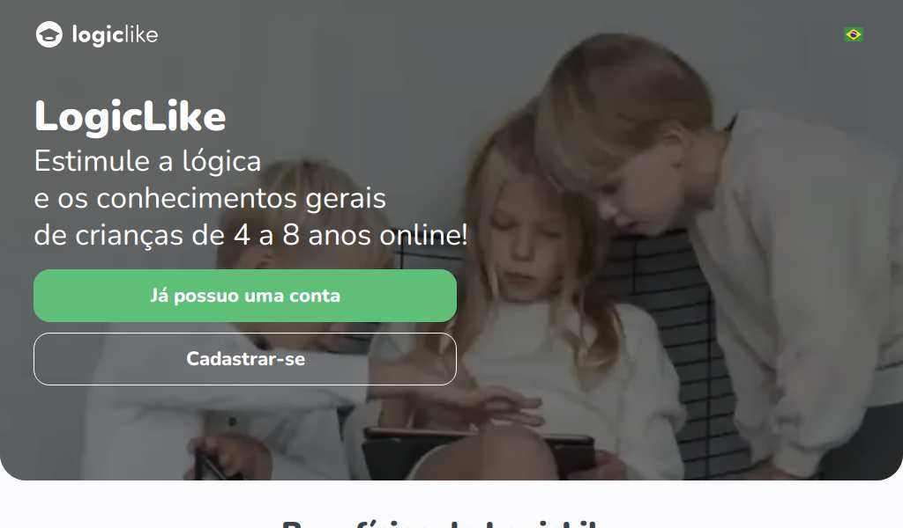   

Tocáveis (amostra):

- `a._logoWrapper_1kv1b_10` 144×30 · "" · eventos: —
- `div.` 36×42 · "" · eventos: —
- `a._size-54-xs_1t1re_168._size-60-sm_1t1re_367._size-60-md_1t1re_549` 480×60 · "Já possuo uma conta" · eventos: —
- `a._size-54-xs_1t1re_168._size-60-sm_1t1re_367._size-60-md_1t1re_549` 480×60 · "Cadastrar-se" · eventos: —

Clique: 0 mutações no 1º s · som media/webaudio 0/0
Escutas no document/window: click:22 pagehide:19 visibilitychange:16 message:12 touchmove:11 mousedown:11 scroll:10 mousemove:10 keydown:10 blur:8

---

### logiclike-logica

`https://logiclike.com/pt-br/logika`

   

Tocáveis (amostra):

- `a._logoWrapper_1kv1b_10` 144×30 · "" · eventos: —
- `a._size-54-xs_1t1re_168._size-60-sm_1t1re_367._size-60-md_1t1re_549` 480×60 · "Ya tengo una cuenta" · eventos: —
- `a._size-54-xs_1t1re_168._size-60-sm_1t1re_367._size-60-md_1t1re_549` 480×60 · "Registrarse" · eventos: —

Clique: 0 mutações no 1º s · som media/webaudio 0/0
Escutas no document/window: click:2 pagehide:1 visibilitychange:1 message:1 popstate:1 pageshow:1

---

### logiclike-cursos

`https://logiclike.com/pt-br/kurs`

   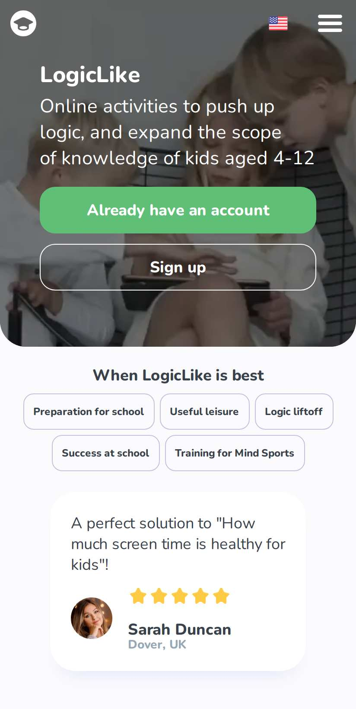

Tocáveis (amostra):

- `a._logoWrapper_1kv1b_10` 144×30 · "" · eventos: —
- `a._size-54-xs_1t1re_168._size-60-sm_1t1re_367._size-60-md_1t1re_549` 480×60 · "Already have an account" · eventos: —
- `a._size-54-xs_1t1re_168._size-60-sm_1t1re_367._size-60-md_1t1re_549` 480×60 · "Sign up" · eventos: —

Clique: 0 mutações no 1º s · som media/webaudio 0/0
Escutas no document/window: pagehide:14 click:14 message:13 scroll:7 visibilitychange:6 pageshow:6 focus:6 blur:6 mousemove:6 touchmove:6

---

### logiclike-matematica

`https://logiclike.com/pt-br/matematika`

   

Tocáveis (amostra):

- `a._logoWrapper_1kv1b_10` 144×30 · "" · eventos: —
- `a._size-54-xs_1t1re_168._size-60-sm_1t1re_367._size-60-md_1t1re_549` 480×60 · "Already have an account" · eventos: —
- `a._size-54-xs_1t1re_168._size-60-sm_1t1re_367._size-60-md_1t1re_549` 480×60 · "Sign up" · eventos: —

Clique: 0 mutações no 1º s · som media/webaudio 0/0
Escutas no document/window: click:13 pagehide:11 message:9 focus:6 blur:6 visibilitychange:5 load:5 mousemove:5 scroll:5 touchmove:5

---

### logiclike-xadrez

`https://logiclike.com/pt-br/shahmaty`

   

Tocáveis (amostra):

- `a._logoWrapper_1kv1b_10` 144×30 · "" · eventos: —
- `a._size-54-xs_1t1re_168._size-60-sm_1t1re_367._size-60-md_1t1re_549` 480×60 · "Вже є акаунт" · eventos: —
- `a._size-54-xs_1t1re_168._size-60-sm_1t1re_367._size-60-md_1t1re_549` 480×60 · "Реєстрація" · eventos: —

Clique: 0 mutações no 1º s · som media/webaudio 0/0
Escutas no document/window: pagehide:14 click:14 message:11 scroll:7 visibilitychange:6 pageshow:6 focus:6 blur:6 mousemove:6 touchmove:6

---

### logiclike-5-anos

`https://logiclike.com/pt-br/deti-5-let`

   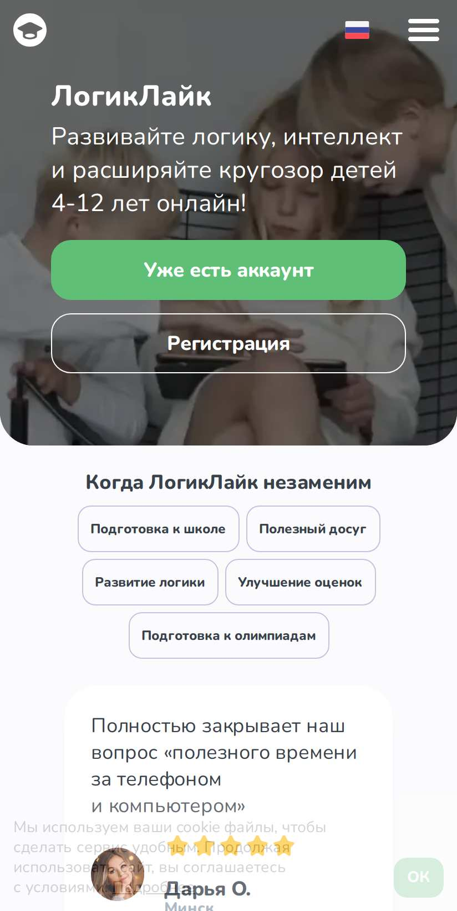

Tocáveis (amostra):

- `a._logoWrapper_1kv1b_10` 144×30 · "" · eventos: —
- `a._size-54-xs_1t1re_168._size-60-sm_1t1re_367._size-60-md_1t1re_549` 480×60 · "Already have an account" · eventos: —
- `a._size-54-xs_1t1re_168._size-60-sm_1t1re_367._size-60-md_1t1re_549` 480×60 · "Sign up" · eventos: —

Clique: 0 mutações no 1º s · som media/webaudio 0/0
Escutas no document/window: pagehide:14 click:14 message:11 scroll:7 visibilitychange:6 pageshow:6 focus:6 blur:6 mousemove:6 touchmove:6

---

### logiclike-6-anos

`https://logiclike.com/pt-br/deti-6-let`

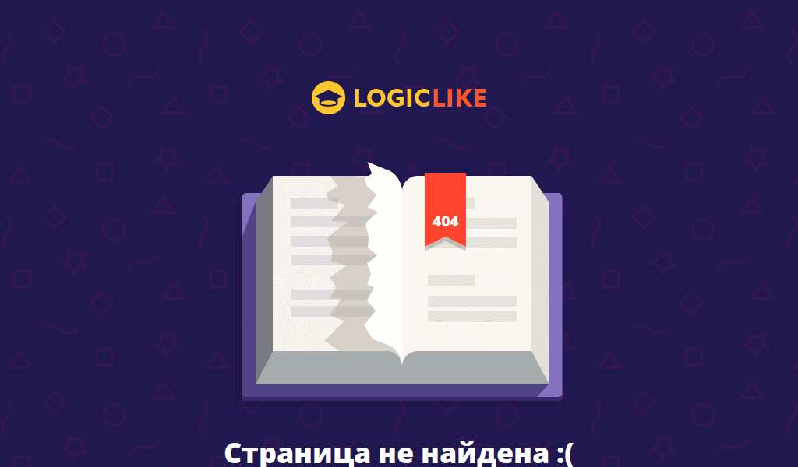   

Tocáveis (amostra):

- `a._logoWrapper_1kv1b_10` 144×30 · "" · eventos: —
- `a._size-54-xs_1t1re_168._size-60-sm_1t1re_367._size-60-md_1t1re_549` 480×60 · "Mam już konto" · eventos: —
- `a._size-54-xs_1t1re_168._size-60-sm_1t1re_367._size-60-md_1t1re_549` 480×60 · "Rejestracja" · eventos: —

Clique: 0 mutações no 1º s · som media/webaudio 0/0
Escutas no document/window: pagehide:14 click:14 message:11 scroll:7 visibilitychange:6 pageshow:6 focus:6 blur:6 mousemove:6 touchmove:6

---

### logiclike-labirintos

`https://logiclike.com/pt-br/labirinty`

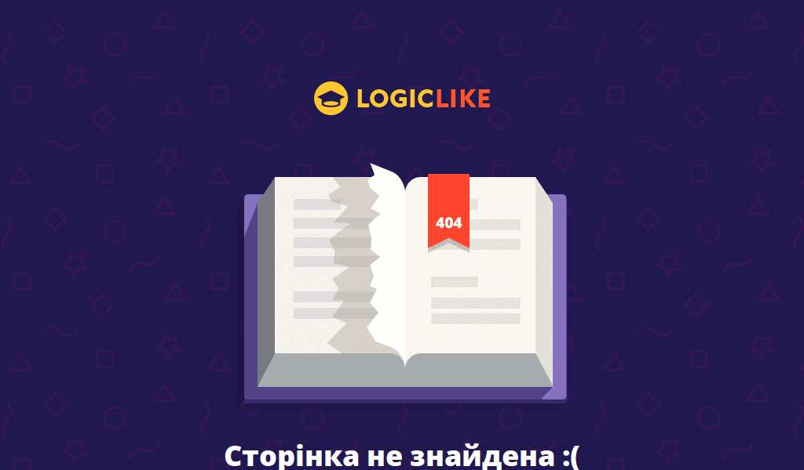  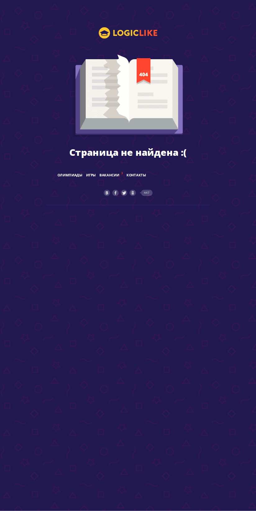 

Tocáveis (amostra):

- `a._logoWrapper_1kv1b_10` 144×30 · "" · eventos: —
- `a._size-54-xs_1t1re_168._size-60-sm_1t1re_367._size-60-md_1t1re_549` 480×60 · "Вже є акаунт" · eventos: —
- `a._size-54-xs_1t1re_168._size-60-sm_1t1re_367._size-60-md_1t1re_549` 480×60 · "Реєстрація" · eventos: —

Clique: 0 mutações no 1º s · som media/webaudio 0/0
Escutas no document/window: pagehide:14 click:14 message:12 scroll:7 visibilitychange:6 pageshow:6 focus:6 blur:6 mousemove:6 touchmove:6

---

### logiclike-enigmas

`https://logiclike.com/pt-br/zagadki` — Загадки для детей с ответами

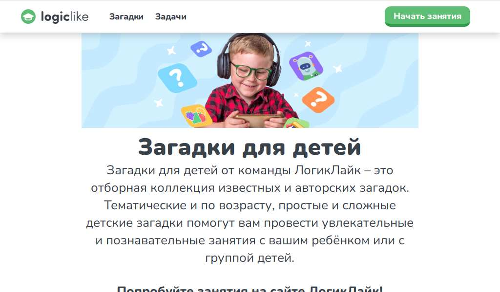 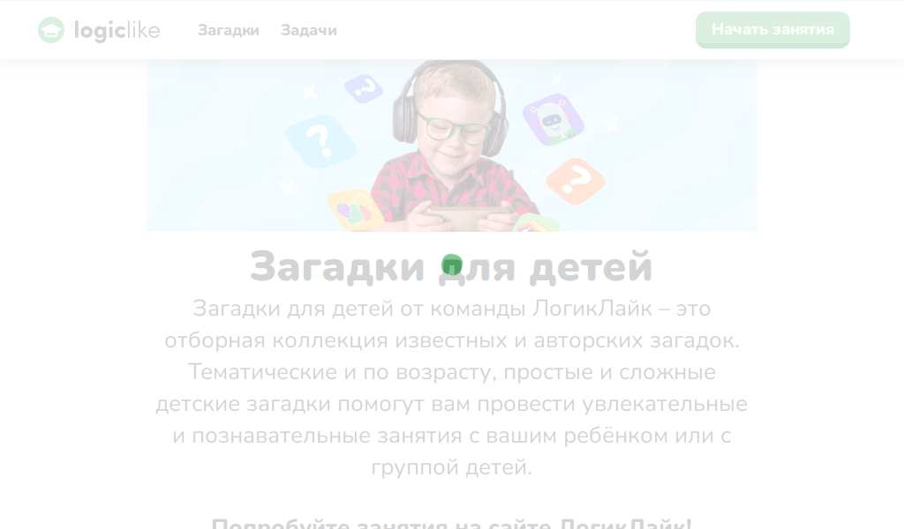 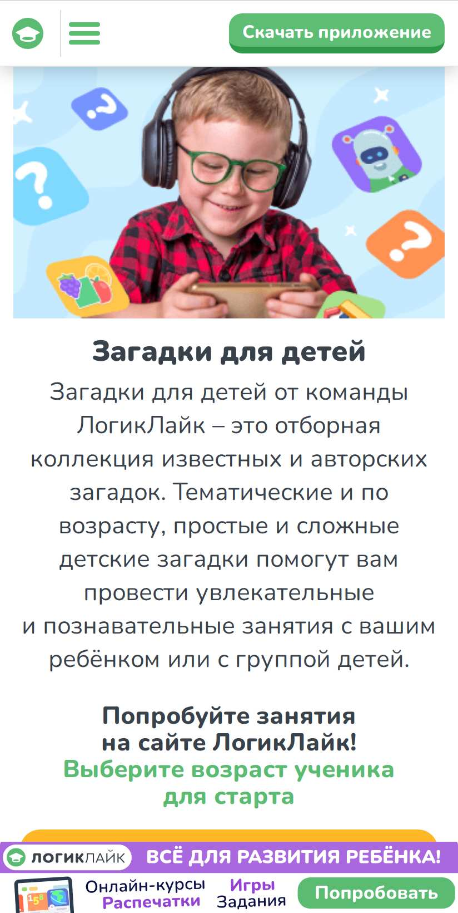 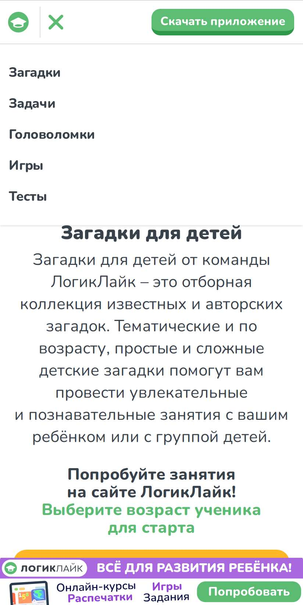

Tocáveis (amostra):

- `a.l-header__main__menu-text` 70×18 · "Загадки" · eventos: —
- `a.l-header__main__menu-text` 63×18 · "Задачи" · eventos: —
- `a.c-btn.c-btn--primary.c-btn--regular` 175×42 · "Начать занятия" · eventos: —
- `a.c-btn.c-btn--primary.c-btn--medium` 220×60 · "3-5 лет" · eventos: —
- `a.c-btn.c-btn--primary.c-btn--medium` 220×60 · "6-7 лет" · eventos: —

Clique: 0 mutações no 1º s · som media/webaudio 0/0
Escutas no document/window: click:11 pagehide:8 message:8 load:6 visibilitychange:5 DOMContentLoaded:4 popstate:4 scroll:4 test:3 blur:3

---

### logiclike-home-en

`https://logiclike.com/en` — LogicLike — Online educational game & brain booster!

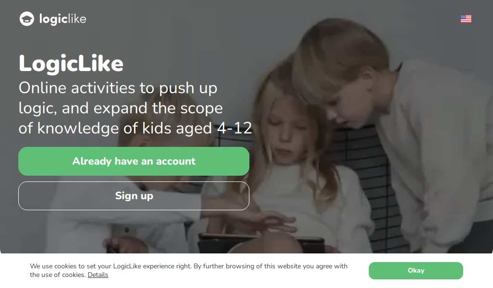   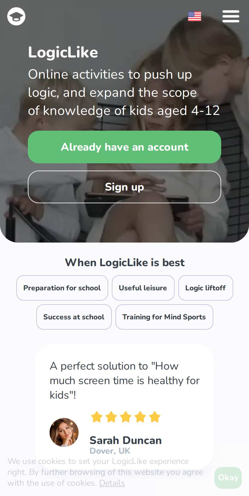

Arrastáveis (amostra):

- `div.swiper.swiper-initialized.swiper-horizontal` 924×948 · eventos: touchstart pointerdown click load · touch-action: pan-y · cursor: auto · transição: 0s

Tocáveis (amostra):

- `a._logoWrapper_1kv1b_10` 144×30 · "" · eventos: —
- `div.` 36×42 · "" · eventos: —
- `a._size-54-xs_1t1re_168._size-60-sm_1t1re_367._size-60-md_1t1re_549` 480×60 · "Already have an account" · eventos: —
- `a._size-54-xs_1t1re_168._size-60-sm_1t1re_367._size-60-md_1t1re_549` 480×60 · "Sign up" · eventos: —
- `div.swiper.swiper-initialized.swiper-horizontal` 924×948 · "Choice of YearLogic & MathBrainteasers f" · eventos: touchstart pointerdown click load

Clique: 0 mutações no 1º s · som media/webaudio 0/0
Escutas no document/window: click:22 pagehide:19 visibilitychange:16 touchmove:13 message:13 mousedown:11 scroll:10 mousemove:10 keydown:10 touchstart:9

---

### logiclike-en-logic

`https://logiclike.com/en/logic`

   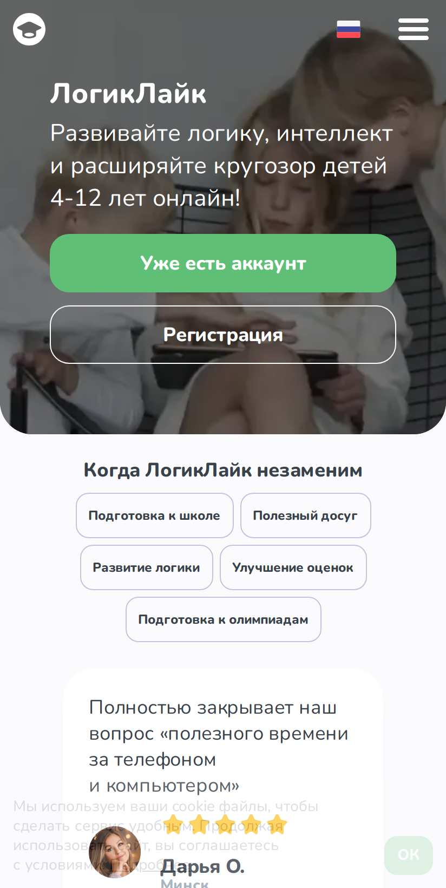

Tocáveis (amostra):

- `a._logoWrapper_1kv1b_10` 144×30 · "" · eventos: —
- `a._size-54-xs_1t1re_168._size-60-sm_1t1re_367._size-60-md_1t1re_549` 480×60 · "Already have an account" · eventos: —
- `a._size-54-xs_1t1re_168._size-60-sm_1t1re_367._size-60-md_1t1re_549` 480×60 · "Sign up" · eventos: —

Clique: 0 mutações no 1º s · som media/webaudio 0/0
Escutas no document/window: click:13 pagehide:11 message:9 focus:6 blur:6 visibilitychange:5 load:5 mousemove:5 scroll:5 touchmove:5

---

### logiclike-en-math

`https://logiclike.com/en/math`

   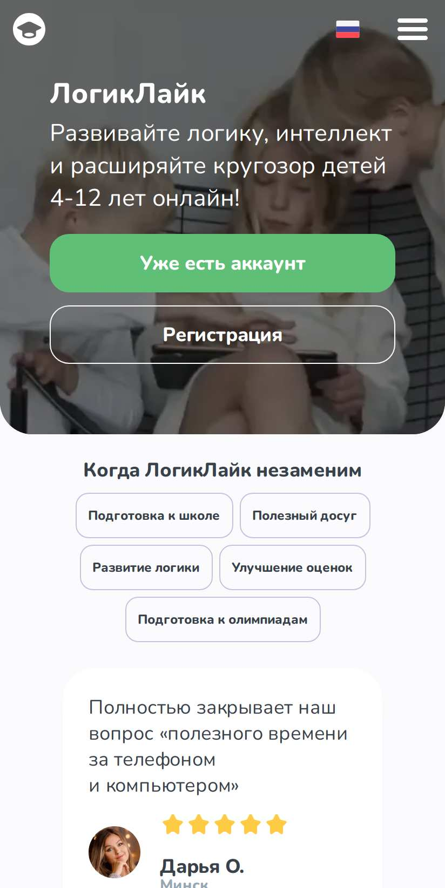

Tocáveis (amostra):

- `a._logoWrapper_1kv1b_10` 144×30 · "" · eventos: —
- `a._size-54-xs_1t1re_168._size-60-sm_1t1re_367._size-60-md_1t1re_549` 480×60 · "Ya tengo una cuenta" · eventos: —
- `a._size-54-xs_1t1re_168._size-60-sm_1t1re_367._size-60-md_1t1re_549` 480×60 · "Registrarse" · eventos: —

Clique: 0 mutações no 1º s · som media/webaudio 0/0
Escutas no document/window: pagehide:14 click:14 message:11 scroll:7 visibilitychange:6 pageshow:6 focus:6 blur:6 mousemove:6 touchmove:6

---

### logiclike-amostra-jogavel

`https://logiclike.com/pt-br` — LogicLike — desenvolva a lógica e o raciocínio com jogos educativos online!

(fechei um aviso: "Ok")

 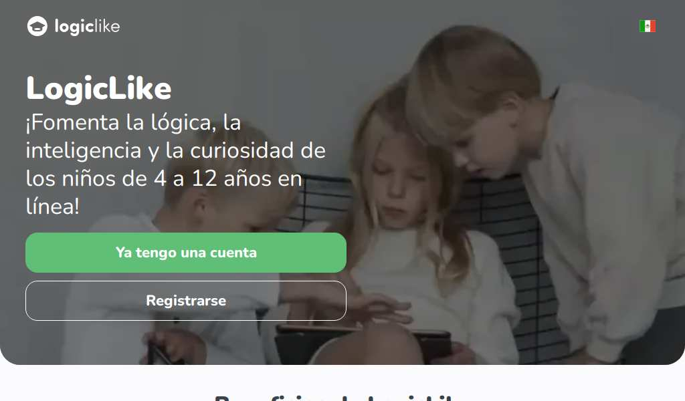 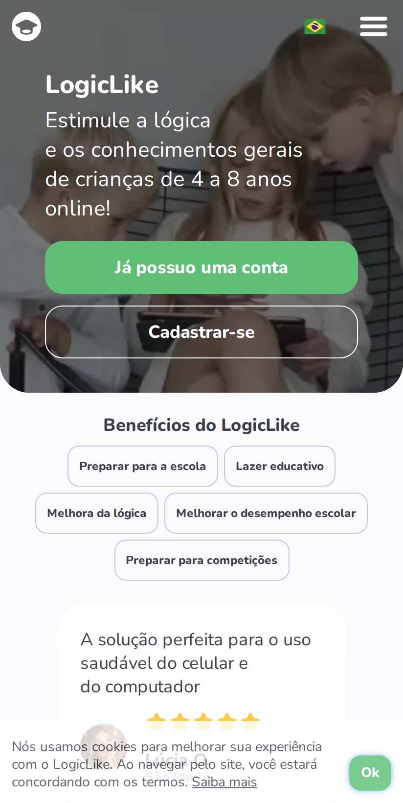 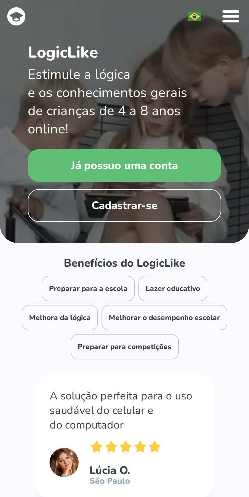

Tocáveis (amostra):

- `a._logoWrapper_1kv1b_10` 144×30 · "" · eventos: —
- `div.` 36×42 · "" · eventos: —
- `a._size-54-xs_1t1re_168._size-60-sm_1t1re_367._size-60-md_1t1re_549` 480×60 · "Já possuo uma conta" · eventos: —
- `a._size-54-xs_1t1re_168._size-60-sm_1t1re_367._size-60-md_1t1re_549` 480×60 · "Cadastrar-se" · eventos: —

Clique: 0 mutações no 1º s · som media/webaudio 0/0
Escutas no document/window: click:22 pagehide:19 visibilitychange:16 message:12 touchmove:11 mousedown:11 scroll:10 mousemove:10 keydown:10 blur:8

---

### logiclike-amostra-jogavel-2

`https://logiclike.com/en` — LogicLike — Online educational game & brain booster!

 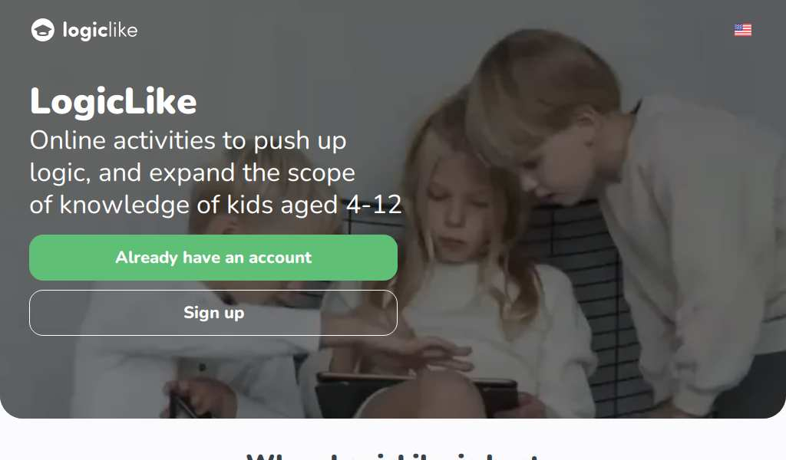 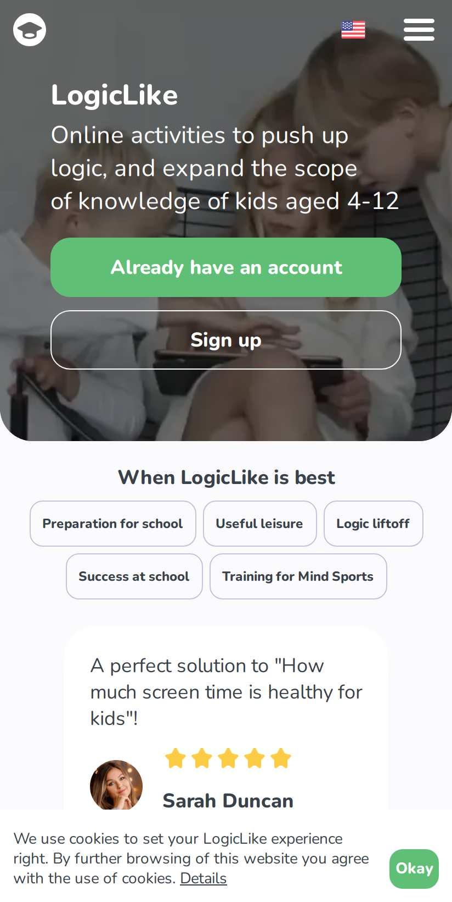 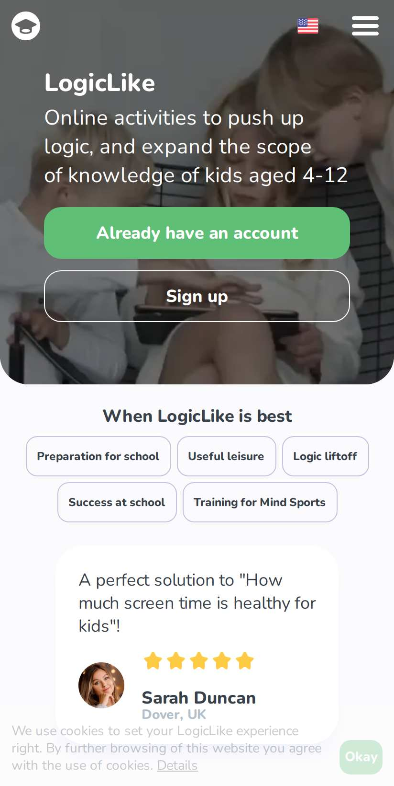

Arrastáveis (amostra):

- `div.swiper.swiper-initialized.swiper-horizontal` 924×948 · eventos: touchstart pointerdown click load · touch-action: pan-y · cursor: auto · transição: 0s

Tocáveis (amostra):

- `a._logoWrapper_1kv1b_10` 144×30 · "" · eventos: —
- `div.` 36×42 · "" · eventos: —
- `a._size-54-xs_1t1re_168._size-60-sm_1t1re_367._size-60-md_1t1re_549` 480×60 · "Already have an account" · eventos: —
- `a._size-54-xs_1t1re_168._size-60-sm_1t1re_367._size-60-md_1t1re_549` 480×60 · "Sign up" · eventos: —
- `div.swiper.swiper-initialized.swiper-horizontal` 924×948 · "Choice of YearLogic & MathBrainteasers f" · eventos: touchstart pointerdown click load

Clique: 0 mutações no 1º s · som media/webaudio 0/0
Escutas no document/window: click:22 pagehide:19 visibilitychange:16 touchmove:13 message:12 mousedown:11 scroll:10 mousemove:10 keydown:10 touchcancel:9

---

### logiclike-opiniao

`https://appshunter.io/ios/app/logiclike-kids-learning-games/id1565113819/reviews` — Um momento…

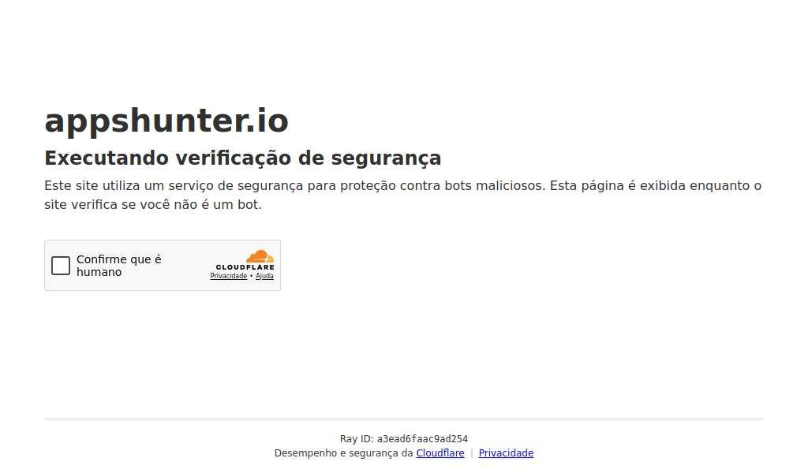  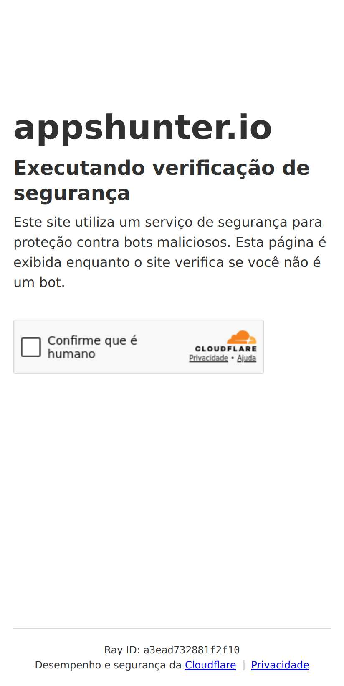 

Tocáveis (amostra):

- `a.` 61×18 · "Cloudflare" · eventos: — · aria-label
- `a.footer-text` 70×18 · "Privacidade" · eventos: — · aria-label

Clique: 2 mutações no 1º s · som media/webaudio 0/0
Escutas no document/window: error:5 touchstart:4 mousemove:4 click:4 message:4 unhandledrejection:3 keydown:2 pointermove:2 pointerover:2 wheel:2

---

### logiclike-opiniao-2

`https://justuseapp.com/en/app/1565113819/logiclike-kids-learning-games/reviews` — LogicLike Reviews (2026) | Check if app is safe or legit

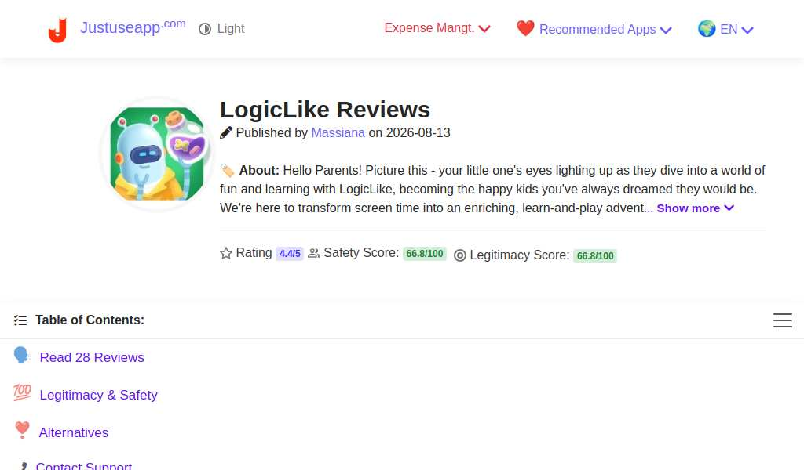  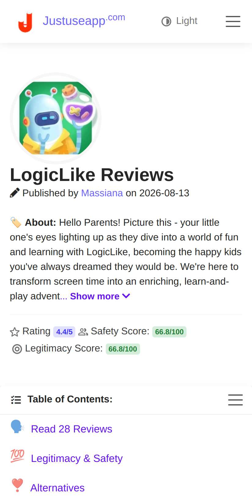 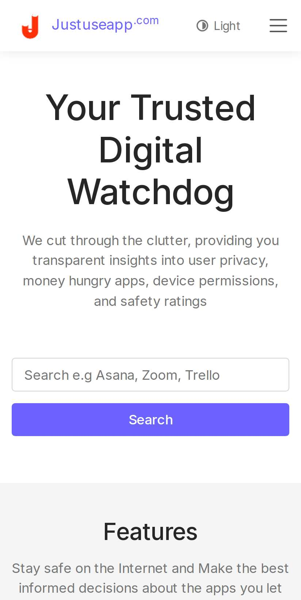

Tocáveis (amostra):

- `a.navbar-brand.p-0` 201×38 · "Justuseapp.com" · eventos: — · aria-label
- `a.text-danger.nav-link` 177×40 · "Expense Mangt." · eventos: —
- `a.text-danger.nav-link` 162×40 · "Business apps" · eventos: —
- `a.text-primary.nav-link` 132×40 · "Consumer" · eventos: —
- `a.text-primary.nav-link` 76×40 · "EN" · eventos: —

Clique: 0 mutações no 1º s · som media/webaudio 0/0
Escutas no document/window: message:12 pageshow:11 click:11 pagehide:9 load:8 visibilitychange:8 blur:7 focus:7 keydown:6 mousemove:5

---
