# 👀 VER RODANDO — atividades de referência jogadas por um Chromium (2026-09-05)

> Gerado por `_padrao/ver_rodando.js` no GitHub Actions (`ver-rodando.yml`). Fotos: PC 1024×600 antes / clique / arrastando / soltou; celular 412×820. **Matéria-prima, não regra.**

| alvo | frames | alvos tocáveis | arrasto (n) | eventos que os alvos escutam | touch-action dos arrastáveis | alvo mín. | fonte mín. | animados | som (media/webaudio) | arrasto deslocou | mutações após soltar | draggable= | canvas/svg |
|---|--:|--:|--:|---|---|--:|--:|--:|---|--:|--:|--:|---|
| **h5p-arrastar-soltar** | 3 | 26 | 1 | click:8 keydown:7 keyup:1 mousedown:1 | auto:1 | 26 | 13 | 18 | 0/0 | 0px | 16 | 0 | 0/0 |
| **h5p-memoria** | 2 | 26 | 1 | click:8 keydown:7 keyup:1 mousedown:1 | auto:1 | 26 | 13 | 18 | 0/0 | 0px | 16 | 0 | 0/0 |
| **h5p-caca-palavras** | 3 | 26 | 1 | click:8 keydown:7 keyup:1 mousedown:1 | auto:1 | 26 | 13 | 18 | 0/0 | 0px | 16 | 0 | 0/0 |
| **h5p-cruzadinha** | 1 | 26 | 1 | click:8 keydown:7 keyup:1 mousedown:1 | auto:1 | 26 | 13 | 18 | 0/0 | 0px | 16 | 0 | 0/0 |
| **h5p-arrastar-palavras** | 3 | 26 | 1 | click:8 keydown:7 keyup:1 mousedown:1 | auto:1 | 26 | 13 | 18 | 0/0 | 0px | 16 | 0 | 0/0 |
| **h5p-lacunas** | 3 | 26 | 1 | click:8 keydown:7 keyup:1 mousedown:1 | auto:1 | 26 | 13 | 18 | 0/0 | 0px | 16 | 0 | 0/0 |
| **h5p-sequencia-imagens** | 1 | 26 | 1 | click:8 keydown:7 keyup:1 mousedown:1 | auto:1 | 26 | 13 | 18 | 0/0 | 0px | 16 | 0 | 0/0 |
| **h5p-ordenar-paragrafos** | 1 | 26 | 1 | click:8 keydown:7 keyup:1 mousedown:1 | auto:1 | 26 | 13 | 18 | 0/0 | 0px | 16 | 0 | 0/0 |
| **h5p-pares-imagem** | 3 | 26 | 1 | click:8 keydown:7 keyup:1 mousedown:1 | auto:1 | 26 | 13 | 18 | 0/0 | 0px | 16 | 0 | 0/0 |
| **h5p-marcar-palavras** | 3 | 26 | 1 | click:8 keydown:7 keyup:1 mousedown:1 | auto:1 | 26 | 13 | 18 | 0/0 | 0px | 16 | 0 | 0/0 |
| **h5p-pontos-na-imagem** | 3 | 26 | 1 | click:8 keydown:7 keyup:1 mousedown:1 | auto:1 | 26 | 13 | 18 | 0/0 | 0px | 16 | 0 | 0/0 |
| **h5p-achar-na-imagem** | 1 | 26 | 1 | click:8 keydown:7 keyup:1 mousedown:1 | auto:1 | 26 | 13 | 18 | 0/0 | 0px | 16 | 0 | 0/0 |
| **h5p-ditado** | 3 | 26 | 1 | click:8 keydown:7 keyup:1 mousedown:1 | auto:1 | 26 | 13 | 18 | 0/0 | 0px | 16 | 0 | 0/0 |
| **h5p-quiz** | 3 | 26 | 1 | click:8 keydown:7 keyup:1 mousedown:1 | auto:1 | 26 | 13 | 18 | 0/0 | 0px | 16 | 0 | 0/0 |
| **h5p-verdadeiro-falso** | 3 | 26 | 1 | click:8 keydown:7 keyup:1 mousedown:1 | auto:1 | 26 | 13 | 18 | 0/0 | 0px | 16 | 0 | 0/0 |
| **h5p-linha-do-tempo** | 3 | 26 | 1 | click:8 keydown:7 keyup:1 mousedown:1 | auto:1 | 26 | 13 | 18 | 0/0 | 0px | 16 | 0 | 0/0 |
| **h5p-flashcards** | 3 | 26 | 1 | click:8 keydown:7 keyup:1 mousedown:1 | auto:1 | 26 | 13 | 18 | 0/0 | 0px | 16 | 0 | 0/0 |
| **phet-balanca** | 1 | 0 | 0 |  |  | — | 10 | 0 | 0/28 | — | — | 0 | 0/3 |
| **phet-fazer-dez** | 1 | 0 | 0 |  |  | — | 10 | 0 | 0/39 | — | — | 0 | 0/3 |
| **phet-reta-numerica** | 1 | 0 | 0 |  |  | — | 10 | 0 | 0/22 | — | — | 0 | 0/3 |
| **phet-fracoes** | 1 | 0 | 0 |  |  | — | 10 | 0 | 0/11 | — | — | 0 | 0/3 |
| **phet-arranjo** | 1 | 0 | 0 |  |  | — | 10 | 0 | 0/31 | — | — | 0 | 0/3 |
| **mlc-reta-numerica** | 3 | 40 | 1 | click:38 dblclick:1 mousedown:1 | auto:1 | 20 | 13 | 1 | 0/0 | — | 16 (clique) | 0 | 1/0 |
| **mlc-base-dez** | 3 | 41 | 7 | click:28 dblclick:7 mousedown:7 | auto:6 | 25 | 16 | 0 | 0/0 | 0px | 24 | 0 | 11/0 |
| **mlc-relogio** | 3 | 31 | 1 | click:30 dblclick:1 mousedown:1 | auto:1 | 32 | 16 | 0 | 0/0 | — | 26 (clique) | 0 | 1/0 |
| **mlc-pecas-padrao** | 3 | 44 | 8 | click:29 dblclick:8 mousedown:8 | auto:6 | 31 | 16 | 0 | 0/0 | 0px | 24 | 0 | 8/0 |
| **mlc-geoboard** | 3 | 38 | 1 | click:37 dblclick:1 mousedown:1 | auto:1 | 38 | 16 | 0 | 0/0 | 0px | 81 | 0 | 1/9 |
| **toytheater-relogio** | 11 | 37 | 0 | click:1 keydown:1 |  | 15 | 11 | 0 | 0/0 | 0px | 15 | 0 | 0/6 |
| **toytheater-tangram** | 10 | 37 | 0 | click:1 keydown:1 |  | 15 | 11 | 0 | 0/0 | 0px | 16 | 0 | 0/6 |
| **toytheater-base-dez** | 11 | 44 | 0 | click:1 keydown:1 |  | 15 | 11 | 0 | 0/0 | 0px | 9 | 0 | 0/6 |
| **learningapps-inicio** | 1 | 21 | 0 |  |  | 14 | 10 | 6 | 0/0 | — | 0 (clique) | 0 | 0/0 |
| **wordwall-inicio** | 1 | 57 | 0 | click:30 |  | 13 | 12 | 1 | 0/0 | — | 0 (clique) | 0 | 0/0 |
| **escolagames-jogos** | 19 | 30 | 2 | click:5 touchstart:2 pointerdown:2 keydown:1 | pan-y:2 | 35 | 14 | 40 | 0/0 | — | 0 (clique) | 0 | 0/46 |
| **pbskids-jogos** | 1 | 37 | 5 | pointerdown:5 pointerup:5 pointerleave:4 pointerenter:4 click:2 mouseenter:2 | auto:5 | 60 | 16 | 13 | 0/0 | 20px | 5 | 0 | 0/5 |
| **jclic-demo** | 2 | 10 | 0 | click:10 |  | 33 | 13 | 13 | 0/0 | — | 8 (clique) | 0 | 0/21 |

## Fotos e detalhes por alvo

### h5p-arrastar-soltar

`https://h5p.org/drag-and-drop` — Drag and Drop | H5P

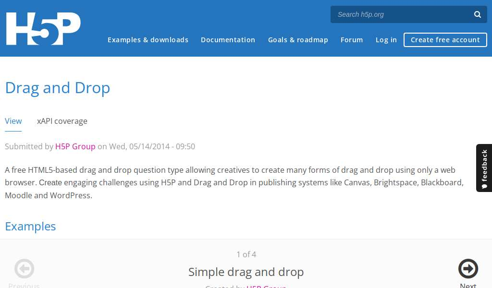    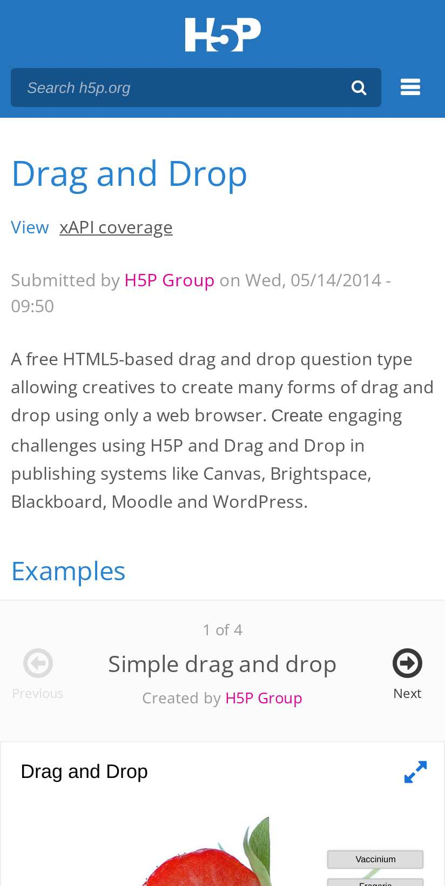 

Arrastáveis (amostra):

- `div.h5p-content.h5p-initialized.h5p-no-frame` 428×418 · eventos: keyup keydown mousedown · touch-action: auto · cursor: auto · transição: 0s

Tocáveis (amostra):

- `a.` 161×77 · "H5P – Create and Share Rich HTML5 Conten" · eventos: —
- `input.form-text` 326×36 · "" · eventos: —
- `input.form-submit` 36×36 · "" · eventos: — · aria-label
- `a.` 168×26 · "Examples & downloads" · eventos: —
- `a.` 114×26 · "Documentation" · eventos: —

Clique: 0 mutações no 1º s · som media/webaudio 0/0
Arrasto: deslocou 0 px · 16 mutações após soltar · som 0/0
Escutas no document/window: visibilitychange:9 pageshow:8 load:7 pagehide:6 click:6 DOMContentLoaded:4 focus:3 mousemove:2 blur:2 message:2

---

### h5p-memoria

`https://h5p.org/memory-game` — Memory Game | H5P

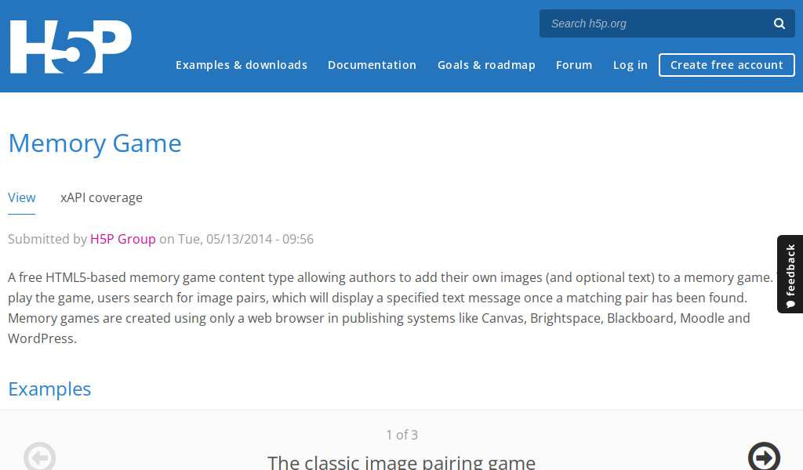    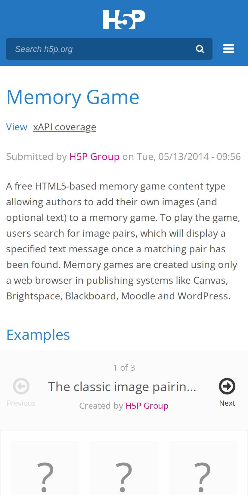 

Arrastáveis (amostra):

- `div.h5p-content.h5p-initialized.h5p-no-frame` 428×418 · eventos: keyup keydown mousedown · touch-action: auto · cursor: auto · transição: 0s

Tocáveis (amostra):

- `a.` 161×77 · "H5P – Create and Share Rich HTML5 Conten" · eventos: —
- `input.form-text` 326×36 · "" · eventos: —
- `input.form-submit` 36×36 · "" · eventos: — · aria-label
- `a.` 168×26 · "Examples & downloads" · eventos: —
- `a.` 114×26 · "Documentation" · eventos: —

Clique: 0 mutações no 1º s · som media/webaudio 0/0
Arrasto: deslocou 0 px · 16 mutações após soltar · som 0/0
Escutas no document/window: visibilitychange:9 pageshow:8 load:7 pagehide:6 click:6 DOMContentLoaded:4 focus:3 mousemove:2 blur:2 message:2

---

### h5p-caca-palavras

`https://h5p.org/find-the-words` — Find the words | H5P

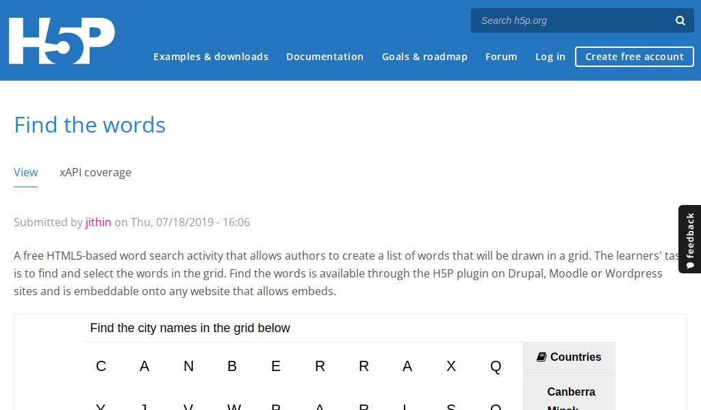    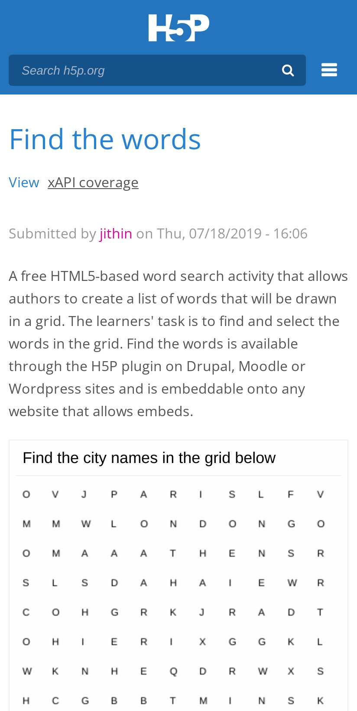 

Arrastáveis (amostra):

- `div.h5p-content.h5p-initialized.h5p-no-frame` 428×418 · eventos: keyup keydown mousedown · touch-action: auto · cursor: auto · transição: 0s

Tocáveis (amostra):

- `a.` 161×77 · "H5P – Create and Share Rich HTML5 Conten" · eventos: —
- `input.form-text` 326×36 · "" · eventos: —
- `input.form-submit` 36×36 · "" · eventos: — · aria-label
- `a.` 168×26 · "Examples & downloads" · eventos: —
- `a.` 114×26 · "Documentation" · eventos: —

Clique: 0 mutações no 1º s · som media/webaudio 0/0
Arrasto: deslocou 0 px · 16 mutações após soltar · som 0/0
Escutas no document/window: visibilitychange:9 pageshow:8 load:6 pagehide:6 click:6 DOMContentLoaded:3 focus:3 mousemove:2 blur:2 message:2

---

### h5p-cruzadinha

`https://h5p.org/crossword` — Page not found | H5P

    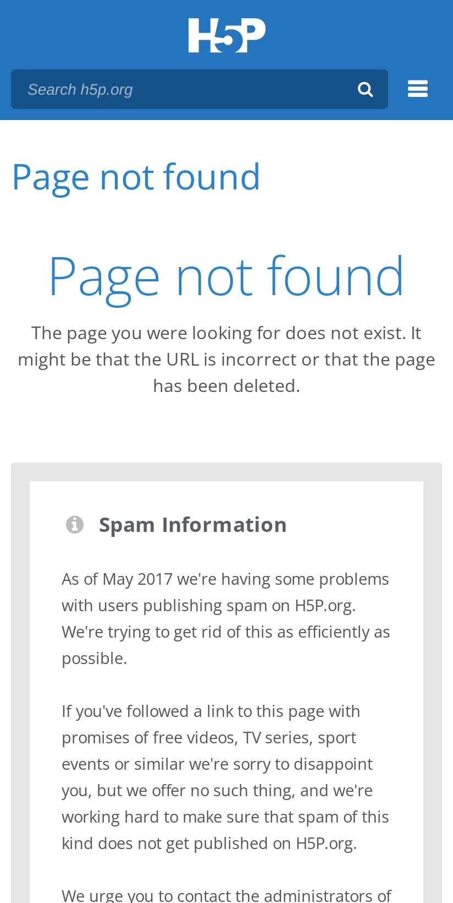 

Arrastáveis (amostra):

- `div.h5p-content.h5p-initialized.h5p-no-frame` 428×418 · eventos: keyup keydown mousedown · touch-action: auto · cursor: auto · transição: 0s

Tocáveis (amostra):

- `a.` 161×77 · "H5P – Create and Share Rich HTML5 Conten" · eventos: —
- `input.form-text` 326×36 · "" · eventos: —
- `input.form-submit` 36×36 · "" · eventos: — · aria-label
- `a.` 168×26 · "Examples & downloads" · eventos: —
- `a.` 114×26 · "Documentation" · eventos: —

Clique: 0 mutações no 1º s · som media/webaudio 0/0
Arrasto: deslocou 0 px · 16 mutações após soltar · som 0/0
Escutas no document/window: visibilitychange:9 pageshow:8 load:7 pagehide:6 click:6 DOMContentLoaded:3 focus:3 blur:2 message:2 resize:2

---

### h5p-arrastar-palavras

`https://h5p.org/drag-the-words` — Drag the Words | H5P

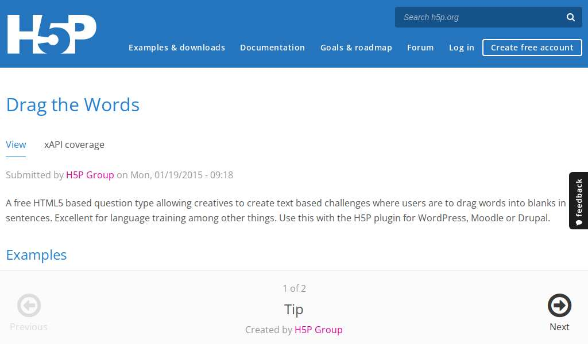    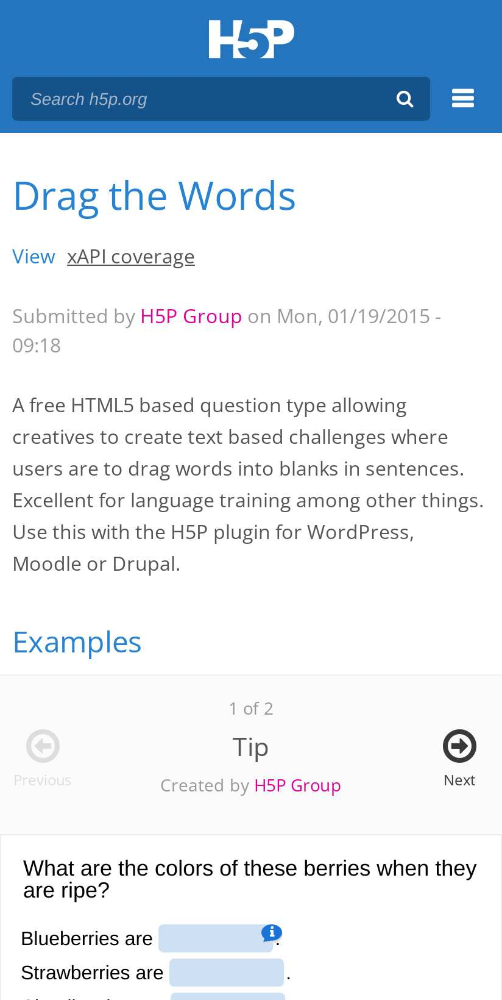 

Arrastáveis (amostra):

- `div.h5p-content.h5p-initialized.h5p-no-frame` 428×418 · eventos: keyup keydown mousedown · touch-action: auto · cursor: auto · transição: 0s

Tocáveis (amostra):

- `a.` 161×77 · "H5P – Create and Share Rich HTML5 Conten" · eventos: —
- `input.form-text` 326×36 · "" · eventos: —
- `input.form-submit` 36×36 · "" · eventos: — · aria-label
- `a.` 168×26 · "Examples & downloads" · eventos: —
- `a.` 114×26 · "Documentation" · eventos: —

Clique: 0 mutações no 1º s · som media/webaudio 0/0
Arrasto: deslocou 0 px · 16 mutações após soltar · som 0/0
Escutas no document/window: visibilitychange:9 pageshow:8 load:7 pagehide:6 click:6 DOMContentLoaded:4 focus:3 blur:2 mousemove:2 message:2

---

### h5p-lacunas

`https://h5p.org/fill-in-the-blanks` — Fill in the Blanks | H5P

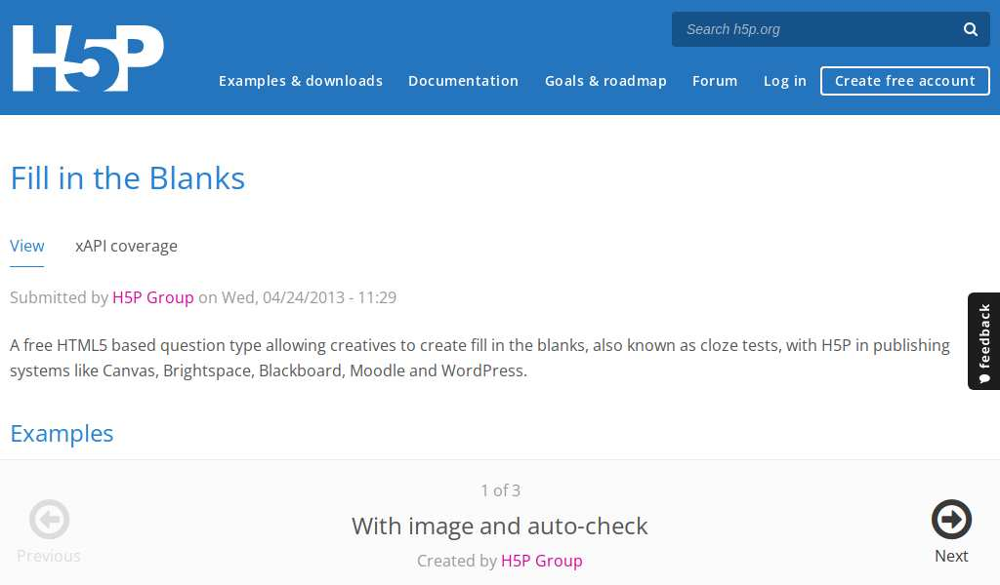    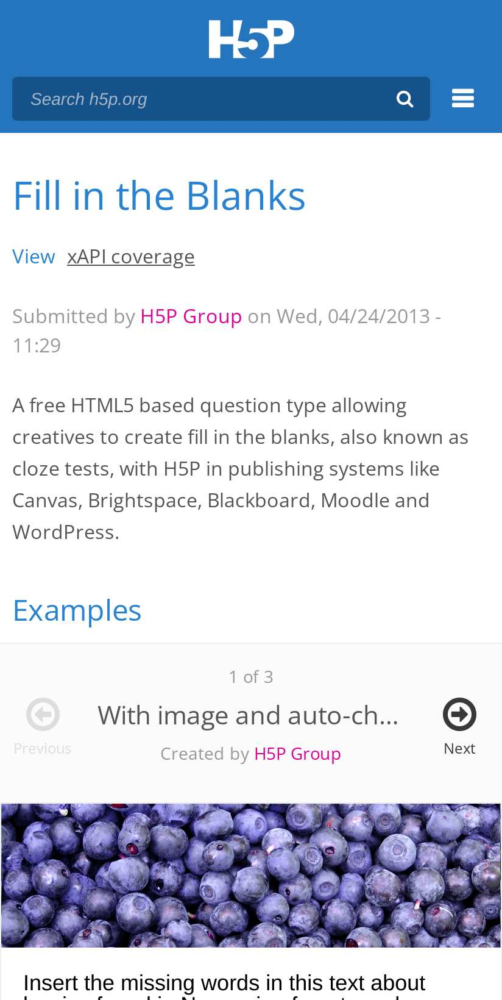 

Arrastáveis (amostra):

- `div.h5p-content.h5p-initialized.h5p-no-frame` 428×418 · eventos: keyup keydown mousedown · touch-action: auto · cursor: auto · transição: 0s

Tocáveis (amostra):

- `a.` 161×77 · "H5P – Create and Share Rich HTML5 Conten" · eventos: —
- `input.form-text` 326×36 · "" · eventos: —
- `input.form-submit` 36×36 · "" · eventos: — · aria-label
- `a.` 168×26 · "Examples & downloads" · eventos: —
- `a.` 114×26 · "Documentation" · eventos: —

Clique: 0 mutações no 1º s · som media/webaudio 0/0
Arrasto: deslocou 0 px · 16 mutações após soltar · som 0/0
Escutas no document/window: visibilitychange:9 pageshow:8 load:7 pagehide:6 click:6 DOMContentLoaded:4 focus:3 mousemove:2 blur:2 message:2

---

### h5p-sequencia-imagens

`https://h5p.org/image-sequencing` — Page not found | H5P

     

Arrastáveis (amostra):

- `div.h5p-content.h5p-initialized.h5p-no-frame` 428×418 · eventos: keyup keydown mousedown · touch-action: auto · cursor: auto · transição: 0s

Tocáveis (amostra):

- `a.` 161×77 · "H5P – Create and Share Rich HTML5 Conten" · eventos: —
- `input.form-text` 326×36 · "" · eventos: —
- `input.form-submit` 36×36 · "" · eventos: — · aria-label
- `a.` 168×26 · "Examples & downloads" · eventos: —
- `a.` 114×26 · "Documentation" · eventos: —

Clique: 0 mutações no 1º s · som media/webaudio 0/0
Arrasto: deslocou 0 px · 16 mutações após soltar · som 0/0
Escutas no document/window: visibilitychange:9 pageshow:8 load:7 pagehide:6 click:6 DOMContentLoaded:3 focus:3 blur:2 message:2 auxclick:2

---

### h5p-ordenar-paragrafos

`https://h5p.org/sort-the-paragraphs` — Page not found | H5P

     

Arrastáveis (amostra):

- `div.h5p-content.h5p-initialized.h5p-no-frame` 428×418 · eventos: keyup keydown mousedown · touch-action: auto · cursor: auto · transição: 0s

Tocáveis (amostra):

- `a.` 161×77 · "H5P – Create and Share Rich HTML5 Conten" · eventos: —
- `input.form-text` 326×36 · "" · eventos: —
- `input.form-submit` 36×36 · "" · eventos: — · aria-label
- `a.` 168×26 · "Examples & downloads" · eventos: —
- `a.` 114×26 · "Documentation" · eventos: —

Clique: 0 mutações no 1º s · som media/webaudio 0/0
Arrasto: deslocou 0 px · 16 mutações após soltar · som 0/0
Escutas no document/window: visibilitychange:9 pageshow:8 load:7 pagehide:6 click:6 DOMContentLoaded:3 focus:3 blur:2 message:2 resize:2

---

### h5p-pares-imagem

`https://h5p.org/image-pairing` — Image pairing | H5P

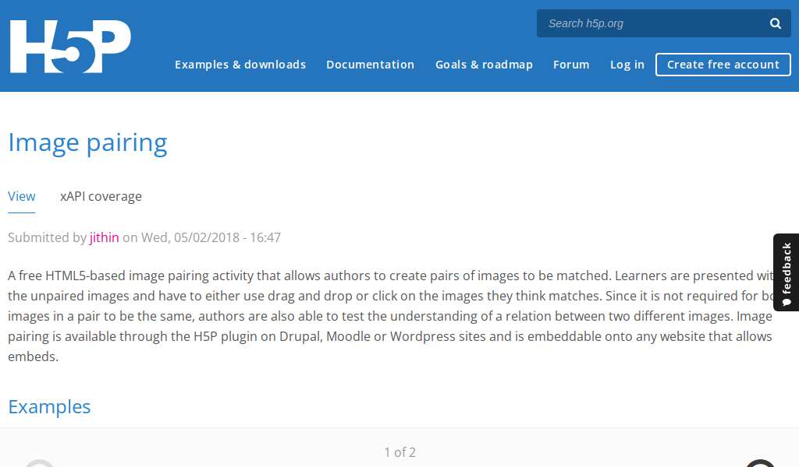    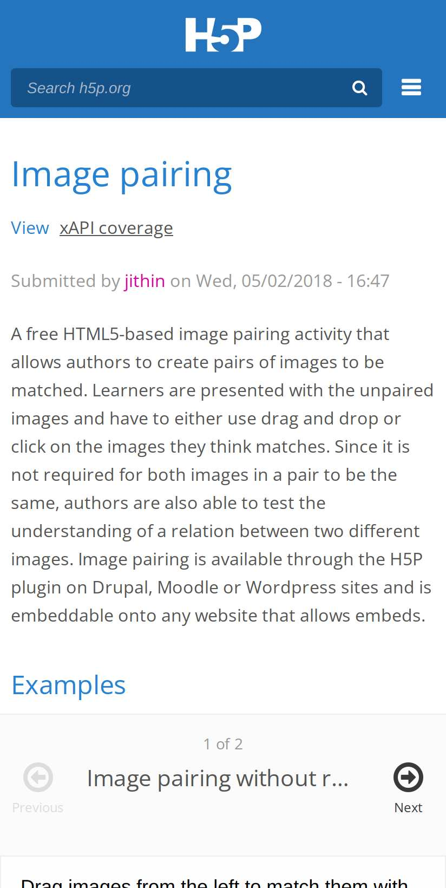 

Arrastáveis (amostra):

- `div.h5p-content.h5p-initialized.h5p-no-frame` 428×418 · eventos: keyup keydown mousedown · touch-action: auto · cursor: auto · transição: 0s

Tocáveis (amostra):

- `a.` 161×77 · "H5P – Create and Share Rich HTML5 Conten" · eventos: —
- `input.form-text` 326×36 · "" · eventos: —
- `input.form-submit` 36×36 · "" · eventos: — · aria-label
- `a.` 168×26 · "Examples & downloads" · eventos: —
- `a.` 114×26 · "Documentation" · eventos: —

Clique: 0 mutações no 1º s · som media/webaudio 0/0
Arrasto: deslocou 0 px · 16 mutações após soltar · som 0/0
Escutas no document/window: visibilitychange:9 pageshow:8 load:7 pagehide:6 click:6 DOMContentLoaded:4 focus:3 mousemove:2 blur:2 message:2

---

### h5p-marcar-palavras

`https://h5p.org/mark-the-words` — Mark the Words | H5P

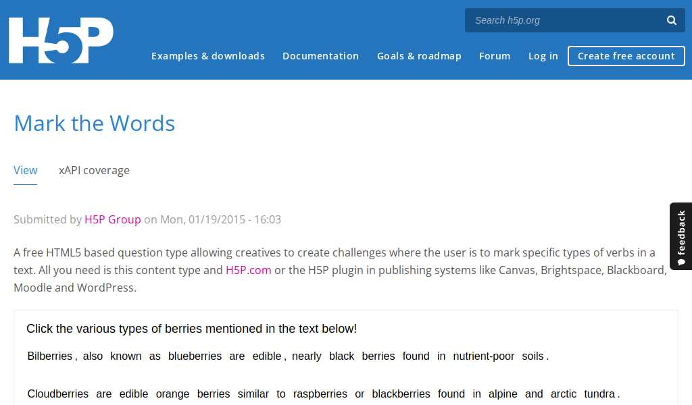    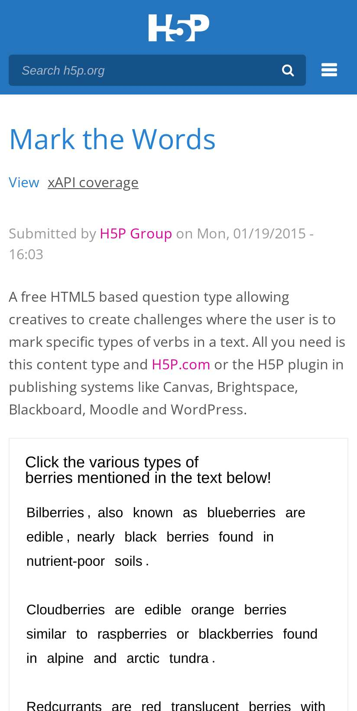 

Arrastáveis (amostra):

- `div.h5p-content.h5p-initialized.h5p-no-frame` 428×418 · eventos: keyup keydown mousedown · touch-action: auto · cursor: auto · transição: 0s

Tocáveis (amostra):

- `a.` 161×77 · "H5P – Create and Share Rich HTML5 Conten" · eventos: —
- `input.form-text` 326×36 · "" · eventos: —
- `input.form-submit` 36×36 · "" · eventos: — · aria-label
- `a.` 168×26 · "Examples & downloads" · eventos: —
- `a.` 114×26 · "Documentation" · eventos: —

Clique: 0 mutações no 1º s · som media/webaudio 0/0
Arrasto: deslocou 0 px · 16 mutações após soltar · som 0/0
Escutas no document/window: visibilitychange:9 pageshow:8 load:7 pagehide:6 click:6 DOMContentLoaded:4 focus:3 mousemove:2 blur:2 message:2

---

### h5p-pontos-na-imagem

`https://h5p.org/image-hotspots` — Image Hotspots | H5P

    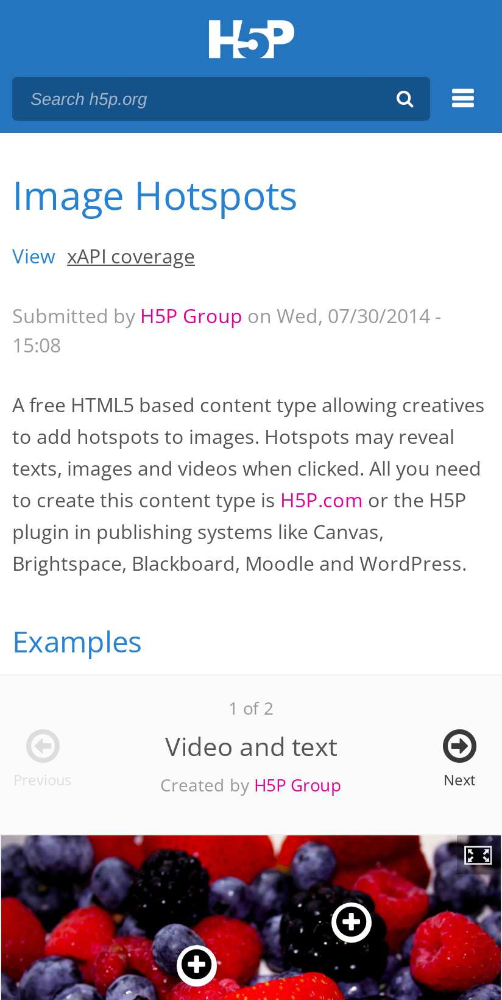 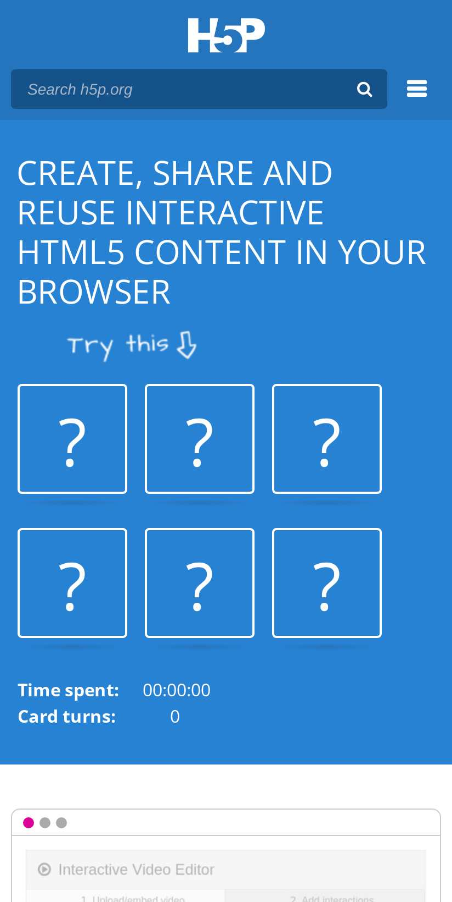

Arrastáveis (amostra):

- `div.h5p-content.h5p-initialized.h5p-no-frame` 428×418 · eventos: keyup keydown mousedown · touch-action: auto · cursor: auto · transição: 0s

Tocáveis (amostra):

- `a.` 161×77 · "H5P – Create and Share Rich HTML5 Conten" · eventos: —
- `input.form-text` 326×36 · "" · eventos: —
- `input.form-submit` 36×36 · "" · eventos: — · aria-label
- `a.` 168×26 · "Examples & downloads" · eventos: —
- `a.` 114×26 · "Documentation" · eventos: —

Clique: 0 mutações no 1º s · som media/webaudio 0/0
Arrasto: deslocou 0 px · 16 mutações após soltar · som 0/0
Escutas no document/window: visibilitychange:9 pageshow:8 load:7 pagehide:6 click:6 DOMContentLoaded:3 focus:3 blur:2 message:2 resize:2

---

### h5p-achar-na-imagem

`https://h5p.org/find-the-hotspot` — Page not found | H5P

     

Arrastáveis (amostra):

- `div.h5p-content.h5p-initialized.h5p-no-frame` 428×418 · eventos: keyup keydown mousedown · touch-action: auto · cursor: auto · transição: 0s

Tocáveis (amostra):

- `a.` 161×77 · "H5P – Create and Share Rich HTML5 Conten" · eventos: —
- `input.form-text` 326×36 · "" · eventos: —
- `input.form-submit` 36×36 · "" · eventos: — · aria-label
- `a.` 168×26 · "Examples & downloads" · eventos: —
- `a.` 114×26 · "Documentation" · eventos: —

Clique: 0 mutações no 1º s · som media/webaudio 0/0
Arrasto: deslocou 0 px · 16 mutações após soltar · som 0/0
Escutas no document/window: visibilitychange:9 pageshow:8 load:7 pagehide:6 click:6 DOMContentLoaded:3 focus:3 blur:2 message:2 resize:2

---

### h5p-ditado

`https://h5p.org/dictation` — Dictation | H5P

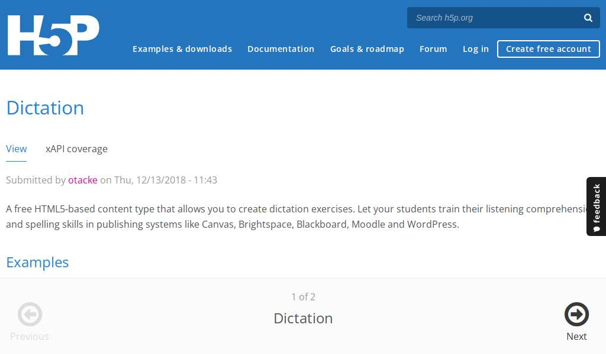    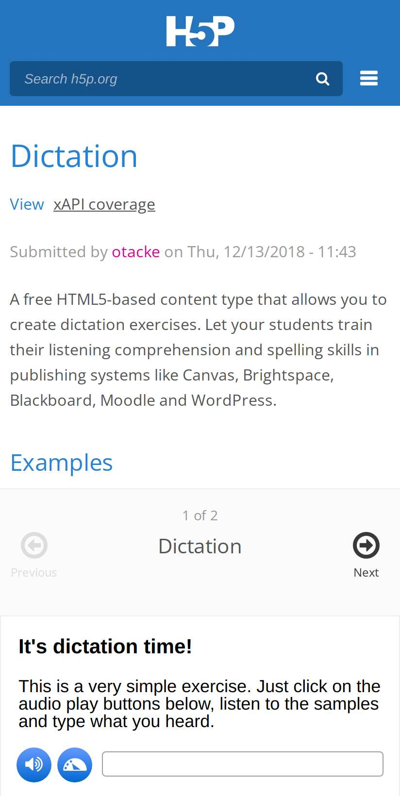 

Arrastáveis (amostra):

- `div.h5p-content.h5p-initialized.h5p-no-frame` 428×418 · eventos: keyup keydown mousedown · touch-action: auto · cursor: auto · transição: 0s

Tocáveis (amostra):

- `a.` 161×77 · "H5P – Create and Share Rich HTML5 Conten" · eventos: —
- `input.form-text` 326×36 · "" · eventos: —
- `input.form-submit` 36×36 · "" · eventos: — · aria-label
- `a.` 168×26 · "Examples & downloads" · eventos: —
- `a.` 114×26 · "Documentation" · eventos: —

Clique: 0 mutações no 1º s · som media/webaudio 0/0
Arrasto: deslocou 0 px · 16 mutações após soltar · som 0/0
Escutas no document/window: visibilitychange:9 pageshow:8 load:7 pagehide:6 click:6 DOMContentLoaded:4 focus:3 blur:2 mousemove:2 message:2

---

### h5p-quiz

`https://h5p.org/single-choice-set` — Single Choice Set | H5P

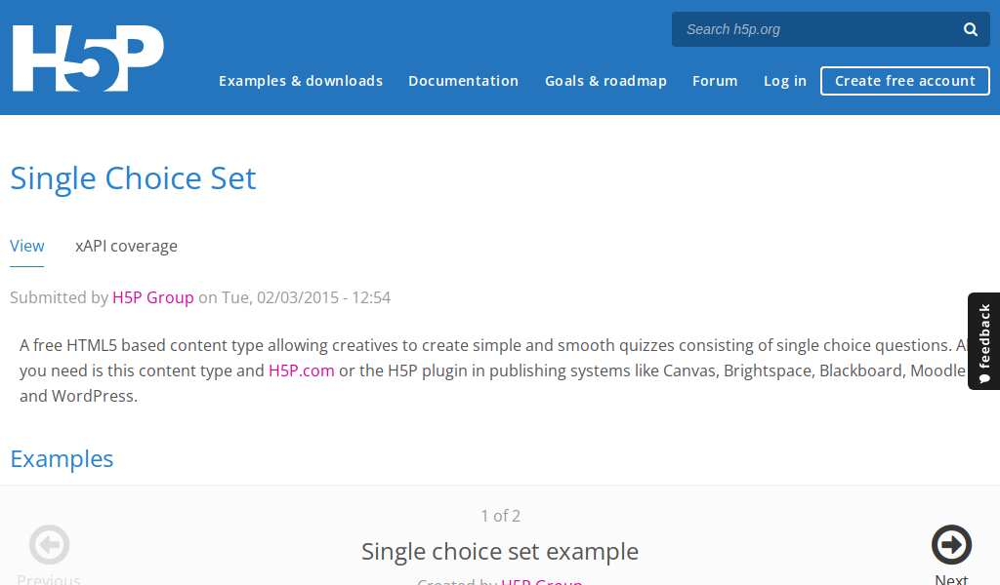 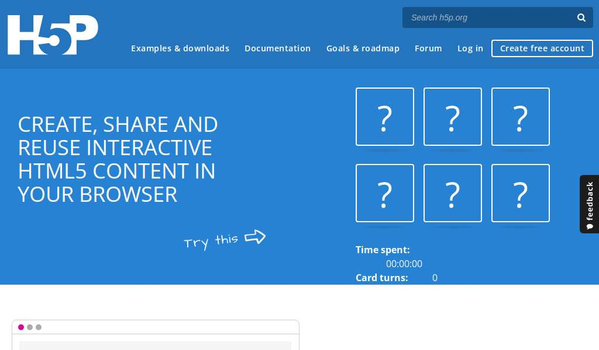   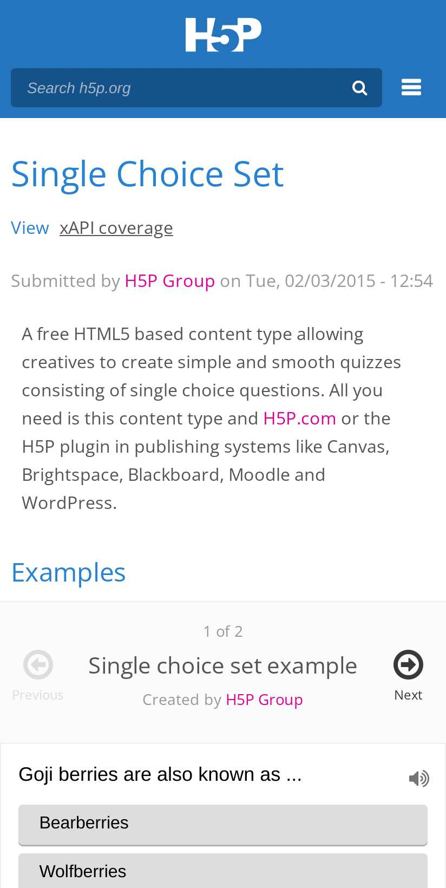 

Arrastáveis (amostra):

- `div.h5p-content.h5p-initialized.h5p-no-frame` 428×418 · eventos: keyup keydown mousedown · touch-action: auto · cursor: auto · transição: 0s

Tocáveis (amostra):

- `a.` 161×77 · "H5P – Create and Share Rich HTML5 Conten" · eventos: —
- `input.form-text` 326×36 · "" · eventos: —
- `input.form-submit` 36×36 · "" · eventos: — · aria-label
- `a.` 168×26 · "Examples & downloads" · eventos: —
- `a.` 114×26 · "Documentation" · eventos: —

Clique: 0 mutações no 1º s · som media/webaudio 0/0
Arrasto: deslocou 0 px · 16 mutações após soltar · som 0/0
Escutas no document/window: visibilitychange:9 pageshow:8 load:6 pagehide:6 click:6 DOMContentLoaded:3 focus:3 mousemove:2 blur:2 message:2

---

### h5p-verdadeiro-falso

`https://h5p.org/true-false` — True/False Question | H5P

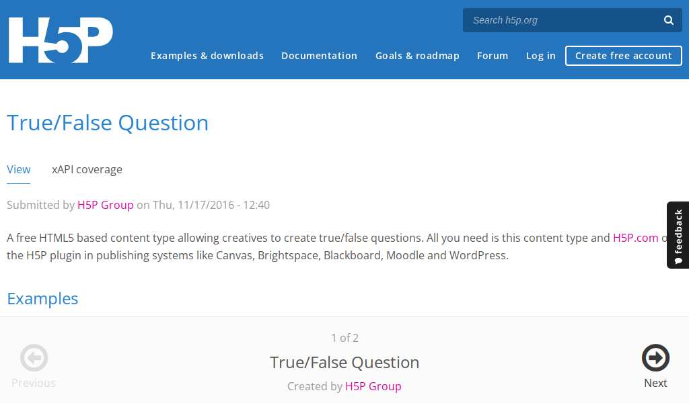    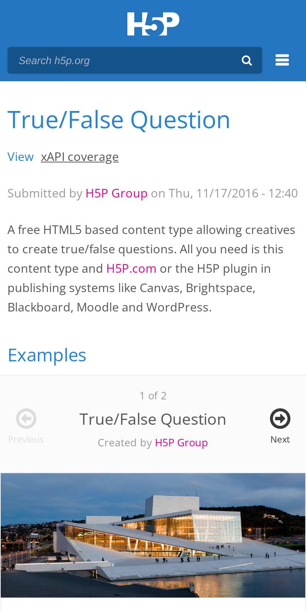 

Arrastáveis (amostra):

- `div.h5p-content.h5p-initialized.h5p-no-frame` 428×418 · eventos: keyup keydown mousedown · touch-action: auto · cursor: auto · transição: 0s

Tocáveis (amostra):

- `a.` 161×77 · "H5P – Create and Share Rich HTML5 Conten" · eventos: —
- `input.form-text` 326×36 · "" · eventos: —
- `input.form-submit` 36×36 · "" · eventos: — · aria-label
- `a.` 168×26 · "Examples & downloads" · eventos: —
- `a.` 114×26 · "Documentation" · eventos: —

Clique: 0 mutações no 1º s · som media/webaudio 0/0
Arrasto: deslocou 0 px · 16 mutações após soltar · som 0/0
Escutas no document/window: visibilitychange:9 pageshow:8 load:7 pagehide:6 click:6 DOMContentLoaded:4 focus:3 blur:2 mousemove:2 message:2

---

### h5p-linha-do-tempo

`https://h5p.org/timeline` — Timeline | H5P

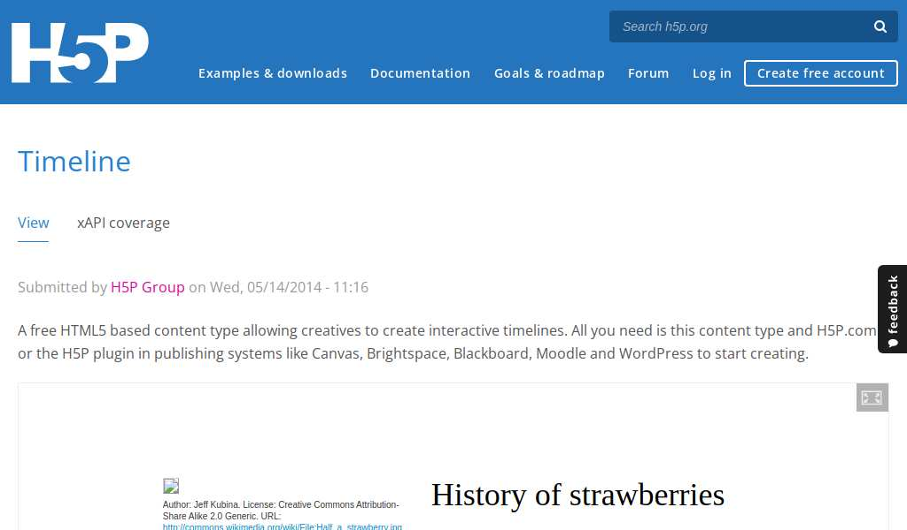  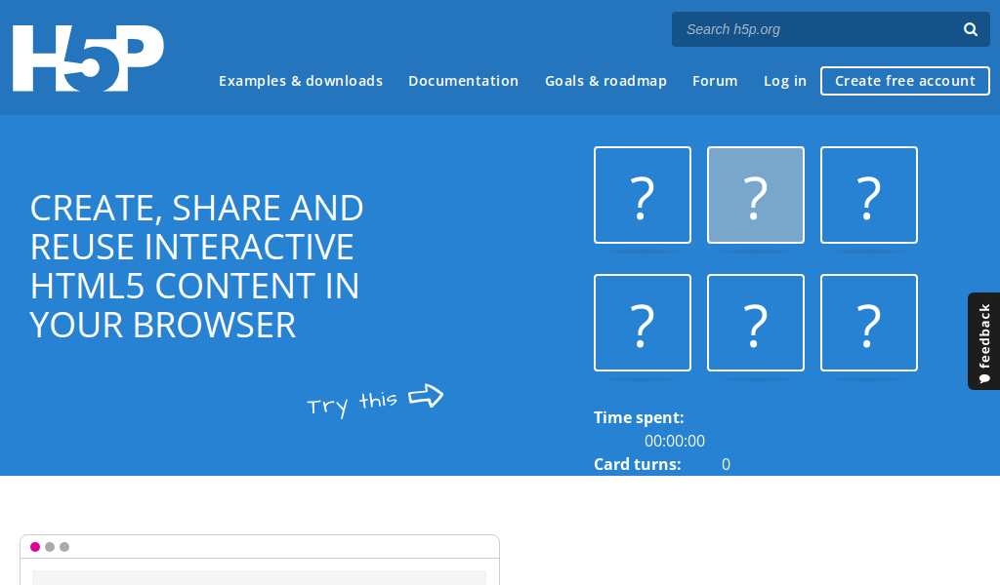  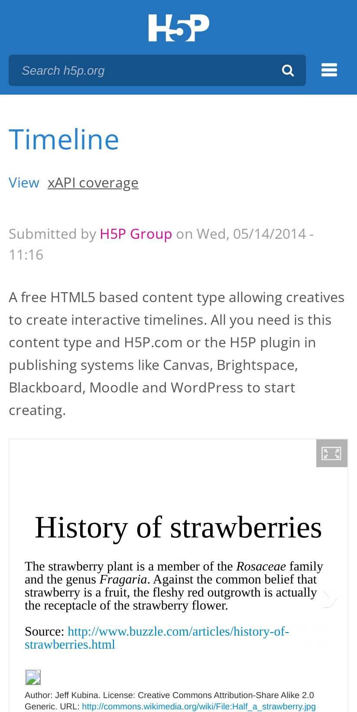 

Arrastáveis (amostra):

- `div.h5p-content.h5p-initialized.h5p-no-frame` 428×418 · eventos: keyup keydown mousedown · touch-action: auto · cursor: auto · transição: 0s

Tocáveis (amostra):

- `a.` 161×77 · "H5P – Create and Share Rich HTML5 Conten" · eventos: —
- `input.form-text` 326×36 · "" · eventos: —
- `input.form-submit` 36×36 · "" · eventos: — · aria-label
- `a.` 168×26 · "Examples & downloads" · eventos: —
- `a.` 114×26 · "Documentation" · eventos: —

Clique: 0 mutações no 1º s · som media/webaudio 0/0
Arrasto: deslocou 0 px · 16 mutações após soltar · som 0/0
Escutas no document/window: visibilitychange:9 pageshow:8 load:7 pagehide:6 click:6 DOMContentLoaded:4 focus:3 mousemove:2 blur:2 message:2

---

### h5p-flashcards

`https://h5p.org/flashcards` — Flashcards | H5P

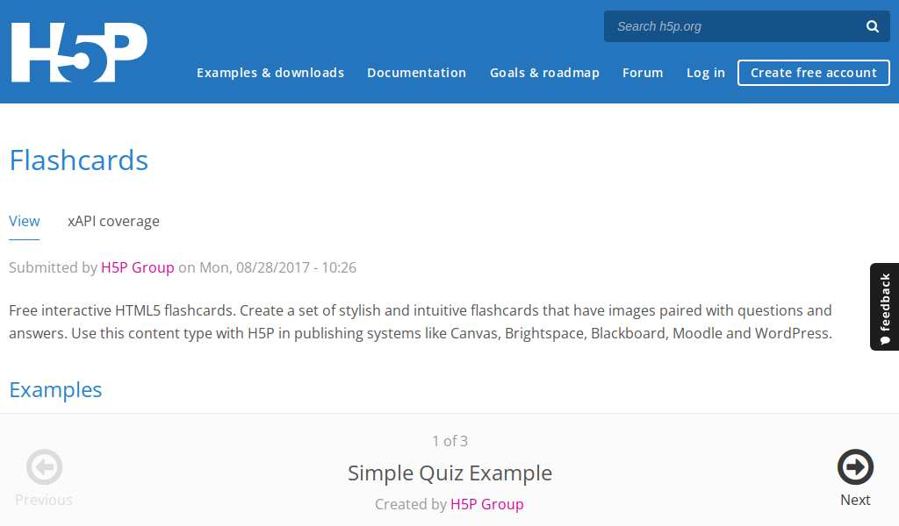    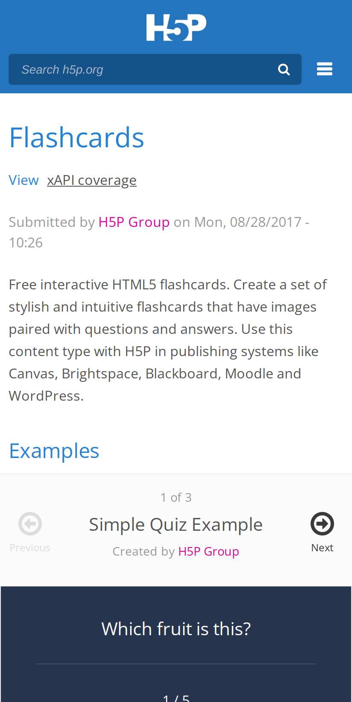 

Arrastáveis (amostra):

- `div.h5p-content.h5p-initialized.h5p-no-frame` 428×418 · eventos: keyup keydown mousedown · touch-action: auto · cursor: auto · transição: 0s

Tocáveis (amostra):

- `a.` 161×77 · "H5P – Create and Share Rich HTML5 Conten" · eventos: —
- `input.form-text` 326×36 · "" · eventos: —
- `input.form-submit` 36×36 · "" · eventos: — · aria-label
- `a.` 168×26 · "Examples & downloads" · eventos: —
- `a.` 114×26 · "Documentation" · eventos: —

Clique: 0 mutações no 1º s · som media/webaudio 0/0
Arrasto: deslocou 0 px · 16 mutações após soltar · som 0/0
Escutas no document/window: visibilitychange:9 pageshow:8 load:7 pagehide:6 click:6 DOMContentLoaded:4 focus:3 mousemove:2 blur:2 message:2

---

### phet-balanca

`https://phet.colorado.edu/sims/html/balancing-act/latest/balancing-act_all.html` — ‪Balancing Act‬

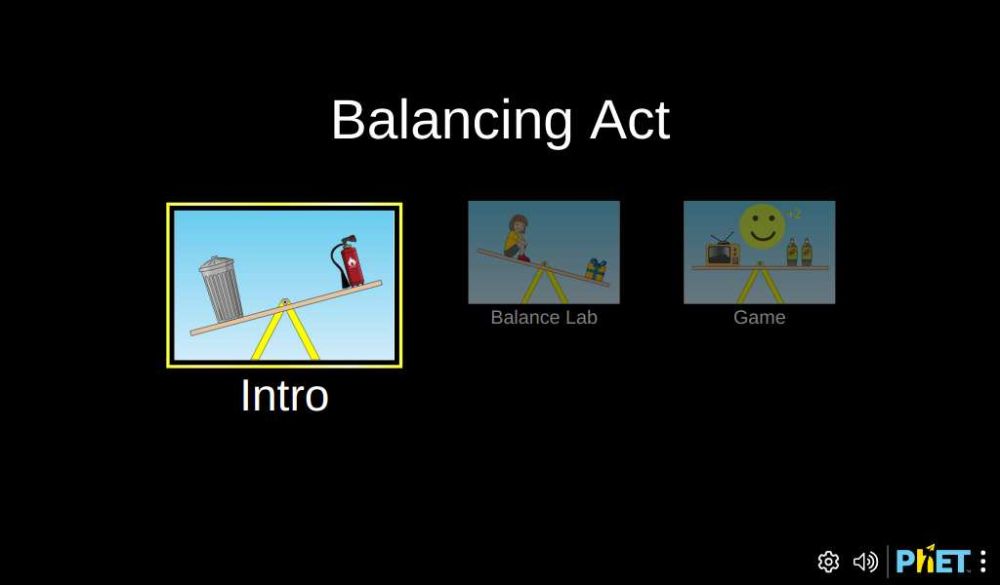 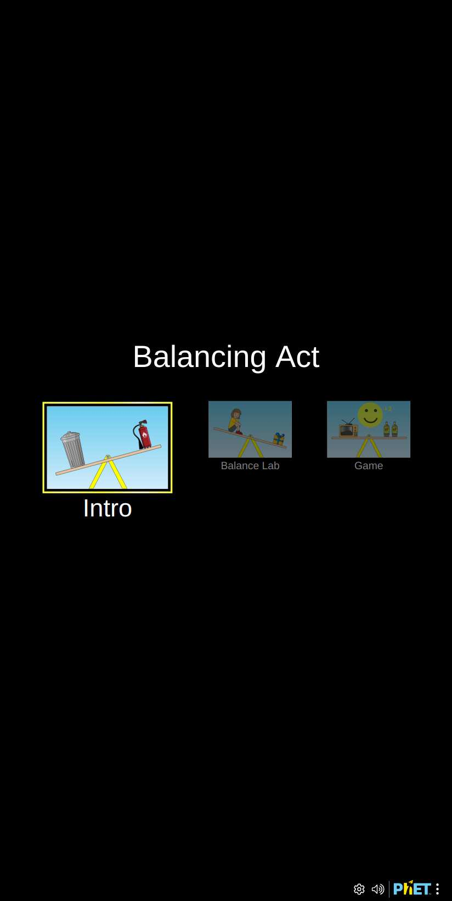

Escutas no document/window: pageshow:9 load:8 visibilitychange:7 keydown:6 click:5 keyup:4 blur:4 touchstart:3 resize:3 pagehide:3

---

### phet-fazer-dez

`https://phet.colorado.edu/sims/html/make-a-ten/latest/make-a-ten_all.html` — ‪Make a Ten‬

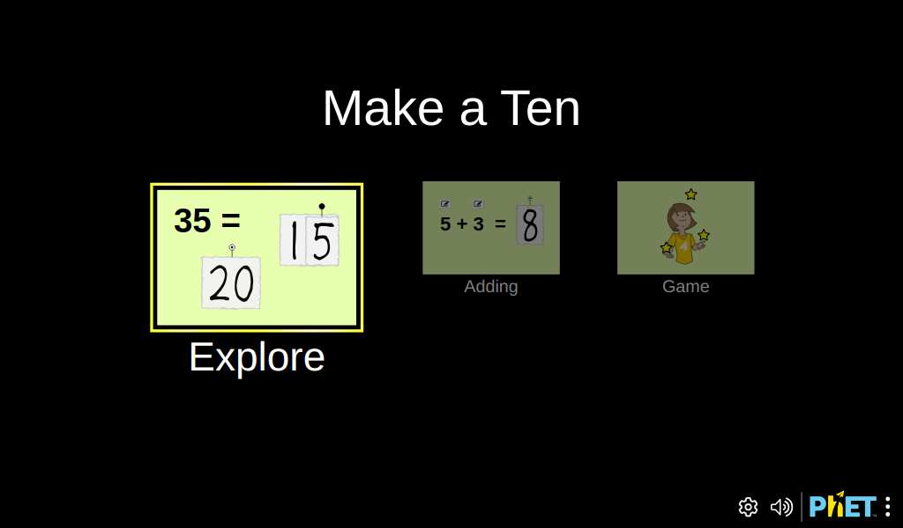 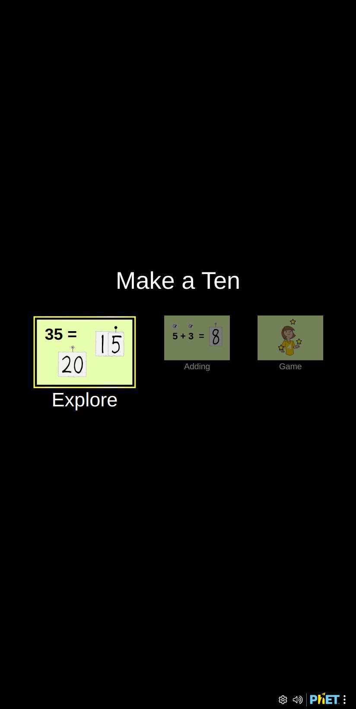

Escutas no document/window: pageshow:9 load:7 keydown:6 visibilitychange:6 click:5 pagehide:4 keyup:4 blur:4 touchstart:3 resize:2

---

### phet-reta-numerica

`https://phet.colorado.edu/sims/html/number-line-integers/latest/number-line-integers_all.html` — ‪Number Line: Integers‬

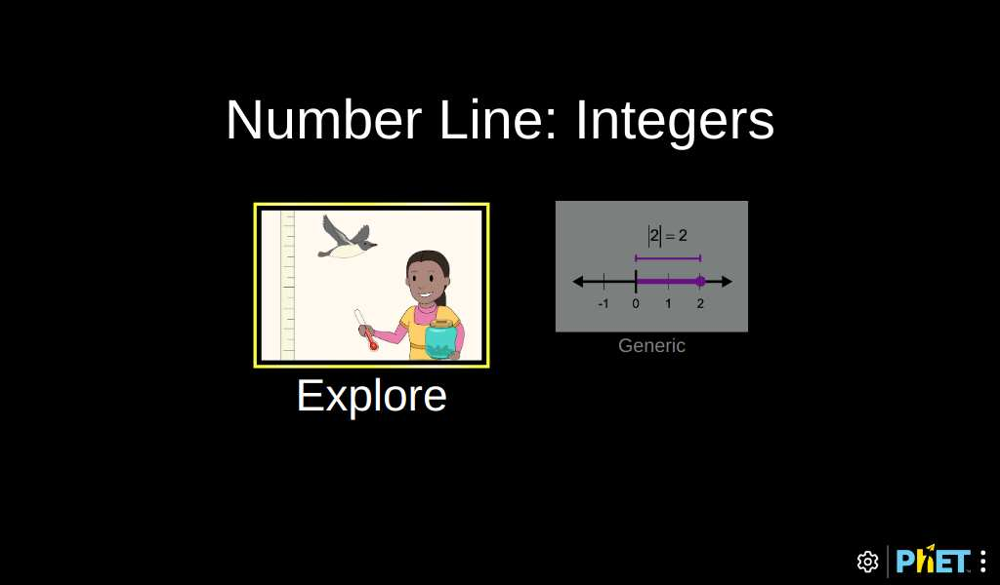 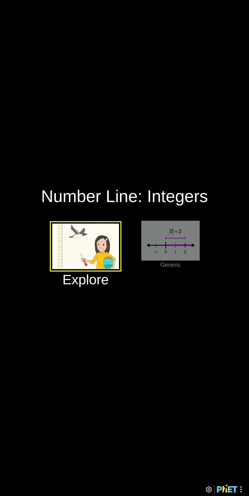

Escutas no document/window: pageshow:9 load:8 visibilitychange:8 keydown:6 click:5 keyup:4 resize:3 blur:3 pagehide:3 touchstart:2

---

### phet-fracoes

`https://phet.colorado.edu/sims/html/fraction-matcher/latest/fraction-matcher_all.html` — ‪Fraction Matcher‬

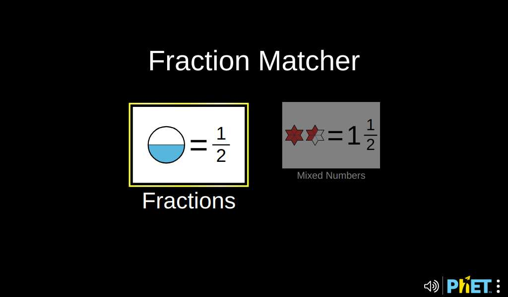 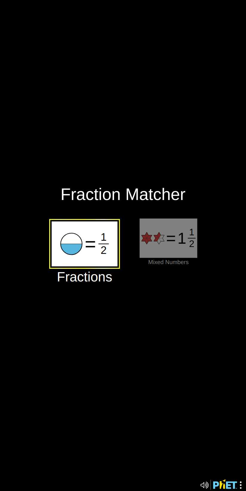

Escutas no document/window: pageshow:9 load:8 visibilitychange:7 resize:3 click:3 pagehide:3 pointerdown:2 pointerup:2 pointermove:2 pointerover:2

---

### phet-arranjo

`https://phet.colorado.edu/sims/html/area-model-multiplication/latest/area-model-multiplication_all.html` — ‪Area Model Multiplication‬

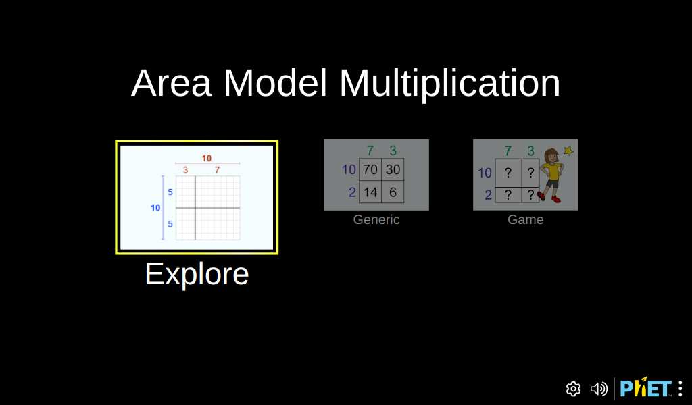 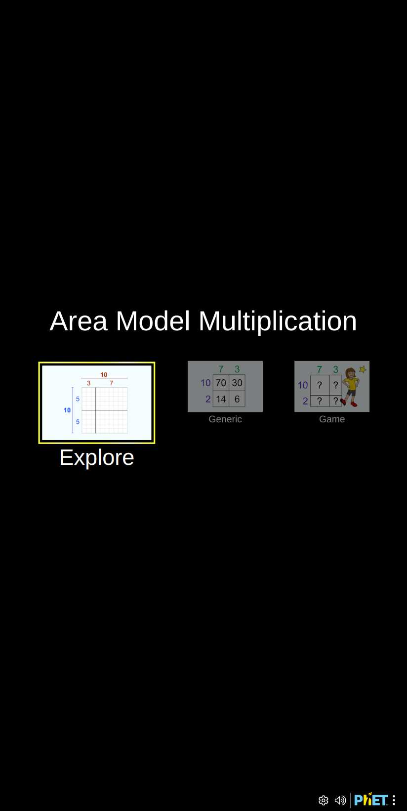

Escutas no document/window: visibilitychange:9 pageshow:9 load:8 keydown:6 click:5 keyup:4 touchstart:3 resize:3 blur:3 pagehide:3

---

### mlc-reta-numerica

`https://apps.mathlearningcenter.org/number-line/` — Number Line, by The Math Learning Center

(fechei um aviso: "OK")

 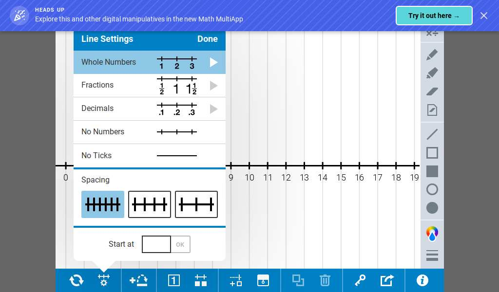  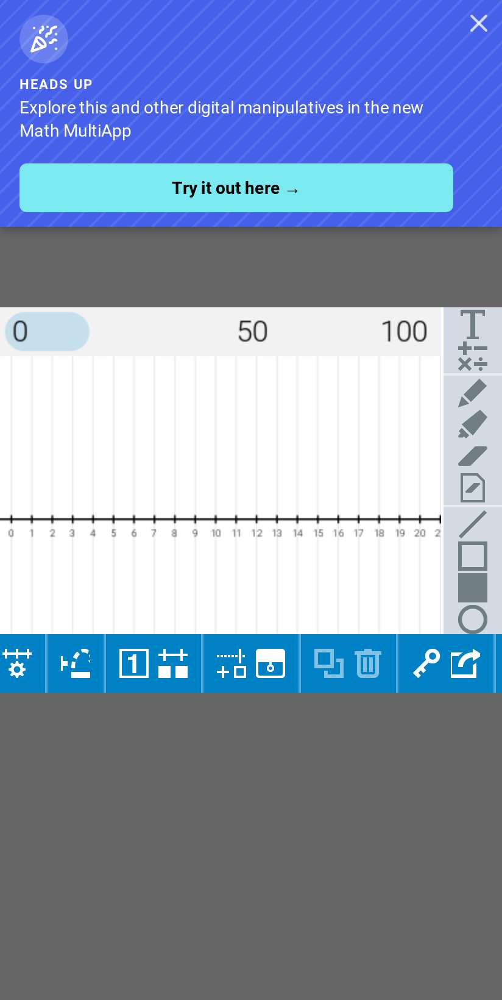

Arrastáveis (amostra):

- `canvas.workspace__canvas` 747×552 · eventos: dblclick mousedown contextmenu · touch-action: auto · cursor: auto · transição: 0s

Tocáveis (amostra):

- `canvas.workspace__canvas` 747×552 · "" · eventos: dblclick mousedown contextmenu
- `menu.o-annotations` 50×552 · "" · eventos: click
- `button.o-annotations__button.o-annotations__button-layout.a-annotation-button` 48×38 · "" · eventos: click · aria-label
- `button.o-annotations__button.o-annotations__button-layout.a-annotation-button` 48×38 · "" · eventos: click · aria-label
- `button.o-annotations__button.o-annotations__button-layout.a-annotation-button` 48×38 · "" · eventos: click · aria-label

Clique: 16 mutações no 1º s · som media/webaudio 0/0
Escutas no document/window: pagehide:4 click:4 keydown:3 keyup:3 mouseup:2 mousemove:2 load:2 focus:2 auxclick:2 submit:2

---

### mlc-base-dez

`https://apps.mathlearningcenter.org/number-pieces/` — Number Pieces by The Math Learning Center

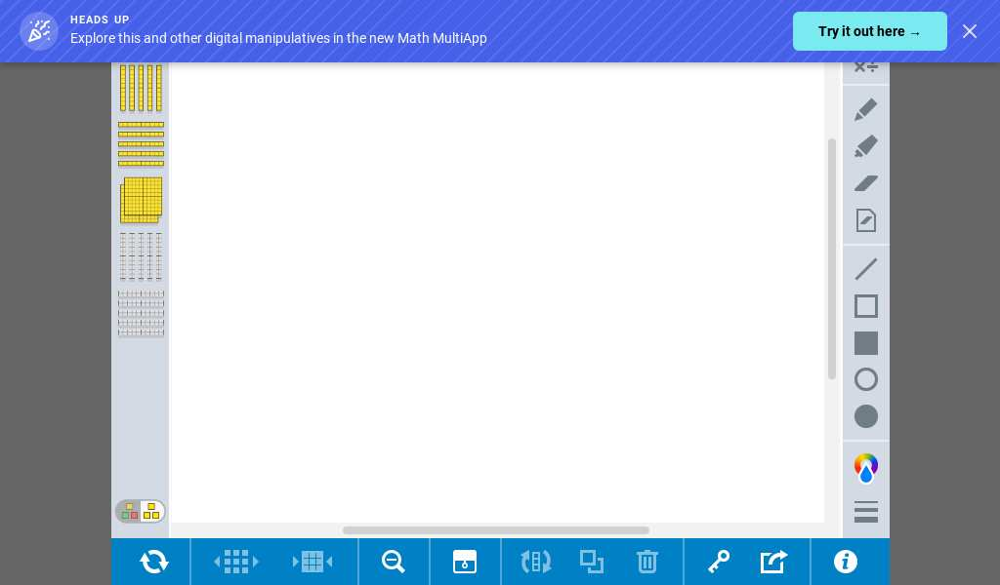 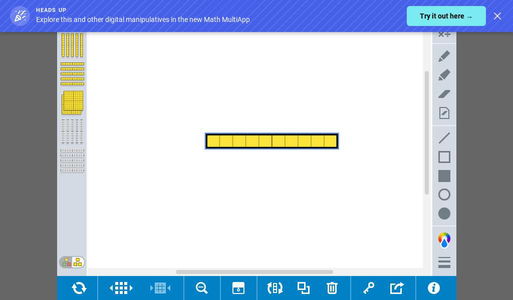  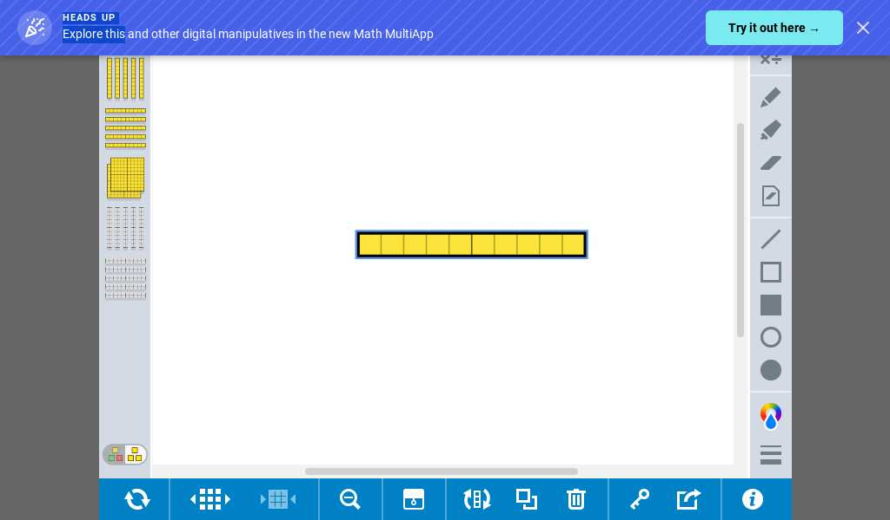 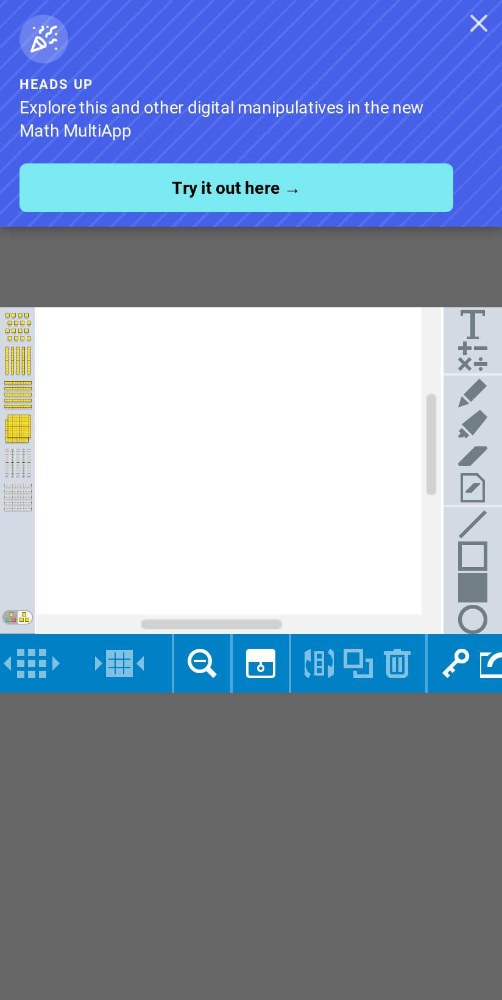 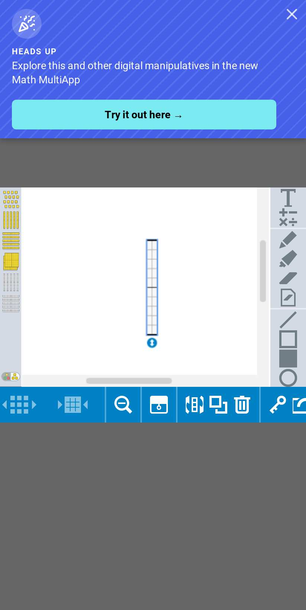

Arrastáveis (amostra):

- `canvas.draggable-canvas` 33×33 · eventos: dblclick mousedown · touch-action: auto · cursor: pointer · transição: 0s
- `canvas.draggable-canvas` 33×268 · eventos: dblclick mousedown · touch-action: auto · cursor: pointer · transição: 0s
- `canvas.draggable-canvas` 268×33 · eventos: dblclick mousedown · touch-action: auto · cursor: pointer · transição: 0s
- `canvas.draggable-canvas` 268×268 · eventos: dblclick mousedown · touch-action: auto · cursor: pointer · transição: 0s
- `canvas.draggable-canvas` 33×271 · eventos: dblclick mousedown · touch-action: auto · cursor: pointer · transição: 0s

Tocáveis (amostra):

- `menu.tray.standard` 61×552 · "" · eventos: click
- `button.toolbar-button.standard` 54×54 · "" · eventos: — · aria-label
- `canvas.draggable-canvas` 33×33 · "" · eventos: dblclick mousedown
- `button.toolbar-button.standard` 54×54 · "" · eventos: — · aria-label
- `canvas.draggable-canvas` 33×268 · "" · eventos: dblclick mousedown

Clique: 21 mutações no 1º s · som media/webaudio 0/0
Arrasto: deslocou 0 px · 24 mutações após soltar · som 0/0
Escutas no document/window: mouseup:13 mousemove:13 pointerdown:12 pointerup:12 pointermove:10 click:5 pagehide:4 keydown:3 keyup:3 auxclick:3

---

### mlc-relogio

`https://apps.mathlearningcenter.org/math-clock/` — Math Clock by The Math Learning Center

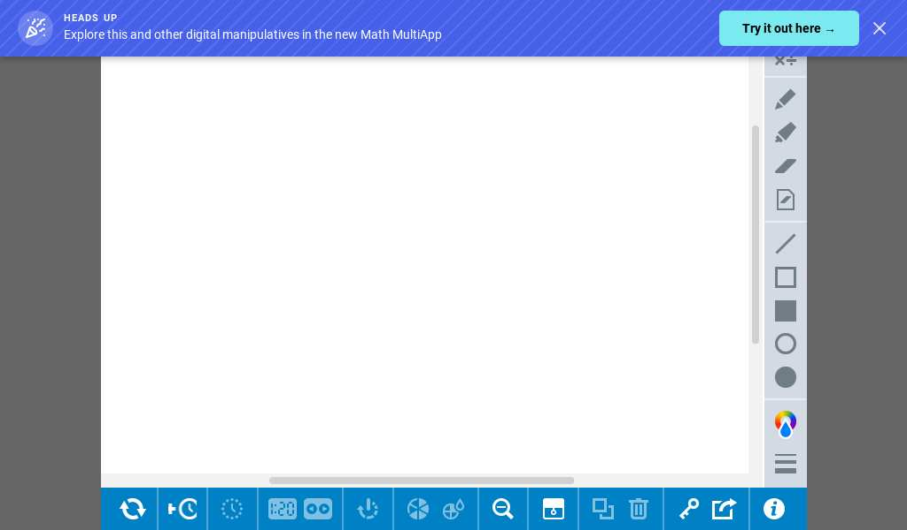   

Arrastáveis (amostra):

- `canvas.workspace__canvas` 747×552 · eventos: dblclick mousedown contextmenu · touch-action: auto · cursor: auto · transição: 0s

Tocáveis (amostra):

- `canvas.workspace__canvas` 747×552 · "" · eventos: dblclick mousedown contextmenu
- `menu.o-annotations` 50×552 · "" · eventos: click
- `button.o-annotations__button.o-annotations__button-layout.a-annotation-button` 48×38 · "" · eventos: click · aria-label
- `button.o-annotations__button.o-annotations__button-layout.a-annotation-button` 48×38 · "" · eventos: click · aria-label
- `button.o-annotations__button.o-annotations__button-layout.a-annotation-button` 48×38 · "" · eventos: click · aria-label

Clique: 26 mutações no 1º s · som media/webaudio 0/0
Escutas no document/window: click:5 pagehide:4 mouseup:3 mousemove:3 load:3 keydown:3 keyup:3 auxclick:3 mousedown:3 focus:2

---

### mlc-pecas-padrao

`https://apps.mathlearningcenter.org/pattern-shapes/` — Pattern Shapes by The Math Learning Center

   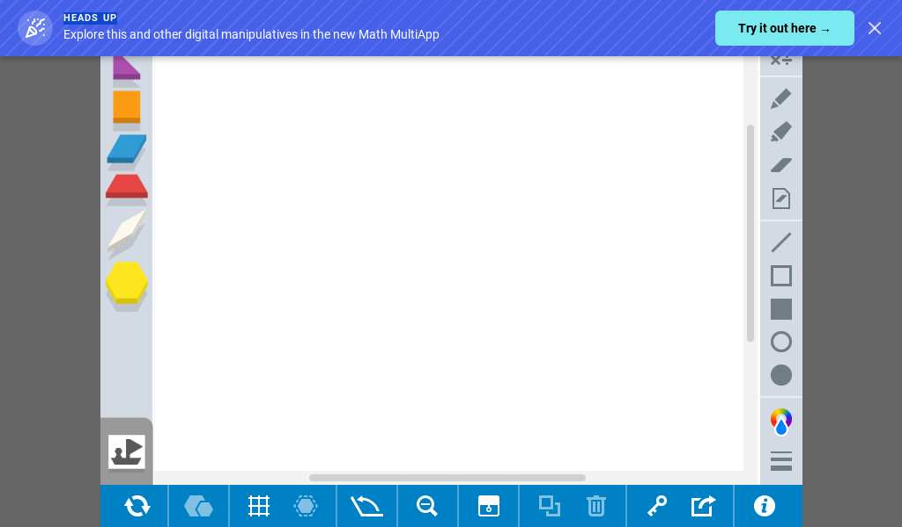 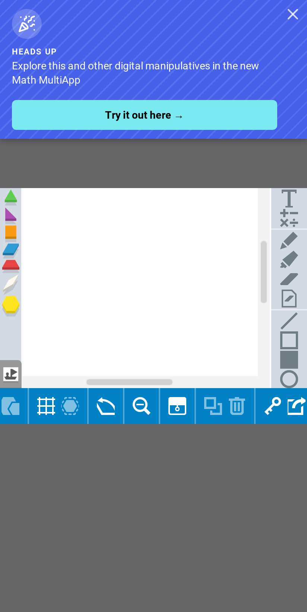 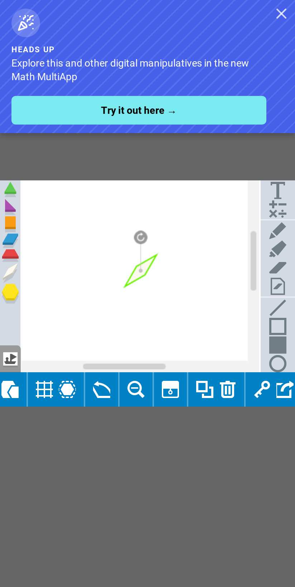

Arrastáveis (amostra):

- `canvas.draggable-canvas` 72×62 · eventos: dblclick mousedown · touch-action: auto · cursor: pointer · transição: 0s
- `canvas.draggable-canvas` 72×72 · eventos: dblclick mousedown · touch-action: auto · cursor: pointer · transição: 0s
- `canvas.draggable-canvas` 72×72 · eventos: dblclick mousedown · touch-action: auto · cursor: pointer · transição: 0s
- `canvas.draggable-canvas` 108×62 · eventos: dblclick mousedown · touch-action: auto · cursor: pointer · transição: 0s
- `canvas.draggable-canvas` 144×62 · eventos: dblclick mousedown · touch-action: auto · cursor: pointer · transição: 0s

Tocáveis (amostra):

- `menu.tray` 61×552 · "" · eventos: click
- `button.tray-button.a-toolbar-button.-equilateral` 34×44 · "" · eventos: — · aria-label
- `canvas.draggable-canvas` 72×62 · "" · eventos: dblclick mousedown
- `button.tray-button.a-toolbar-button.-right-triangle` 31×46 · "" · eventos: — · aria-label
- `canvas.draggable-canvas` 72×72 · "" · eventos: dblclick mousedown

Clique: 12 mutações no 1º s · som media/webaudio 0/0
Arrasto: deslocou 0 px · 24 mutações após soltar · som 0/0
Escutas no document/window: mouseup:10 mousemove:10 pointerdown:9 pointerup:9 pointermove:7 click:5 pagehide:4 keydown:3 keyup:3 auxclick:3

---

### mlc-geoboard

`https://apps.mathlearningcenter.org/geoboard/` — Geoboard by The Math Learning Center

     

Arrastáveis (amostra):

- `canvas.workspace__canvas` 747×552 · eventos: dblclick mousedown contextmenu · touch-action: auto · cursor: auto · transição: 0s

Tocáveis (amostra):

- `canvas.workspace__canvas` 747×552 · "" · eventos: dblclick mousedown contextmenu
- `button.o-band-piles__button.-white` 85×85 · "" · eventos: click · aria-label
- `button.o-band-piles__button.-yellow` 85×85 · "" · eventos: click · aria-label
- `button.o-band-piles__button.-orange` 85×85 · "" · eventos: click · aria-label
- `button.o-band-piles__button.-red` 85×85 · "" · eventos: click · aria-label

Clique: 12 mutações no 1º s · som media/webaudio 0/0
Arrasto: deslocou 0 px · 81 mutações após soltar · som 0/0
Escutas no document/window: pointerdown:10 pointerup:10 pointermove:8 keydown:5 keyup:5 click:5 pagehide:4 mouseup:3 mousemove:3 wheel:3

---

### toytheater-relogio

`https://toytheater.com/clock/` — Interactive Clock | Telling Time | Analog & Digital | Toy Theater

     

Tocáveis (amostra):

- `a.` 99×18 · "Teacher Tools" · eventos: —
- `a.` 99×18 · "Assessment" · eventos: —
- `a.` 99×18 · "Fluency" · eventos: —
- `a.` 99×36 · "Virtual Manipulatives" · eventos: —
- `a.` 100×30 · "" · eventos: —

Clique: 0 mutações no 1º s · som media/webaudio 0/0
Arrasto: deslocou 0 px · 15 mutações após soltar · som 0/0
Escutas no document/window: message:23 load:21 visibilitychange:12 pageshow:8 click:8 pagehide:6 DOMContentLoaded:6 mousedown:6 keydown:3 test:3

---

### toytheater-tangram

`https://toytheater.com/tangram/` — Tangram | Free Virtual Manipulatives | Toy Theater

     

Tocáveis (amostra):

- `a.` 99×18 · "Teacher Tools" · eventos: —
- `a.` 99×18 · "Assessment" · eventos: —
- `a.` 99×18 · "Fluency" · eventos: —
- `a.` 99×36 · "Virtual Manipulatives" · eventos: —
- `a.` 100×30 · "" · eventos: —

Clique: 0 mutações no 1º s · som media/webaudio 0/0
Arrasto: deslocou 0 px · 16 mutações após soltar · som 0/0
Escutas no document/window: message:23 load:21 DOMContentLoaded:9 visibilitychange:9 pageshow:8 click:8 pagehide:6 mousedown:6 test:4 keydown:3

---

### toytheater-base-dez

`https://toytheater.com/base-ten-blocks/` — Base Ten Blocks | Teaching Tools | Toy Theater Educational Games

     

Tocáveis (amostra):

- `a.` 99×18 · "Teacher Tools" · eventos: —
- `a.` 99×18 · "Assessment" · eventos: —
- `a.` 99×18 · "Fluency" · eventos: —
- `a.` 99×36 · "Virtual Manipulatives" · eventos: —
- `a.` 100×30 · "" · eventos: —

Clique: 0 mutações no 1º s · som media/webaudio 0/0
Arrasto: deslocou 0 px · 9 mutações após soltar · som 0/0
Escutas no document/window: message:23 load:20 visibilitychange:9 DOMContentLoaded:8 pageshow:8 click:8 pagehide:6 mousedown:6 keydown:3 test:3

---

### learningapps-inicio

`https://learningapps.org/` — LearningApps - blocos de aprendizagem interativos e multimídia

   

Tocáveis (amostra):

- `div.` 320×65 · "" · eventos: —
- `img.` 24×16 · "" · eventos: —
- `a.` 91×18 · "Português" · eventos: —
- `input.searchbox_input` 170×19 · "" · eventos: —
- `a.toolbar_textbutton` 116×30 · "Visualizar Apps" · eventos: —

Clique: 0 mutações no 1º s · som media/webaudio 0/0
Escutas no document/window: DOMContentLoaded:3 load:3 message:2 mouseup:1 beforeunload:1 visibilitychange:1 online:1

---

### wordwall-inicio

`https://wordwall.net/pt` — Criador de Atividades Interativas para Professores | Wordwall

   

Tocáveis (amostra):

- `a.default-btn.white.js-log-in` 103×32 · "Fazer login" · eventos: click
- `a.default-btn.white.js-sign-up` 112×32 · "Inscrever-se" · eventos: click
- `a.default-btn.white.transparent` 119×32 · "Português" · eventos: click
- `a.js-home` 56×51 · "Início" · eventos: —
- `a.js-features` 81×51 · "Recursos" · eventos: —

Clique: 0 mutações no 1º s · som media/webaudio -1/0
Escutas no document/window: load:11 pageshow:10 pagehide:7 visibilitychange:6 DOMContentLoaded:5 readystatechange:4 click:3 focus:2 blur:2 resize:1

---

### escolagames-jogos

`https://www.escolagames.com.br/jogos/` — Recursos Educacionais - Escola Games

   

Arrastáveis (amostra):

- `div.swiper._bannerHomeSwiper_19gwb_4.swiper-initialized` 974×283 · eventos: touchstart pointerdown click load · touch-action: pan-y · cursor: auto · transição: 0s
- `div.swiper.scrollable-list-swiper.overflow-x-hidden!` 924×200 · eventos: touchstart pointerdown click load · touch-action: pan-y · cursor: auto · transição: 0s

Tocáveis (amostra):

- `a.relative.flex.h-full` 175×96 · "" · eventos: —
- `button.aa-SubmitButton` 47×44 · "" · eventos: —
- `input.aa-Input` 661×44 · "" · eventos: input compositionend keydown focus blur click
- `a.hidden.relative.lg:block` 35×35 · "" · eventos: —
- `a.flex.items-center.rounded-full` 96×46 · "Home" · eventos: —

Clique: 0 mutações no 1º s · som media/webaudio -1/0
Escutas no document/window: touchstart:13 touchmove:12 user-preferences:hidden-activities-applied:11 pointermove:11 touchend:11 pointerup:11 pointercancel:11 touchcancel:11 pointerout:11 pointerleave:11

---

### pbskids-jogos

`https://pbskids.org/games/` — Games | PBS KIDS

(fechei um aviso: "OK")

     

Arrastáveis (amostra):

- `div.` 1024×1613 · eventos: abort auxclick beforetoggle cancel canplay canplaythrough click close contextmenu copy cut drag dragend dragenter dragexit dragleave dragover dragstart drop durationchange emptied encrypted ended error gotpointercapture input invalid keydown keypress keyup load loadeddata loadedmetadata loadstart lostpointercapture mousedown mousemove mouseout mouseover mouseup paste pause play playing pointercancel pointerdown pointermove pointerout pointerover pointerup progress ratechange reset resize seeked seeking stalled submit suspend timeupdate touchcancel touchend touchstart volumechange scroll toggle touchmove waiting wheel scrollend animationend animationiteration animationstart dblclick focusin focusout transitionrun transitionstart transitioncancel transitionend change compositionend textInput compositionstart compositionupdate · touch-action: auto · cursor: auto · transição: 0s
- `div.squish.squish--down` 117×128 · eventos: pointerdown pointerup pointerleave pointerenter transitionend animationend · touch-action: auto · cursor: pointer · transição: 0.1s
- `div.squish` 240×87 · eventos: pointerdown pointerup pointerleave pointerenter transitionend animationend · touch-action: auto · cursor: auto · transição: 0.15s
- `div.squish` 220×220 · eventos: pointerdown pointerup pointerleave pointerenter transitionend animationend · touch-action: auto · cursor: auto · transição: 0.15s
- `div.squish` 220×220 · eventos: pointerdown pointerup pointerleave pointerenter transitionend animationend · touch-action: auto · cursor: auto · transição: 0.15s

Tocáveis (amostra):

- `div.` 1024×1613 · "<iframe src="//www.googletagmanager.com/" · eventos: abort auxclick beforetoggle cancel canplay canplaythrough click close contextmenu copy cut drag dragend dragenter dragexit dragleave dragover dragstart drop durationchange emptied encrypted ended error gotpointercapture input invalid keydown keypress keyup load loadeddata loadedmetadata loadstart lostpointercapture mousedown mousemove mouseout mouseover mouseup paste pause play playing pointercancel pointerdown pointermove pointerout pointerover pointerup progress ratechange reset resize seeked seeking stalled submit suspend timeupdate touchcancel touchend touchstart volumechange scroll toggle touchmove waiting wheel scrollend animationend animationiteration animationstart dblclick focusin focusout transitionrun transitionstart transitioncancel transitionend change compositionend textInput compositionstart compositionupdate
- `a.StandardHeader_navIconButton__sYlVr.StandardHeader_pbsKidsLogo__coyGC` 150×150 · "PBS KIDS" · eventos: —
- `div.squish.squish--down` 117×128 · "PBS KIDS" · eventos: pointerdown pointerup pointerleave pointerenter transitionend animationend
- `div.squish` 240×87 · "" · eventos: pointerdown pointerup pointerleave pointerenter transitionend animationend
- `button.BridgeLink_button__oTo9q.StandardHeader_stationLogoInner__x_WYK` 240×80 · "" · eventos: click

Clique: 0 mutações no 1º s · som media/webaudio 0/0
Arrasto: deslocou 20 px · 5 mutações após soltar · som 0/0
Escutas no document/window: resize:8 click:5 pagehide:5 keydown:5 visibilitychange:3 load:3 popstate:2 auxclick:2 keypress:1 test:1

---

### jclic-demo

`https://clic.xtec.cat/repo/index.html?prj=demo` — Biblioteca d'activitats JClic - Activitats de demostració del JClic | zonaClic

   

Tocáveis (amostra):

- `a.pojo-a11y-toolbar-link.pojo-a11y-toolbar-toggle-link` 52×52 · "Obre la barra d'eines
					
						Eines " · eventos: click · role=button
- `a.pojo-a11y-toolbar-link.pojo-a11y-btn-resize-font.pojo-a11y-btn-resize-plus` 178×33 · "Augmenta el textAugmenta el text" · eventos: click · role=button
- `a.pojo-a11y-toolbar-link.pojo-a11y-btn-resize-font.pojo-a11y-btn-resize-minus` 178×33 · "Disminueix el textDisminueix el text" · eventos: click · role=button
- `a.pojo-a11y-toolbar-link.pojo-a11y-btn-background-group.pojo-a11y-btn-grayscale` 178×33 · "Escala de grisosEscala de grisos" · eventos: click · role=button
- `a.pojo-a11y-toolbar-link.pojo-a11y-btn-background-group.pojo-a11y-btn-high-contrast` 178×33 · "Contrast altContrast alt" · eventos: click · role=button

Clique: 8 mutações no 1º s · som media/webaudio 0/0
Escutas no document/window: DOMContentLoaded:10 load:4 click:3 astLayoutWidthChanged:3 astPartialContentRendered:3 keydown:3 test:2 message:2 resize:2 readystatechange:1

---
