# 👀 VER RODANDO — atividades de referência jogadas por um Chromium (2026-09-05)

> Gerado por `_padrao/ver_rodando.js` no GitHub Actions (`ver-rodando.yml`). Fotos: PC 1024×600 antes / clique / arrastando / soltou; celular 412×820. **Matéria-prima, não regra.**

| alvo | frames | alvos tocáveis | arrasto (n) | eventos que os alvos escutam | touch-action dos arrastáveis | alvo mín. | fonte mín. | animados | som (media/webaudio) | arrasto deslocou | mutações após soltar | draggable= | canvas/svg |
|---|--:|--:|--:|---|---|--:|--:|--:|---|--:|--:|--:|---|
| **phet-balanca** | 1 | 0 | 0 |  |  | — | 11 | 0 | 0/28 | — | — | 0 | 0/3 |
| **phet-fazer-dez** | 1 | 0 | 0 |  |  | — | 16 | 0 | 0/39 | — | — | 0 | 0/3 |
| **phet-reta-numerica** | 1 | 0 | 0 |  |  | — | 10 | 0 | 0/22 | — | — | 0 | 0/3 |
| **phet-fracoes** | 1 | 0 | 0 |  |  | — | 16 | 0 | 0/6 | — | — | 0 | 0/3 |
| **phet-arranjo** | 1 | 0 | 0 |  |  | — | 16 | 0 | 0/31 | — | — | 0 | 0/3 |
| **mlc-base-dez** | 3 | 41 | 7 | click:28 dblclick:7 mousedown:7 | auto:6 | 25 | 16 | 0 | 0/0 | 0px | 24 | 0 | 11/0 |
| **mlc-relogio** | 3 | 31 | 1 | click:30 dblclick:1 mousedown:1 | auto:1 | 32 | 16 | 0 | 0/0 | — | 26 (clique) | 0 | 1/0 |
| **mlc-reta-numerica** | 3 | 40 | 1 | click:38 dblclick:1 mousedown:1 | auto:1 | 20 | 13 | 1 | 0/0 | — | 16 (clique) | 0 | 1/0 |
| **mlc-fracoes** | 3 | 29 | 1 | click:28 dblclick:1 mousedown:1 | auto:1 | 38 | 16 | 0 | 0/0 | — | 14 (clique) | 0 | 1/0 |
| **mlc-dinheiro** | 3 | 41 | 7 | click:28 dblclick:7 mousedown:7 | auto:6 | 24 | 16 | 0 | 0/0 | 0px | 24 | 0 | 7/0 |
| **toytheater-relogio** | 8 | 44 | 0 | click:1 keydown:1 |  | 15 | 11 | 0 | 0/0 | 0px | 16 | 0 | 0/6 |
| **toytheater-tangram** | 8 | 44 | 0 | click:1 keydown:1 |  | 15 | 11 | 0 | 0/0 | 0px | 15 | 0 | 0/6 |
| **toytheater-base-dez** | 8 | 44 | 0 | click:1 keydown:1 |  | 15 | 11 | 0 | 0/0 | 0px | 15 | 0 | 0/6 |
| **toytheater-balanca** | 8 | 37 | 0 | click:1 keydown:1 |  | 15 | 10 | 0 | 0/0 | 0px | 7 | 0 | 0/7 |
| **jclic-demo** | 2 | 10 | 0 | click:10 |  | 33 | 13 | 13 | 0/0 | — | 8 (clique) | 0 | 0/21 |

## Fotos e detalhes por alvo

### phet-balanca

`https://phet.colorado.edu/sims/html/balancing-act/latest/balancing-act_all.html?screens=1` — ‪Balancing Act‬

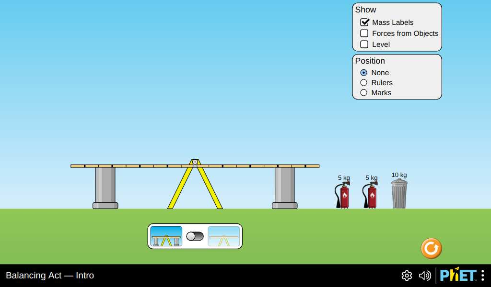 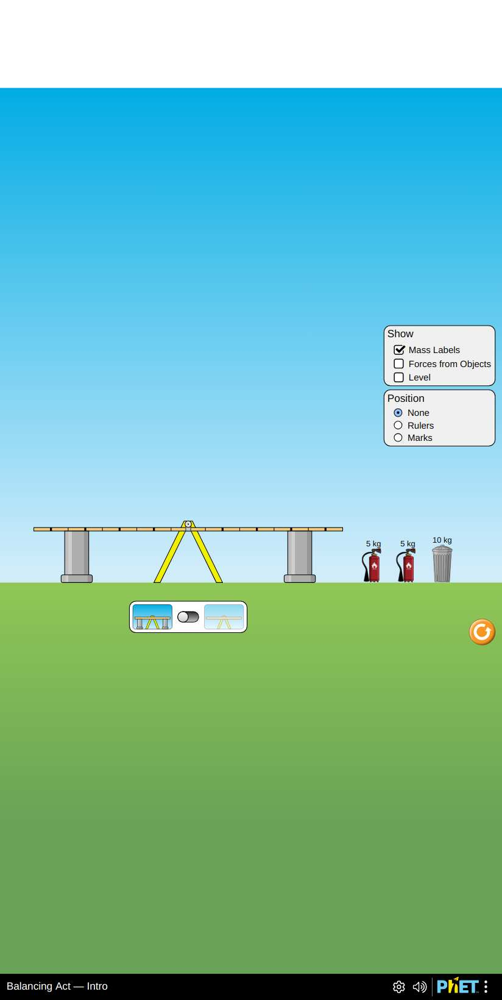

Escutas no document/window: load:9 pageshow:9 visibilitychange:7 keydown:6 click:5 keyup:4 blur:4 touchstart:3 resize:3 pagehide:3

---

### phet-fazer-dez

`https://phet.colorado.edu/sims/html/make-a-ten/latest/make-a-ten_all.html?screens=1` — ‪Make a Ten‬

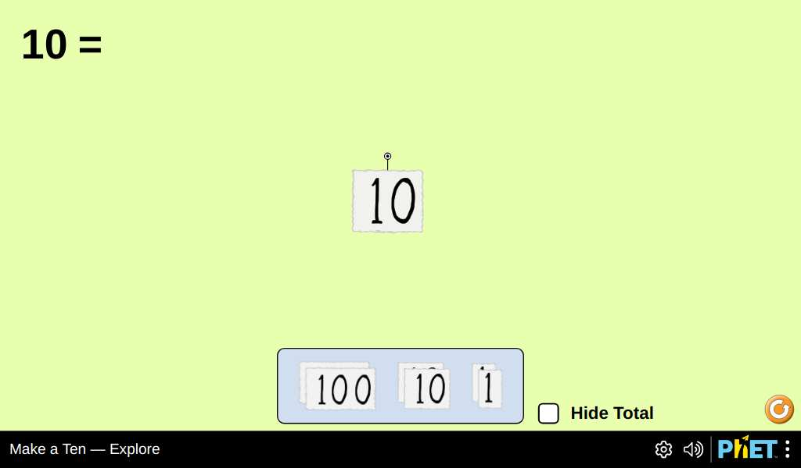 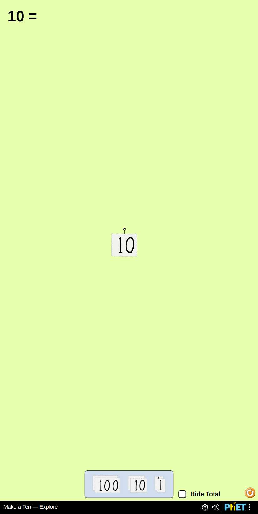

Escutas no document/window: load:9 pageshow:9 keydown:6 visibilitychange:6 click:5 pagehide:4 keyup:4 blur:4 touchstart:3 resize:2

---

### phet-reta-numerica

`https://phet.colorado.edu/sims/html/number-line-integers/latest/number-line-integers_all.html?screens=1` — ‪Number Line: Integers‬

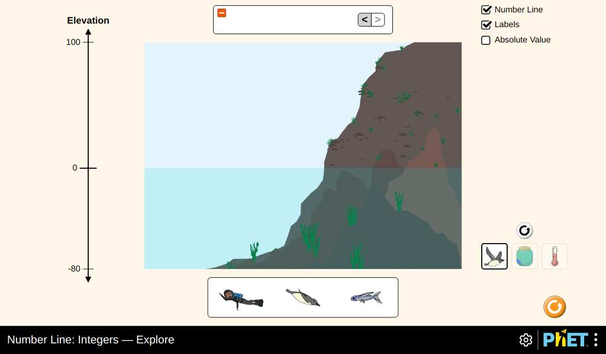 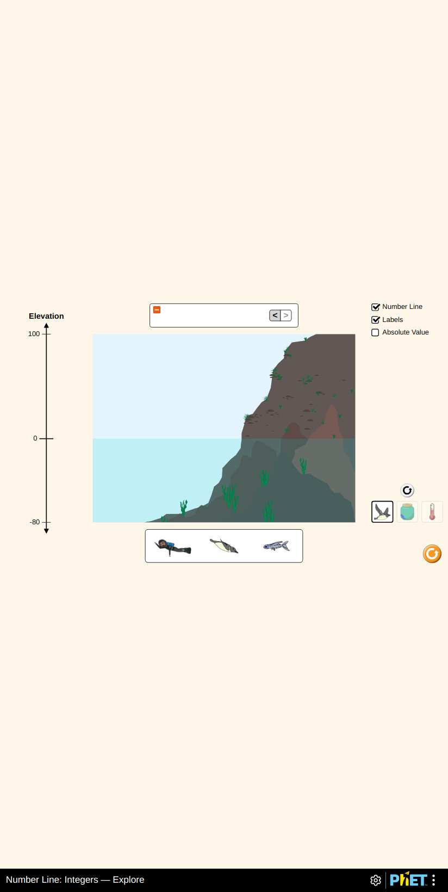

Escutas no document/window: load:10 pageshow:9 visibilitychange:7 keydown:6 click:5 keyup:4 DOMContentLoaded:3 resize:3 blur:3 pagehide:3

---

### phet-fracoes

`https://phet.colorado.edu/sims/html/fraction-matcher/latest/fraction-matcher_all.html?screens=1` — ‪Fraction Matcher‬

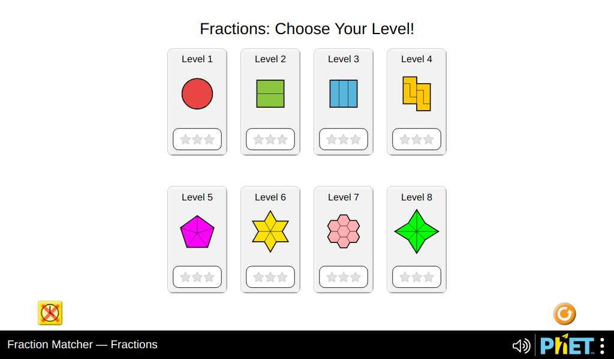 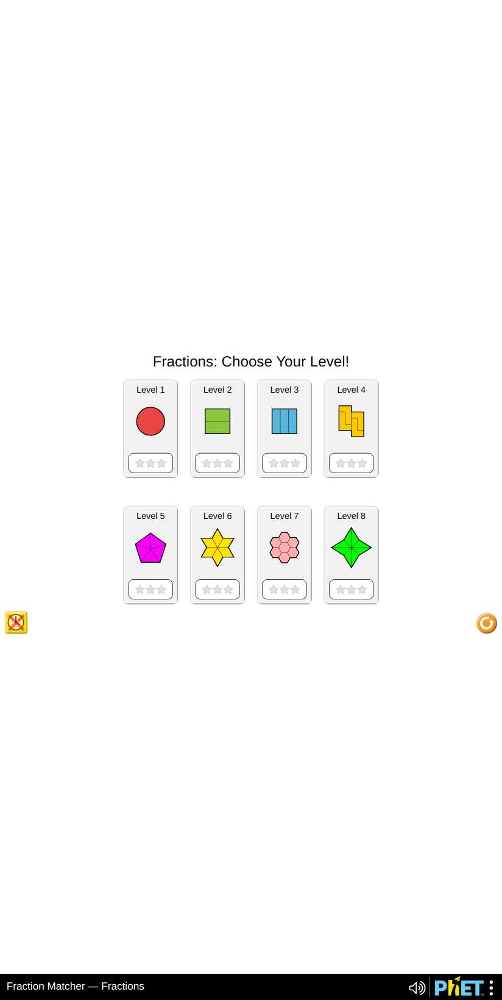

Escutas no document/window: pageshow:9 load:8 visibilitychange:7 resize:3 pagehide:3 click:3 pointerdown:2 pointerup:2 pointermove:2 pointerover:2

---

### phet-arranjo

`https://phet.colorado.edu/sims/html/area-model-multiplication/latest/area-model-multiplication_all.html?screens=1` — ‪Area Model Multiplication‬

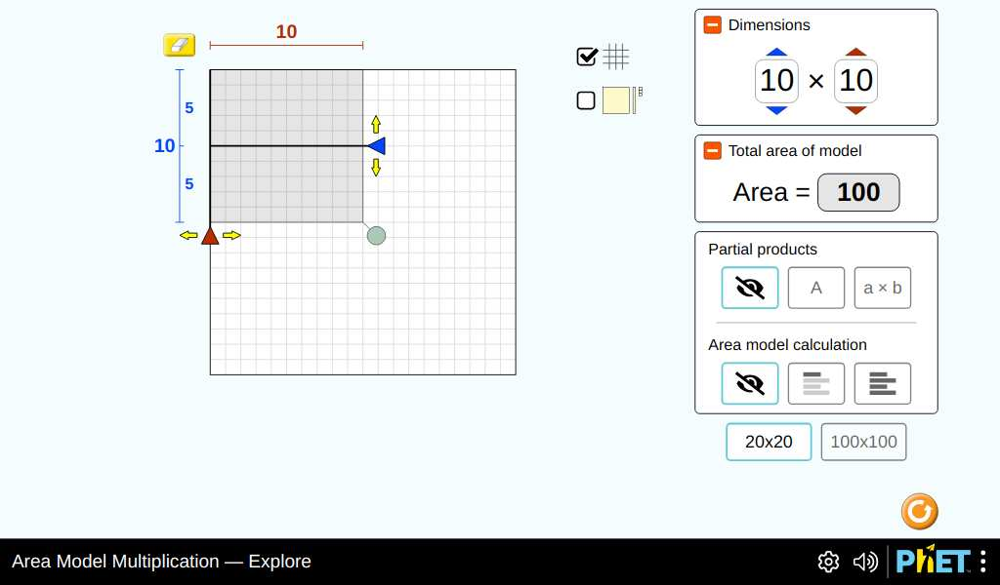 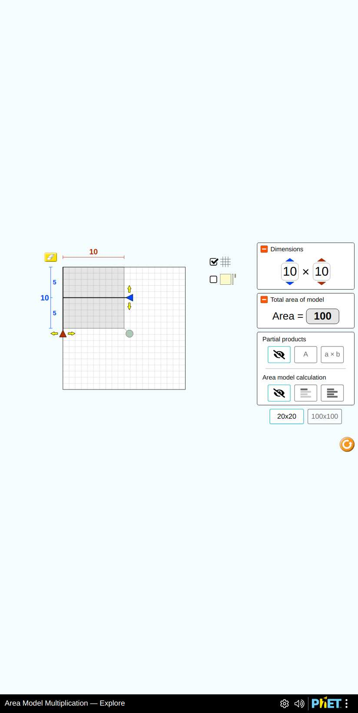

Escutas no document/window: load:9 pageshow:9 keydown:6 visibilitychange:6 click:5 keyup:4 touchstart:3 resize:3 blur:3 pagehide:3

---

### mlc-base-dez

`https://apps.mathlearningcenter.org/number-pieces/` — Number Pieces by The Math Learning Center

 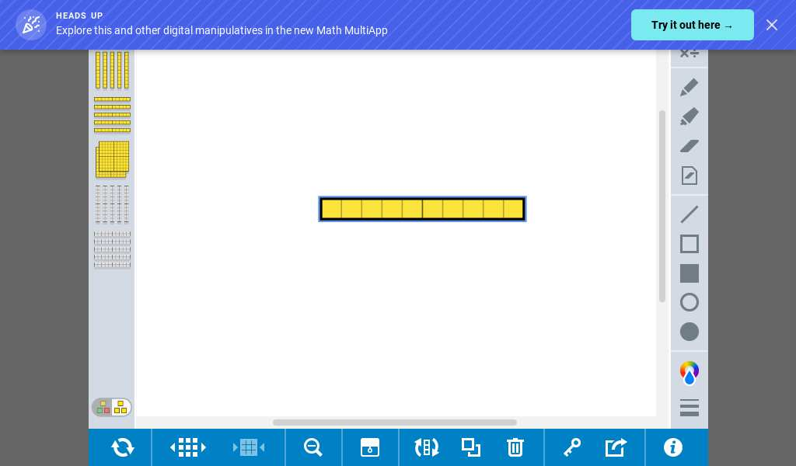  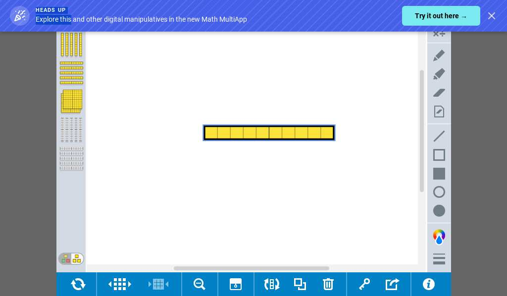  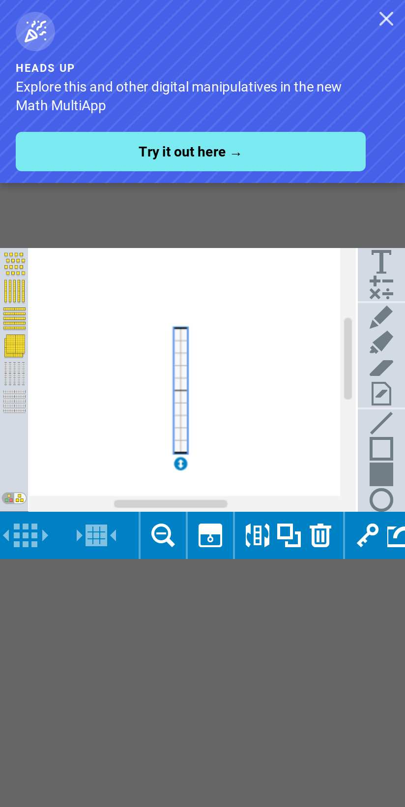

Arrastáveis (amostra):

- `canvas.draggable-canvas` 33×33 · eventos: dblclick mousedown · touch-action: auto · cursor: pointer · transição: 0s
- `canvas.draggable-canvas` 33×268 · eventos: dblclick mousedown · touch-action: auto · cursor: pointer · transição: 0s
- `canvas.draggable-canvas` 268×33 · eventos: dblclick mousedown · touch-action: auto · cursor: pointer · transição: 0s
- `canvas.draggable-canvas` 268×268 · eventos: dblclick mousedown · touch-action: auto · cursor: pointer · transição: 0s
- `canvas.draggable-canvas` 33×271 · eventos: dblclick mousedown · touch-action: auto · cursor: pointer · transição: 0s

Tocáveis (amostra):

- `menu.tray.standard` 61×552 · "" · eventos: click
- `button.toolbar-button.standard` 54×54 · "" · eventos: — · aria-label
- `canvas.draggable-canvas` 33×33 · "" · eventos: dblclick mousedown
- `button.toolbar-button.standard` 54×54 · "" · eventos: — · aria-label
- `canvas.draggable-canvas` 33×268 · "" · eventos: dblclick mousedown

Clique: 21 mutações no 1º s · som media/webaudio 0/0
Arrasto: deslocou 0 px · 24 mutações após soltar · som 0/0
Escutas no document/window: mouseup:13 mousemove:13 pointerdown:12 pointerup:12 pointermove:10 click:5 pagehide:4 keydown:3 keyup:3 auxclick:3

---

### mlc-relogio

`https://apps.mathlearningcenter.org/math-clock/` — Math Clock by The Math Learning Center

 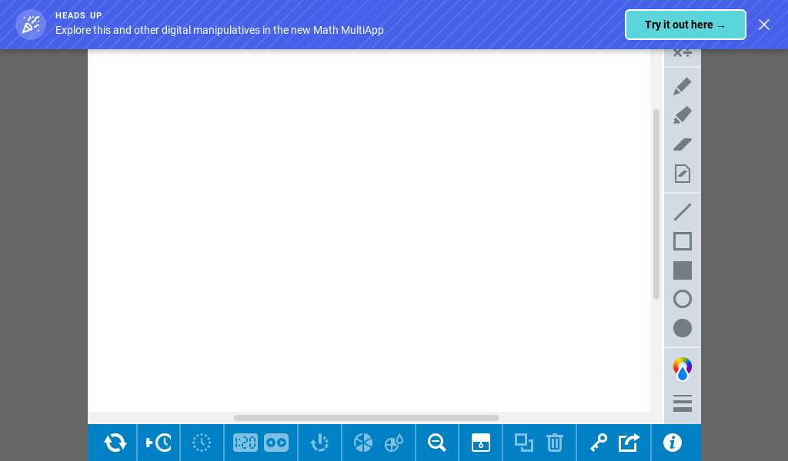 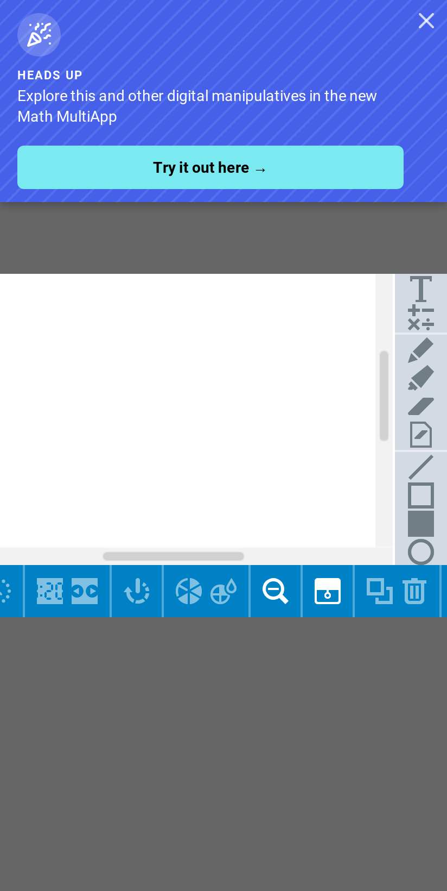 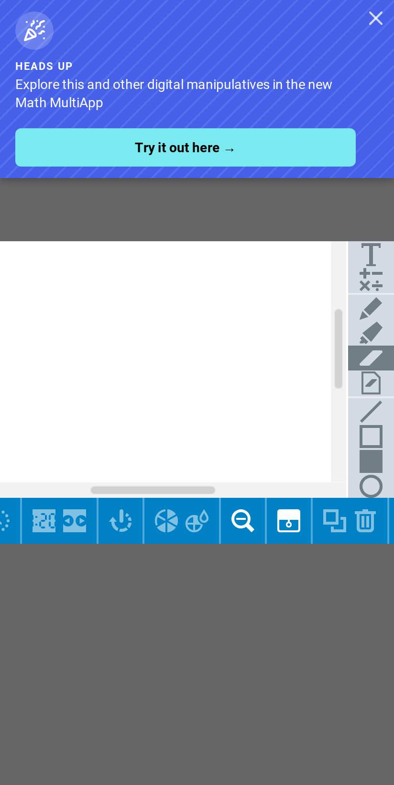

Arrastáveis (amostra):

- `canvas.workspace__canvas` 747×552 · eventos: dblclick mousedown contextmenu · touch-action: auto · cursor: auto · transição: 0s

Tocáveis (amostra):

- `canvas.workspace__canvas` 747×552 · "" · eventos: dblclick mousedown contextmenu
- `menu.o-annotations` 50×552 · "" · eventos: click
- `button.o-annotations__button.o-annotations__button-layout.a-annotation-button` 48×38 · "" · eventos: click · aria-label
- `button.o-annotations__button.o-annotations__button-layout.a-annotation-button` 48×38 · "" · eventos: click · aria-label
- `button.o-annotations__button.o-annotations__button-layout.a-annotation-button` 48×38 · "" · eventos: click · aria-label

Clique: 26 mutações no 1º s · som media/webaudio 0/0
Escutas no document/window: click:5 pagehide:4 mouseup:3 mousemove:3 load:3 keydown:3 keyup:3 auxclick:3 mousedown:3 focus:2

---

### mlc-reta-numerica

`https://apps.mathlearningcenter.org/number-line/` — Number Line, by The Math Learning Center

(fechei um aviso: "OK")

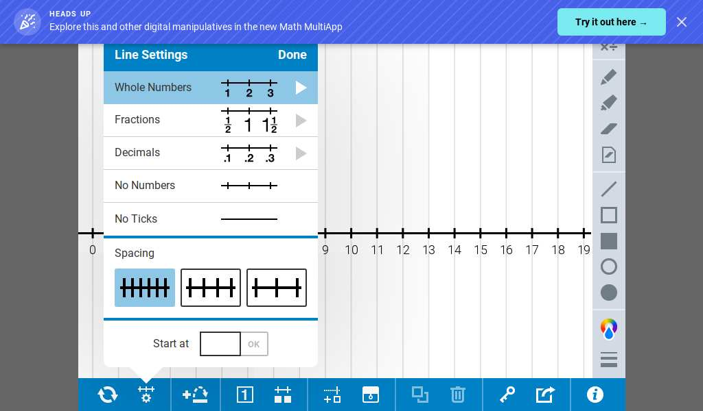  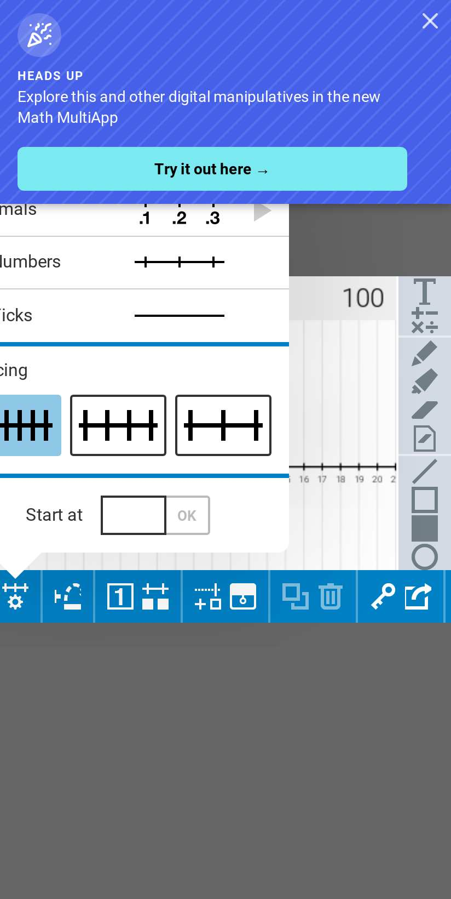 

Arrastáveis (amostra):

- `canvas.workspace__canvas` 747×552 · eventos: dblclick mousedown contextmenu · touch-action: auto · cursor: auto · transição: 0s

Tocáveis (amostra):

- `canvas.workspace__canvas` 747×552 · "" · eventos: dblclick mousedown contextmenu
- `menu.o-annotations` 50×552 · "" · eventos: click
- `button.o-annotations__button.o-annotations__button-layout.a-annotation-button` 48×38 · "" · eventos: click · aria-label
- `button.o-annotations__button.o-annotations__button-layout.a-annotation-button` 48×38 · "" · eventos: click · aria-label
- `button.o-annotations__button.o-annotations__button-layout.a-annotation-button` 48×38 · "" · eventos: click · aria-label

Clique: 16 mutações no 1º s · som media/webaudio 0/0
Escutas no document/window: pagehide:4 click:4 load:3 keydown:3 keyup:3 mouseup:2 mousemove:2 focus:2 auxclick:2 submit:2

---

### mlc-fracoes

`https://apps.mathlearningcenter.org/fractions/` — Fractions by The Math Learning Center

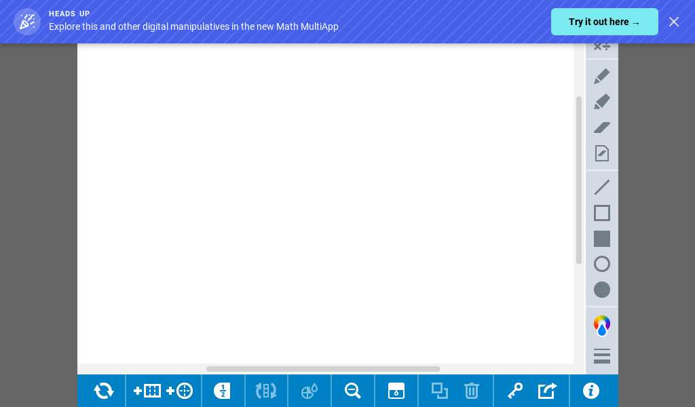 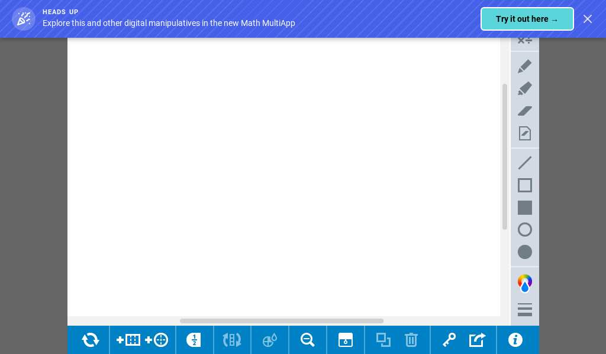 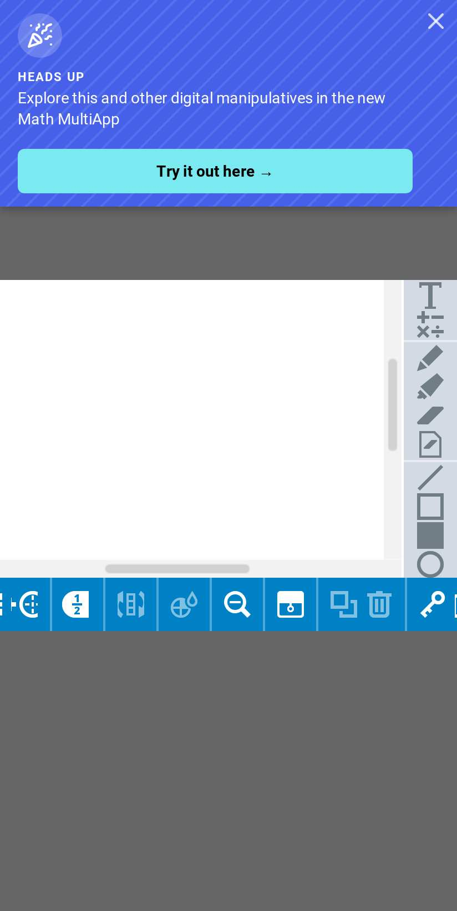 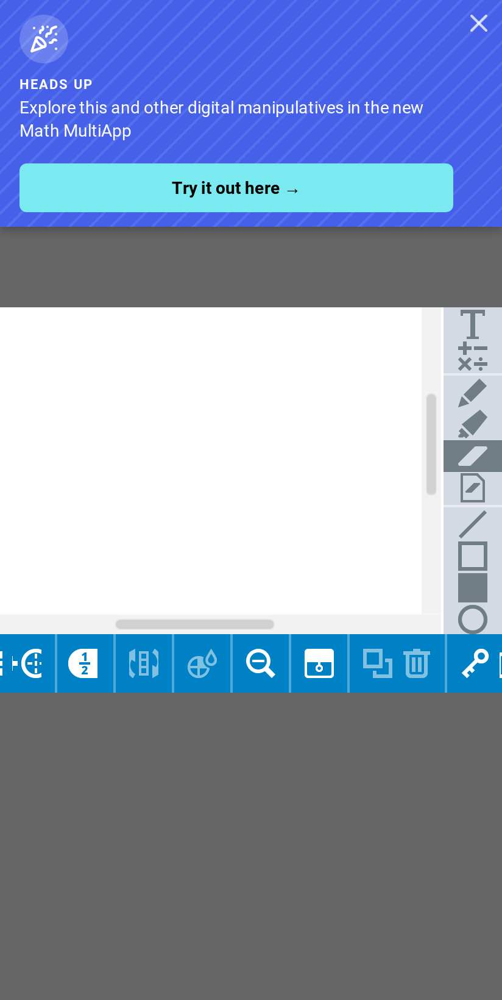

Arrastáveis (amostra):

- `canvas.workspace__canvas` 747×552 · eventos: dblclick mousedown contextmenu · touch-action: auto · cursor: auto · transição: 0s

Tocáveis (amostra):

- `canvas.workspace__canvas` 747×552 · "" · eventos: dblclick mousedown contextmenu
- `menu.o-annotations` 50×552 · "" · eventos: click
- `button.o-annotations__button.o-annotations__button-layout.a-annotation-button` 48×38 · "" · eventos: click · aria-label
- `button.o-annotations__button.o-annotations__button-layout.a-annotation-button` 48×38 · "" · eventos: click · aria-label
- `button.o-annotations__button.o-annotations__button-layout.a-annotation-button` 48×38 · "" · eventos: click · aria-label

Clique: 14 mutações no 1º s · som media/webaudio 0/0
Escutas no document/window: click:5 pagehide:4 mouseup:3 mousemove:3 load:3 keydown:3 keyup:3 auxclick:3 mousedown:3 focus:2

---

### mlc-dinheiro

`https://apps.mathlearningcenter.org/money-pieces/` — Money Pieces by The Math Learning Center

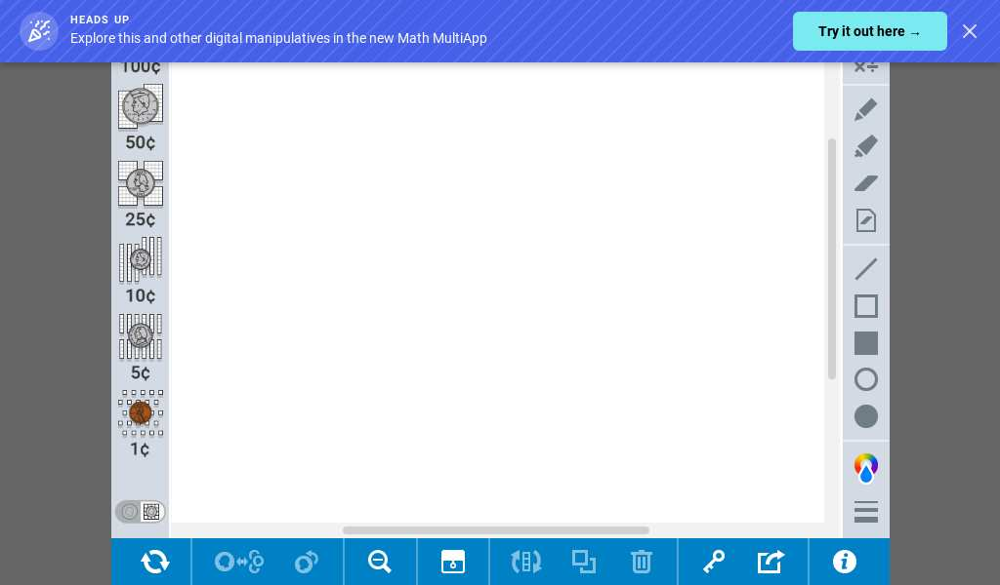  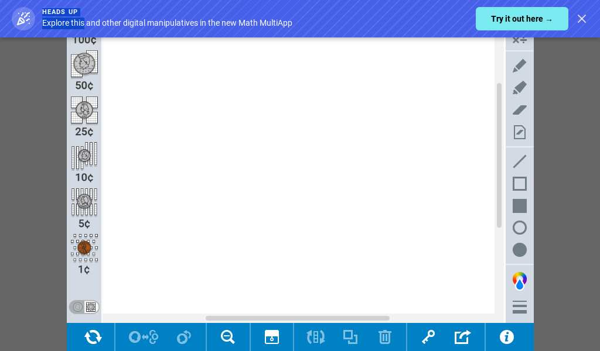  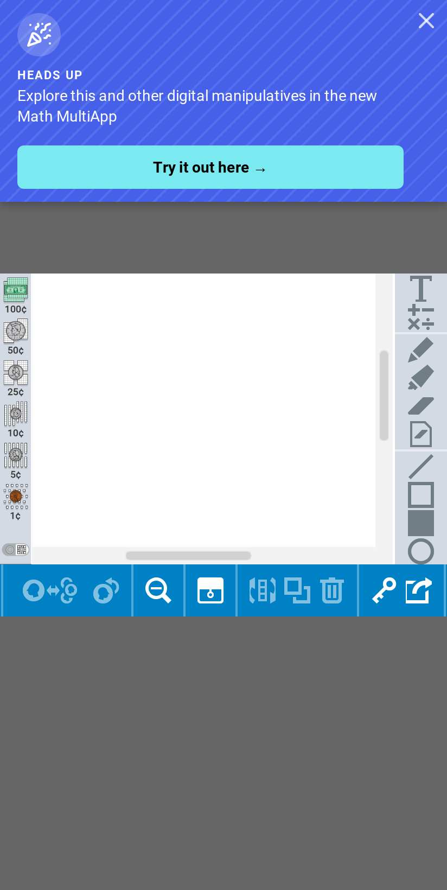 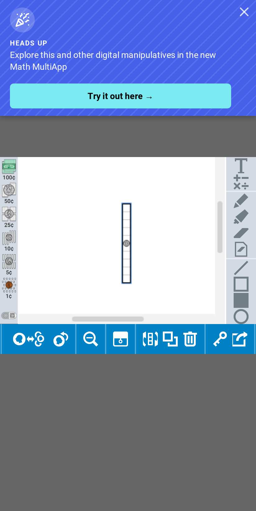

Arrastáveis (amostra):

- `canvas.draggable-canvas` 271×271 · eventos: dblclick mousedown · touch-action: auto · cursor: pointer · transição: 0s
- `canvas.draggable-canvas` 141×271 · eventos: dblclick mousedown · touch-action: auto · cursor: pointer · transição: 0s
- `canvas.draggable-canvas` 141×141 · eventos: dblclick mousedown · touch-action: auto · cursor: pointer · transição: 0s
- `canvas.draggable-canvas` 36×271 · eventos: dblclick mousedown · touch-action: auto · cursor: pointer · transição: 0s
- `canvas.draggable-canvas` 36×141 · eventos: dblclick mousedown · touch-action: auto · cursor: pointer · transição: 0s

Tocáveis (amostra):

- `menu.tray` 61×552 · "" · eventos: click
- `button.toolbar-button` 60×75 · "" · eventos: — · aria-label
- `canvas.draggable-canvas` 271×271 · "" · eventos: dblclick mousedown
- `button.toolbar-button` 60×75 · "" · eventos: — · aria-label
- `canvas.draggable-canvas` 141×271 · "" · eventos: dblclick mousedown

Clique: 12 mutações no 1º s · som media/webaudio 0/0
Arrasto: deslocou 0 px · 24 mutações após soltar · som 0/0
Escutas no document/window: mouseup:9 mousemove:9 pointerdown:8 pointerup:8 pointermove:6 click:5 pagehide:4 load:3 keydown:3 keyup:3

---

### toytheater-relogio

`https://toytheater.com/clock/` — Interactive Clock | Telling Time | Analog & Digital | Toy Theater

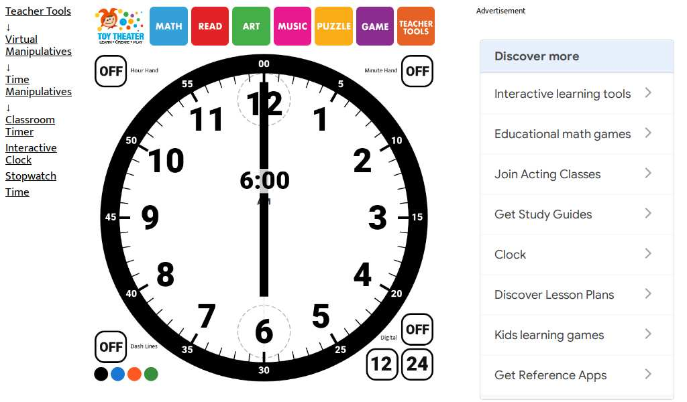  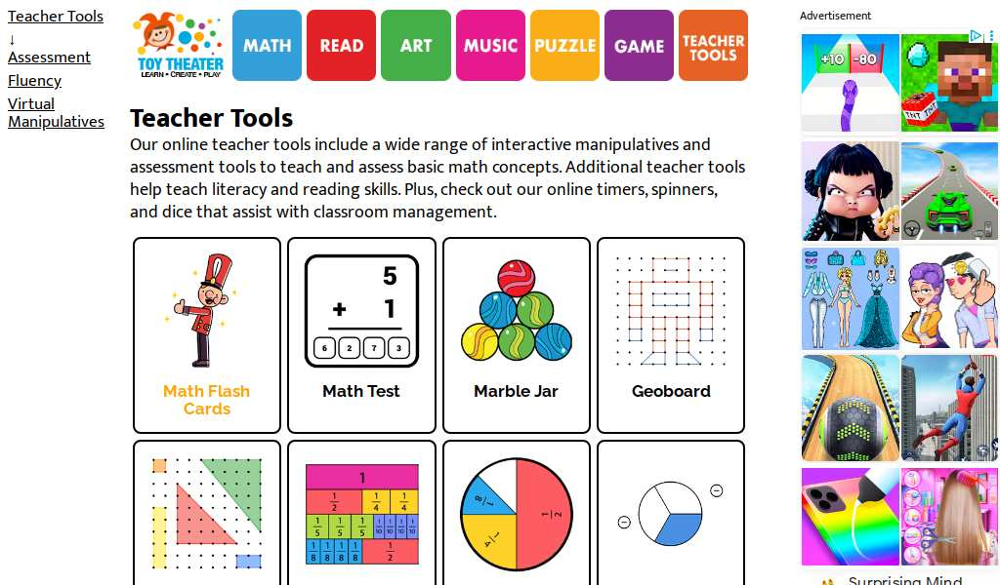  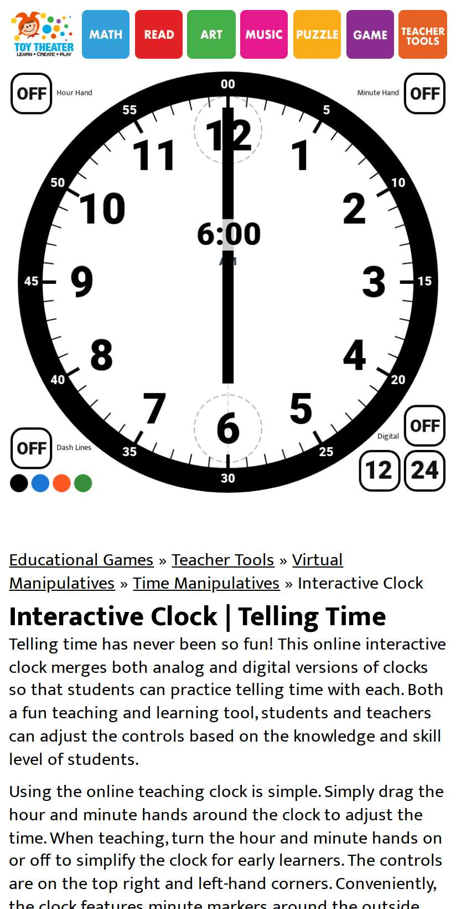 

Tocáveis (amostra):

- `a.` 99×18 · "Teacher Tools" · eventos: —
- `a.` 99×18 · "Assessment" · eventos: —
- `a.` 99×18 · "Fluency" · eventos: —
- `a.` 99×36 · "Virtual Manipulatives" · eventos: —
- `a.` 100×30 · "" · eventos: —

Clique: 0 mutações no 1º s · som media/webaudio 0/0
Arrasto: deslocou 0 px · 16 mutações após soltar · som 0/0
Escutas no document/window: message:23 load:22 visibilitychange:15 DOMContentLoaded:11 pageshow:8 click:8 pagehide:6 mousedown:6 keydown:3 test:3

---

### toytheater-tangram

`https://toytheater.com/tangram/` — Tangram | Free Virtual Manipulatives | Toy Theater

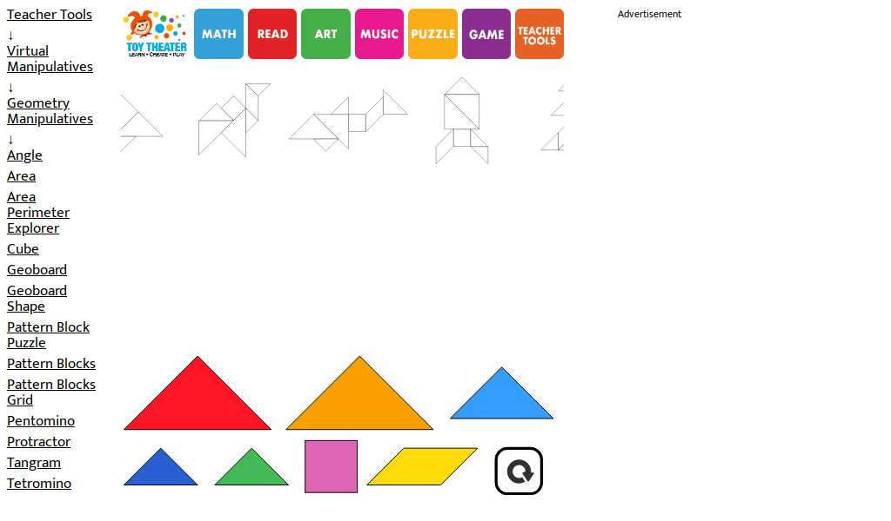  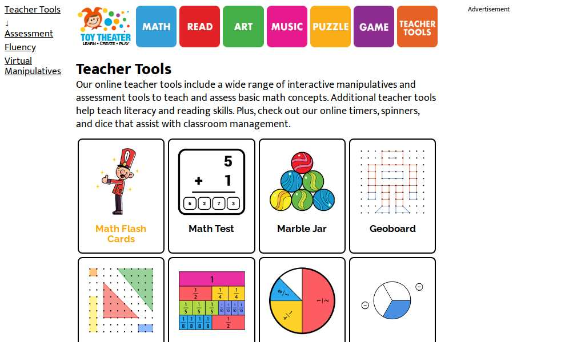  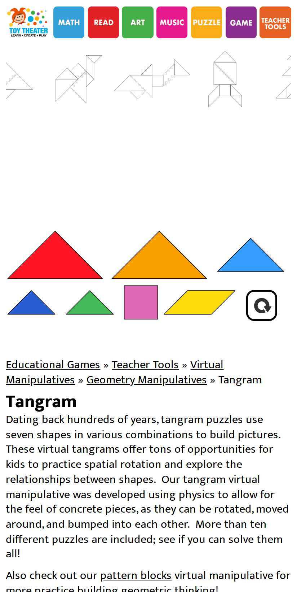 

Tocáveis (amostra):

- `a.` 99×18 · "Teacher Tools" · eventos: —
- `a.` 99×18 · "Assessment" · eventos: —
- `a.` 99×18 · "Fluency" · eventos: —
- `a.` 99×36 · "Virtual Manipulatives" · eventos: —
- `a.` 100×30 · "" · eventos: —

Clique: 0 mutações no 1º s · som media/webaudio 0/0
Arrasto: deslocou 0 px · 15 mutações após soltar · som 0/0
Escutas no document/window: message:23 load:20 visibilitychange:13 DOMContentLoaded:9 pageshow:8 click:8 mousedown:6 pagehide:5 keydown:3 test:3

---

### toytheater-base-dez

`https://toytheater.com/base-ten-blocks/` — Base Ten Blocks | Teaching Tools | Toy Theater Educational Games

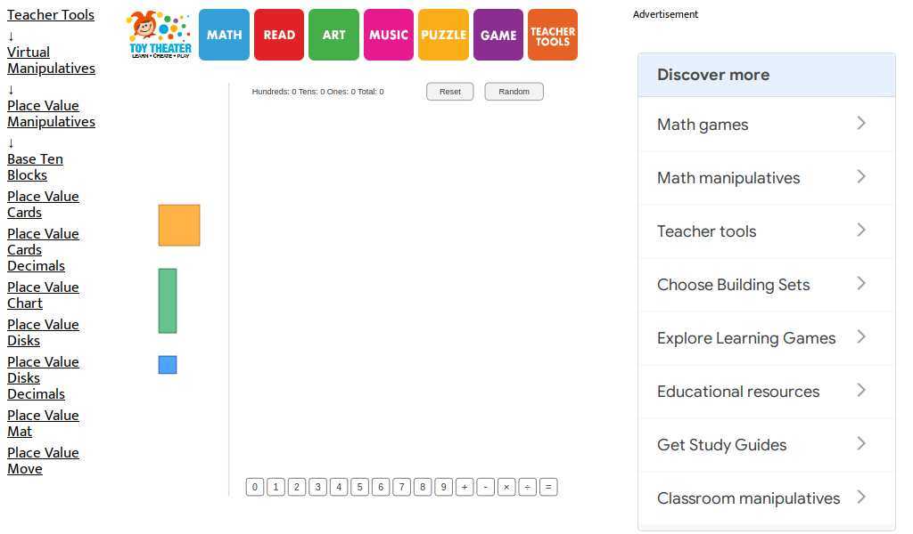 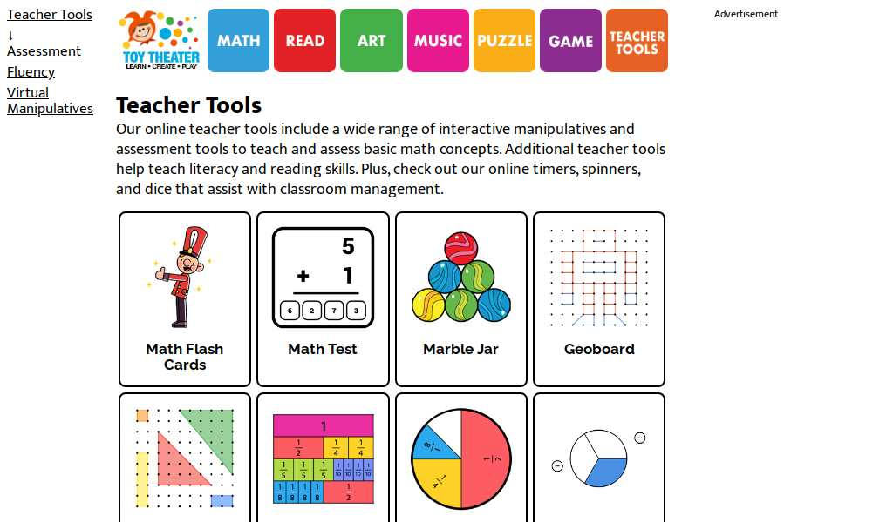 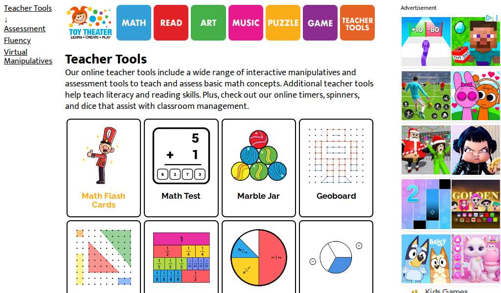  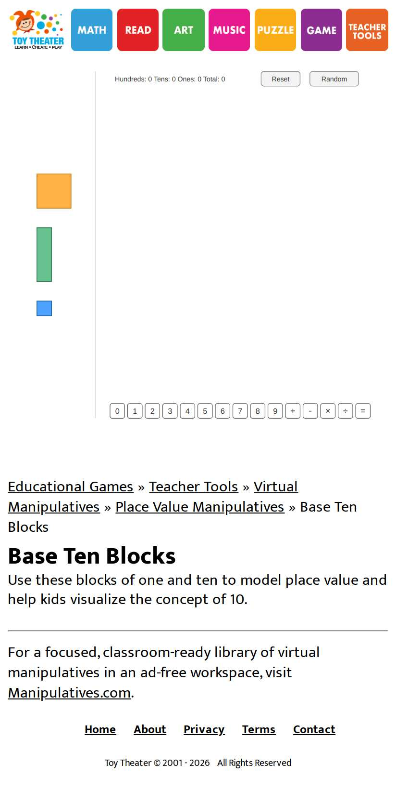 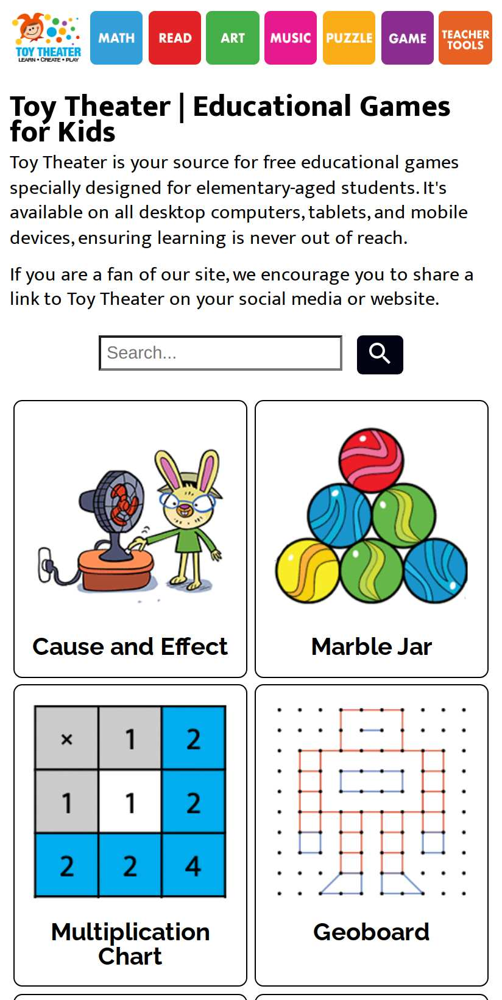

Tocáveis (amostra):

- `a.` 99×18 · "Teacher Tools" · eventos: —
- `a.` 99×18 · "Assessment" · eventos: —
- `a.` 99×18 · "Fluency" · eventos: —
- `a.` 99×36 · "Virtual Manipulatives" · eventos: —
- `a.` 100×30 · "" · eventos: —

Clique: 0 mutações no 1º s · som media/webaudio 0/0
Arrasto: deslocou 0 px · 15 mutações após soltar · som 0/0
Escutas no document/window: message:23 load:22 visibilitychange:14 DOMContentLoaded:9 pageshow:8 click:8 pagehide:7 mousedown:6 keydown:3 test:3

---

### toytheater-balanca

`https://toytheater.com/balance-scale/` — Page not found » Toy Theater

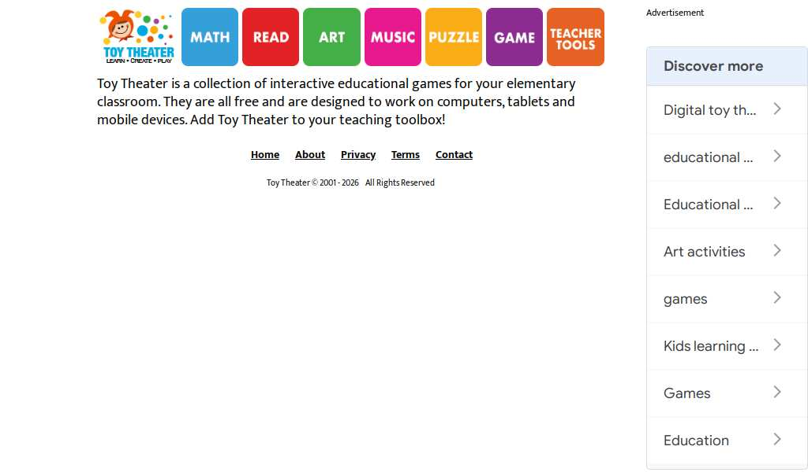 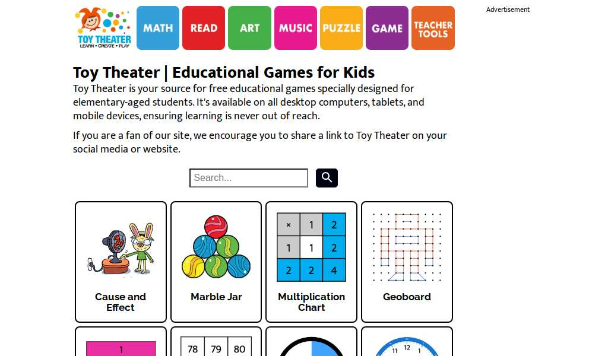 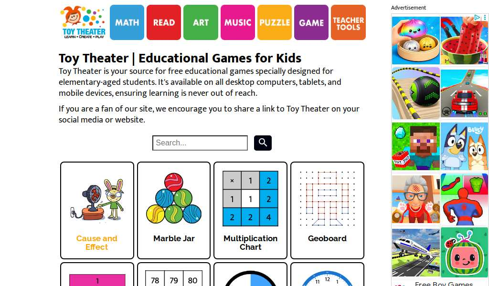 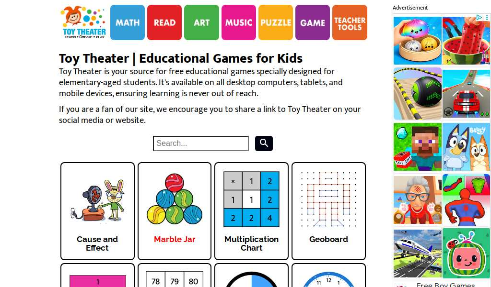 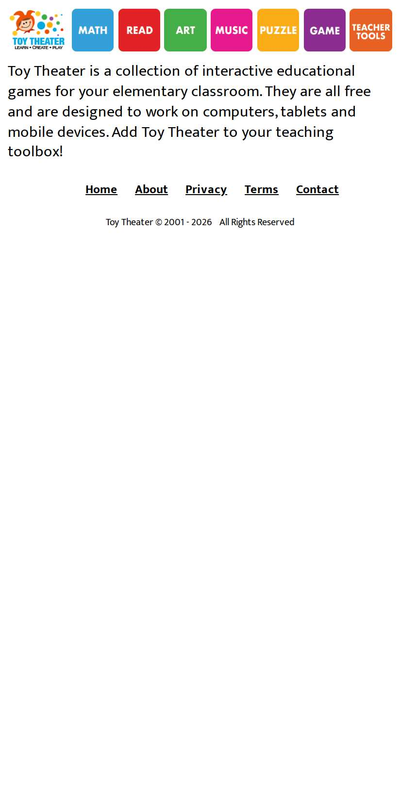 

Tocáveis (amostra):

- `a.` 102×30 · "" · eventos: —
- `a.` 72×30 · "" · eventos: —
- `a.` 72×30 · "" · eventos: —
- `a.` 72×30 · "" · eventos: —
- `a.` 72×30 · "" · eventos: —

Clique: 0 mutações no 1º s · som media/webaudio 0/0
Arrasto: deslocou 0 px · 7 mutações após soltar · som 0/0
Escutas no document/window: message:22 load:21 visibilitychange:16 DOMContentLoaded:9 click:8 pageshow:8 pagehide:6 mousedown:6 keydown:3 test:3

---

### jclic-demo

`https://clic.xtec.cat/repo/index.html?prj=demo` — Biblioteca d'activitats JClic - Activitats de demostració del JClic | zonaClic

  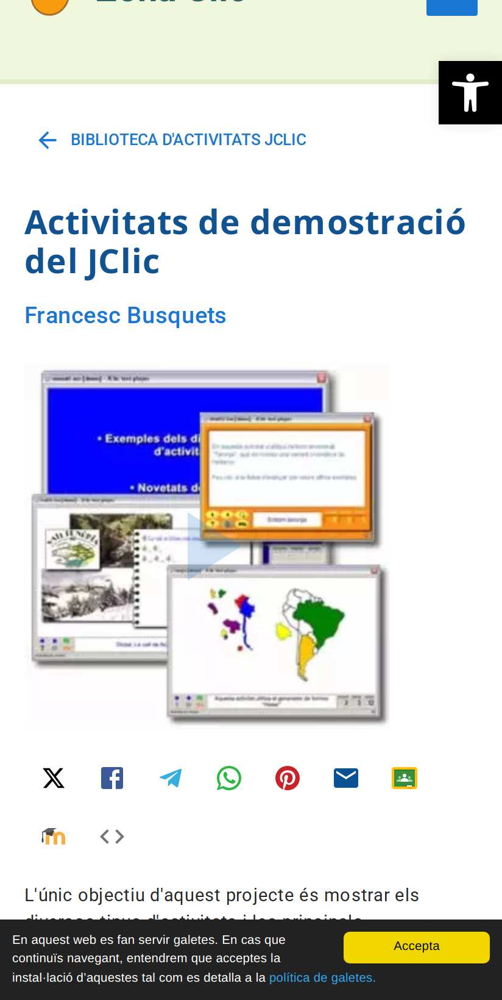 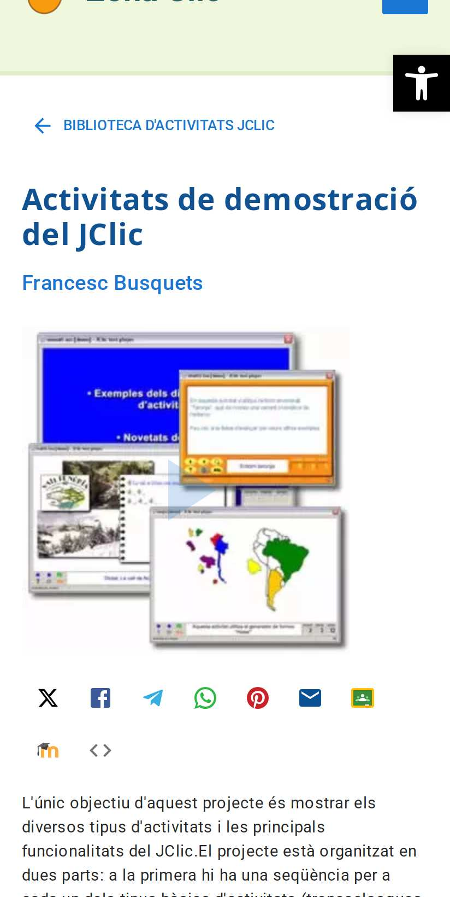

Tocáveis (amostra):

- `a.pojo-a11y-toolbar-link.pojo-a11y-toolbar-toggle-link` 52×52 · "Obre la barra d'eines
					
						Eines " · eventos: click · role=button
- `a.pojo-a11y-toolbar-link.pojo-a11y-btn-resize-font.pojo-a11y-btn-resize-plus` 178×33 · "Augmenta el textAugmenta el text" · eventos: click · role=button
- `a.pojo-a11y-toolbar-link.pojo-a11y-btn-resize-font.pojo-a11y-btn-resize-minus` 178×33 · "Disminueix el textDisminueix el text" · eventos: click · role=button
- `a.pojo-a11y-toolbar-link.pojo-a11y-btn-background-group.pojo-a11y-btn-grayscale` 178×33 · "Escala de grisosEscala de grisos" · eventos: click · role=button
- `a.pojo-a11y-toolbar-link.pojo-a11y-btn-background-group.pojo-a11y-btn-high-contrast` 178×33 · "Contrast altContrast alt" · eventos: click · role=button

Clique: 8 mutações no 1º s · som media/webaudio 0/0
Escutas no document/window: DOMContentLoaded:10 load:4 click:3 astLayoutWidthChanged:3 astPartialContentRendered:3 keydown:3 test:2 message:2 resize:2 readystatechange:1

---
