# 👀 VER RODANDO — atividades de referência jogadas por um Chromium (2026-09-06)

> Gerado por `_padrao/ver_rodando.js` no GitHub Actions (`ver-rodando.yml`). Fotos: PC 1024×600 antes / clique / arrastando / soltou; celular 412×820. **Matéria-prima, não regra.**

| alvo | frames | alvos tocáveis | arrasto (n) | eventos que os alvos escutam | touch-action dos arrastáveis | alvo mín. | fonte mín. | animados | som (media/webaudio) | arrasto deslocou | mutações após soltar | draggable= | canvas/svg |
|---|--:|--:|--:|---|---|--:|--:|--:|---|--:|--:|--:|---|
| **phet-contar** | 1 | 0 | 0 |  |  | — | 14 | 0 | 0/29 | — | — | 0 | 0/3 |
| **phet-comparar** | 1 | 0 | 0 |  |  | — | 12 | 0 | 0/22 | — | — | 0 | 0/3 |
| **topmarks-hit-the-button** | 2 | 2 | 0 | click:1 |  | 15 | 13 | 2 | 0/0 | — | — | 0 | 0/0 |
| **topmarks-teddy-numbers** | 2 | 2 | 0 | click:1 |  | 15 | 13 | 2 | 0/0 | — | — | 0 | 0/0 |
| **topmarks-caterpillar-ordering** | 2 | 2 | 0 | click:1 |  | 15 | 13 | 2 | 0/0 | — | — | 0 | 0/0 |
| **topmarks-teaching-clock** | 2 | 2 | 0 | click:1 |  | 15 | 13 | 2 | 0/0 | — | — | 0 | 0/0 |
| **topmarks-coins** | 2 | 2 | 0 | click:1 |  | 15 | 13 | 2 | 0/0 | — | — | 0 | 0/0 |
| **topmarks-daily10** | 2 | 2 | 0 | click:1 |  | 15 | 13 | 2 | 0/0 | — | — | 0 | 0/0 |
| **ictgames-inicio** | 1 | 34 | 0 | click:16 |  | 20 | 14 | 16 | 0/0 | 3px | 0 | 0 | 0/0 |
| **sesame-games** | 2 | 61 | 1 | click:3 auxclick:1 gotpointercapture:1 keydown:1 keypress:1 keyup:1 | auto:1 | 42 | 12 | 21 | 0/0 | — | 29 (clique) | 0 | 0/14 |
| **starfall-abc** | 1 | 19 | 0 | click:2 |  | 14 | 13 | 9 | 0/0 | — | 0 (clique) | 0 | 0/0 |
| **ictgames-valor-posicional** | 1 | 34 | 0 | click:16 |  | 20 | 14 | 16 | 0/0 | 3px | 0 | 0 | 0/0 |
| **ictgames-valor-posicional-2** | 1 | 34 | 0 | click:16 |  | 20 | 14 | 16 | 0/0 | 3px | 0 | 0 | 0/0 |
| **ictgames-shark-numbers** | 1 | 0 | 0 |  |  | — | — | 0 | 0/2 | 362px | 0 | 0 | 2/0 |
| **ictgames-shark-numbers-2** | 1 | 10 | 0 |  |  | 16 | 12 | 3 | 0/0 | — | 0 (clique) | 0 | 0/0 |

## Fotos e detalhes por alvo

### phet-contar

`https://phet.colorado.edu/sims/html/number-play/latest/number-play_all.html?screens=1` — ‪Number Play‬

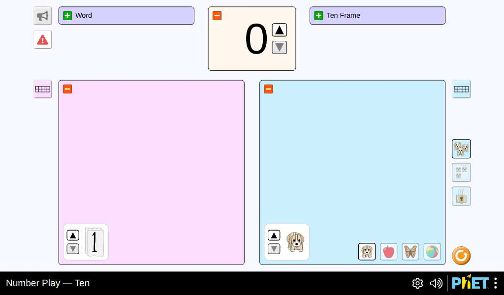 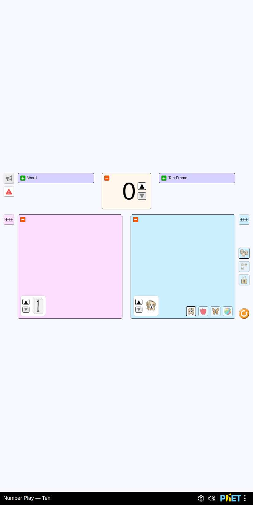

Escutas no document/window: pageshow:9 load:7 visibilitychange:6 keydown:5 click:5 resize:3 keyup:3 pagehide:3 touchstart:2 focus:2

---

### phet-comparar

`https://phet.colorado.edu/sims/html/number-compare/latest/number-compare_all.html?screens=1` — ‪Number Compare‬

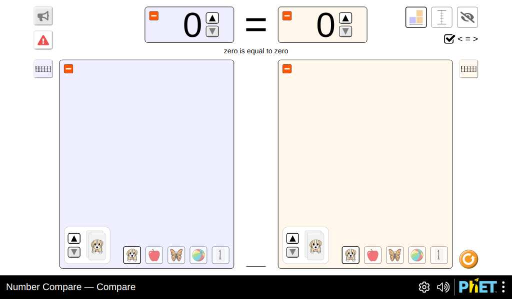 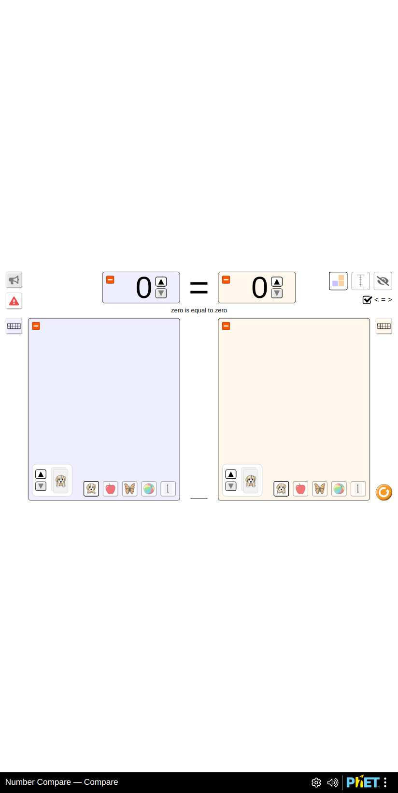

Escutas no document/window: pageshow:9 load:7 visibilitychange:6 keydown:5 click:5 resize:3 keyup:3 pagehide:3 focus:2 blur:2

---

### topmarks-hit-the-button

`https://www.topmarks.co.uk/maths-games/hit-the-button` — Attention Required! | Cloudflare

 

Tocáveis (amostra):

- `button.cf-footer-ip-reveal-btn` 82×20 · "Click to reveal" · eventos: click
- `a.` 59×15 · "Cloudflare" · eventos: —

Escutas no document/window: pageshow:7 visibilitychange:4 DOMContentLoaded:2 click:2 load:2 prerenderingchange:1 keydown:1 __playwright_global_listeners_check__:1 mousemove:1 pointerdown:1

---

### topmarks-teddy-numbers

`https://www.topmarks.co.uk/learning-to-count/teddy-numbers` — Attention Required! | Cloudflare

 

Tocáveis (amostra):

- `button.cf-footer-ip-reveal-btn` 82×20 · "Click to reveal" · eventos: click
- `a.` 59×15 · "Cloudflare" · eventos: —

Escutas no document/window: pageshow:7 visibilitychange:4 DOMContentLoaded:2 click:2 load:2 prerenderingchange:1 keydown:1 __playwright_global_listeners_check__:1 mousemove:1 pointerdown:1

---

### topmarks-caterpillar-ordering

`https://www.topmarks.co.uk/ordering-and-sequencing/caterpillar-ordering` — Attention Required! | Cloudflare

 

Tocáveis (amostra):

- `button.cf-footer-ip-reveal-btn` 82×20 · "Click to reveal" · eventos: click
- `a.` 59×15 · "Cloudflare" · eventos: —

Escutas no document/window: pageshow:7 visibilitychange:4 DOMContentLoaded:2 click:2 load:2 prerenderingchange:1 keydown:1 __playwright_global_listeners_check__:1 mousemove:1 pointerdown:1

---

### topmarks-teaching-clock

`https://www.topmarks.co.uk/time/teaching-clock` — Attention Required! | Cloudflare

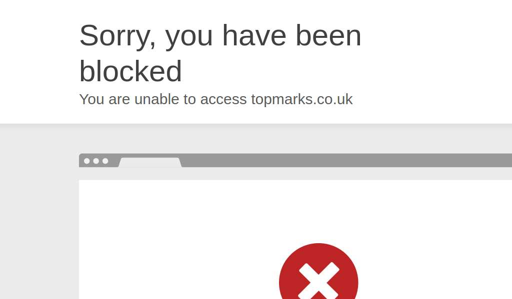 

Tocáveis (amostra):

- `button.cf-footer-ip-reveal-btn` 82×20 · "Click to reveal" · eventos: click
- `a.` 59×15 · "Cloudflare" · eventos: —

Escutas no document/window: pageshow:7 visibilitychange:4 DOMContentLoaded:2 click:2 load:2 prerenderingchange:1 keydown:1 __playwright_global_listeners_check__:1 mousemove:1 pointerdown:1

---

### topmarks-coins

`https://www.topmarks.co.uk/money/coins-game` — Attention Required! | Cloudflare

 

Tocáveis (amostra):

- `button.cf-footer-ip-reveal-btn` 82×20 · "Click to reveal" · eventos: click
- `a.` 59×15 · "Cloudflare" · eventos: —

Escutas no document/window: pageshow:7 visibilitychange:3 DOMContentLoaded:2 click:2 load:2 prerenderingchange:1 keydown:1 __playwright_global_listeners_check__:1 mousemove:1 pointerdown:1

---

### topmarks-daily10

`https://www.topmarks.co.uk/maths-games/daily10` — Attention Required! | Cloudflare

 

Tocáveis (amostra):

- `button.cf-footer-ip-reveal-btn` 82×20 · "Click to reveal" · eventos: click
- `a.` 59×15 · "Cloudflare" · eventos: —

Escutas no document/window: pageshow:7 visibilitychange:4 DOMContentLoaded:2 click:2 load:2 prerenderingchange:1 keydown:1 __playwright_global_listeners_check__:1 mousemove:1 pointerdown:1

---

### ictgames-inicio

`https://www.ictgames.com/` — ictgames - Home Page

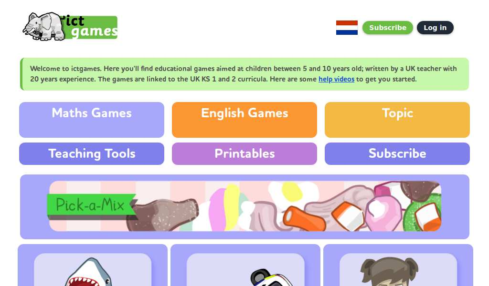 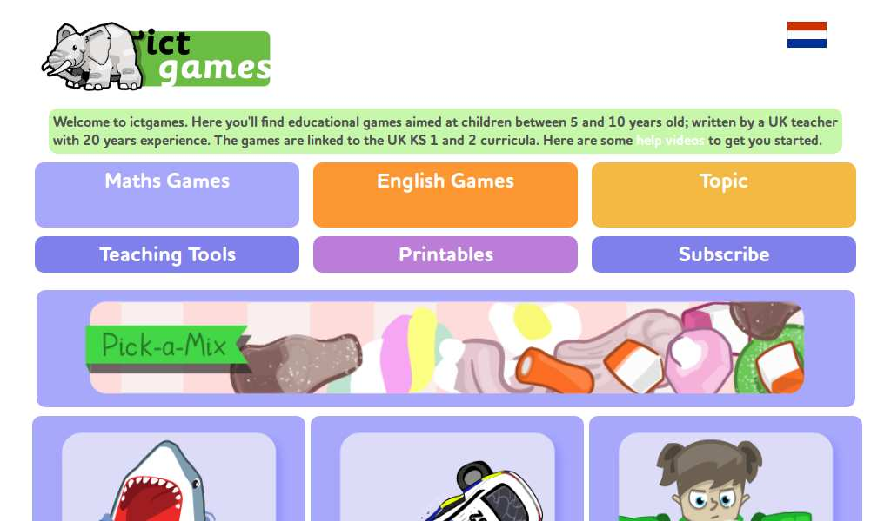 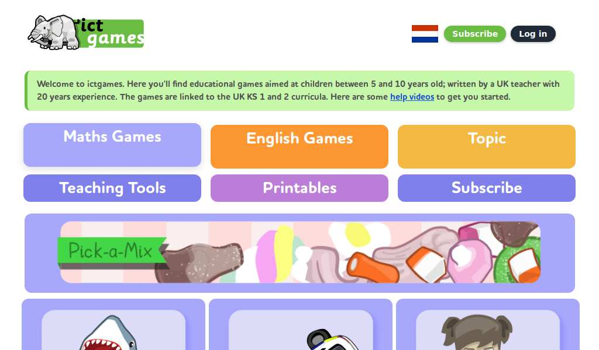   

Tocáveis (amostra):

- `a.` 200×67 · "" · eventos: —
- `a.` 45×30 · "" · eventos: —
- `a.ictgames-ctl` 106×28 · "Subscribe" · eventos: —
- `a.ictgames-ctl` 76×28 · "Log in" · eventos: —
- `a.` 75×20 · "help videos" · eventos: —

Clique: 0 mutações no 1º s · som media/webaudio 0/0
Arrasto: deslocou 3 px · 0 mutações após soltar · som 0/0
Escutas no document/window: __playwright_global_listeners_check__:1 mousemove:1 pointerdown:1 pointerup:1 touchstart:1 touchend:1 touchcancel:1 mousedown:1 mouseup:1 click:1

---

### sesame-games

`https://www.sesamestreet.org/games` — Preschool Games | Sesame Street

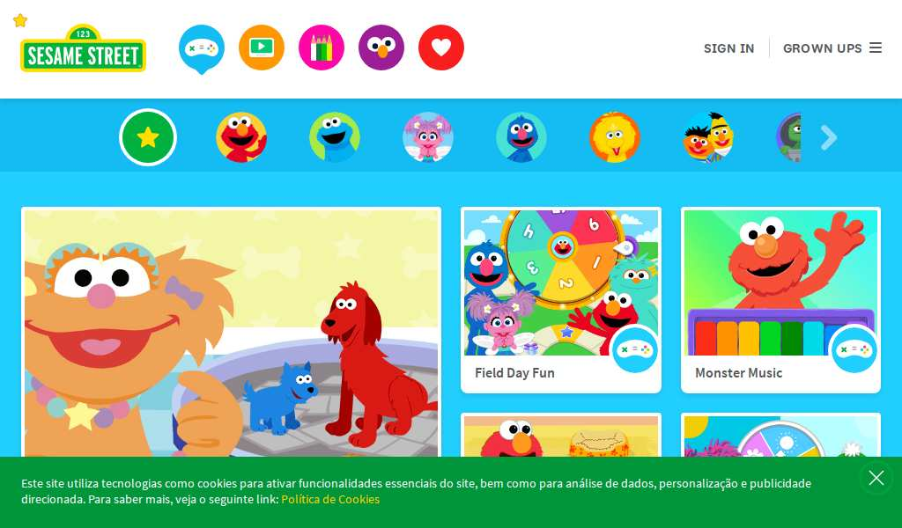 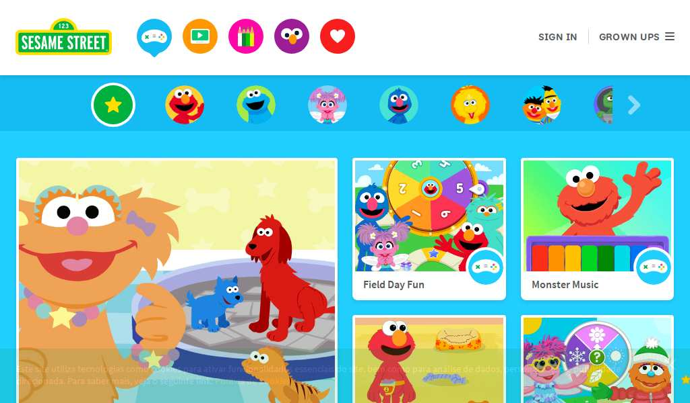 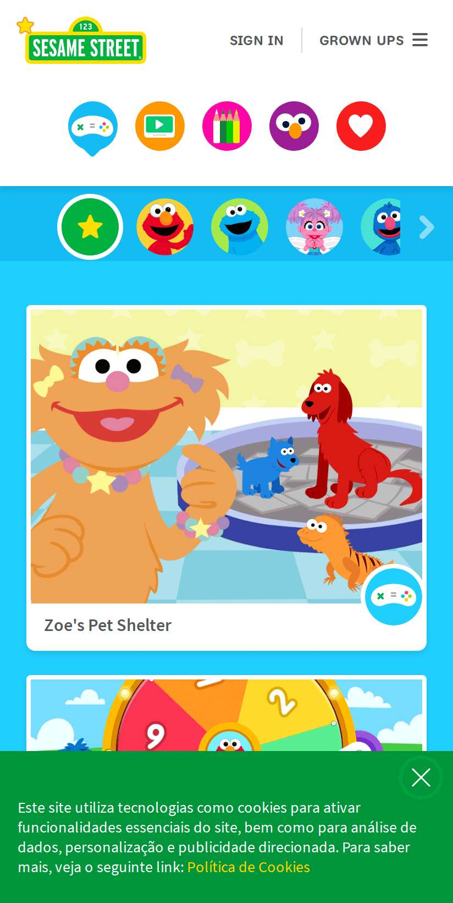 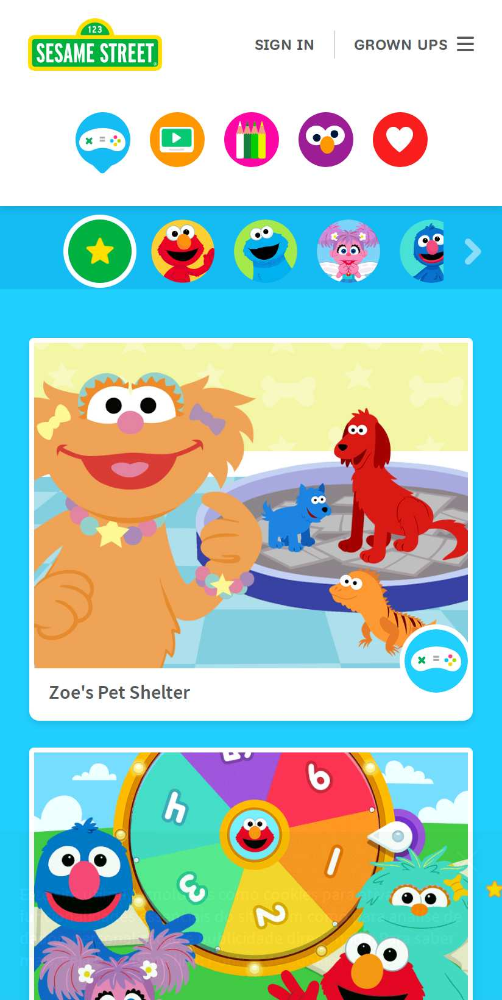

Arrastáveis (amostra):

- `div.` 1024×2330 · eventos: abort auxclick cancel canplay canplaythrough click close contextmenu copy cut drag dragend dragenter dragexit dragleave dragover dragstart drop durationchange emptied encrypted ended error gotpointercapture input invalid keydown keypress keyup load loadeddata loadedmetadata loadstart lostpointercapture mousedown mousemove mouseout mouseover mouseup paste pause play playing pointercancel pointerdown pointermove pointerout pointerover pointerup progress ratechange reset resize seeked seeking stalled submit suspend timeupdate touchcancel touchend touchstart volumechange scroll toggle touchmove waiting wheel animationend animationiteration animationstart dblclick focusin focusout transitionend change compositionend textInput compositionstart compositionupdate · touch-action: auto · cursor: auto · transição: 0s

Tocáveis (amostra):

- `div.` 1024×2330 · "GamesVideosArtMuppetsFavoritesSign InGro" · eventos: abort auxclick cancel canplay canplaythrough click close contextmenu copy cut drag dragend dragenter dragexit dragleave dragover dragstart drop durationchange emptied encrypted ended error gotpointercapture input invalid keydown keypress keyup load loadeddata loadedmetadata loadstart lostpointercapture mousedown mousemove mouseout mouseover mouseup paste pause play playing pointercancel pointerdown pointermove pointerout pointerover pointerup progress ratechange reset resize seeked seeking stalled submit suspend timeupdate touchcancel touchend touchstart volumechange scroll toggle touchmove waiting wheel animationend animationiteration animationstart dblclick focusin focusout transitionend change compositionend textInput compositionstart compositionupdate
- `a.sc-43e89328-0.evLYdW` 143×56 · "" · eventos: —
- `a.sc-10fa9b8e-0.jFCMmg.sc-dc002c22-0` 52×52 · "Games" · eventos: — · role=button
- `a.sc-10fa9b8e-0.PraYL.sc-dc002c22-0` 52×52 · "Videos" · eventos: — · role=button
- `a.sc-10fa9b8e-0.YaeVM.sc-dc002c22-0` 52×52 · "Art" · eventos: — · role=button

Clique: 29 mutações no 1º s · som media/webaudio 0/0
Escutas no document/window: click:24 pagehide:6 visibilitychange:4 load:4 popstate:3 focus:3 mousedown:3 DOMContentLoaded:2 auxclick:2 hashchange:2

---

### starfall-abc

`https://www.starfall.com/h/ltr-classic/` — Learn to Read with Phonics - Starfall

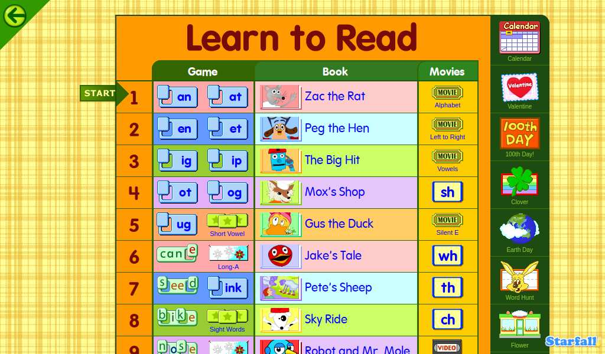 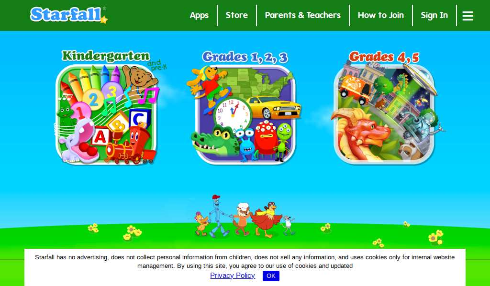 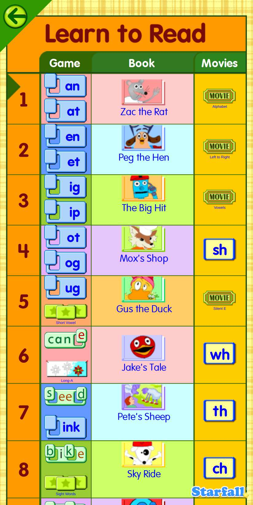 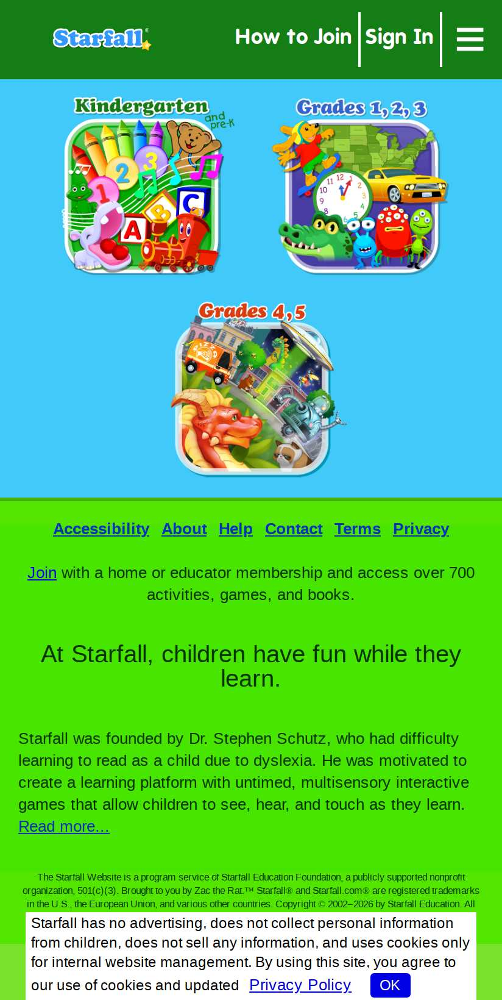

Tocáveis (amostra):

- `a.hide-zoomed-md-d-none` 69×46 · "Apps" · eventos: —
- `a.link-store.hide-zoomed-md-d-none` 76×46 · "Store" · eventos: —
- `a.link-teach.hide-zoomed-md-d-none` 188×46 · "Parents & Teachers" · eventos: —
- `a.` 126×46 · "How to Join" · eventos: —
- `a.` 86×46 · "Sign In" · eventos: —

Clique: 0 mutações no 1º s · som media/webaudio 0/0
Escutas no document/window: DOMContentLoaded:2 load:1

---

### ictgames-valor-posicional

`https://ictgames.com/mobilePage/placeValue.html` — ictgames - Place Value

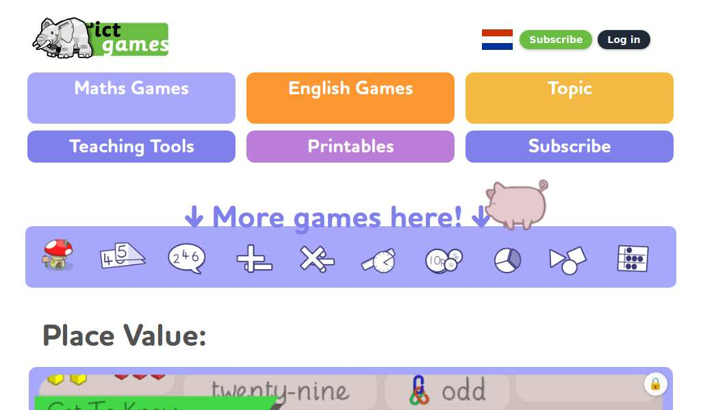 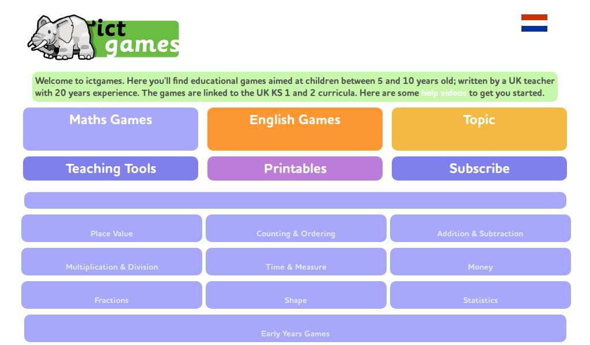   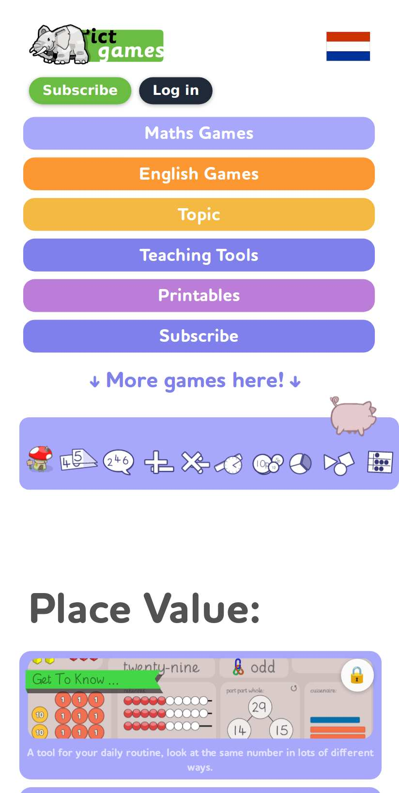 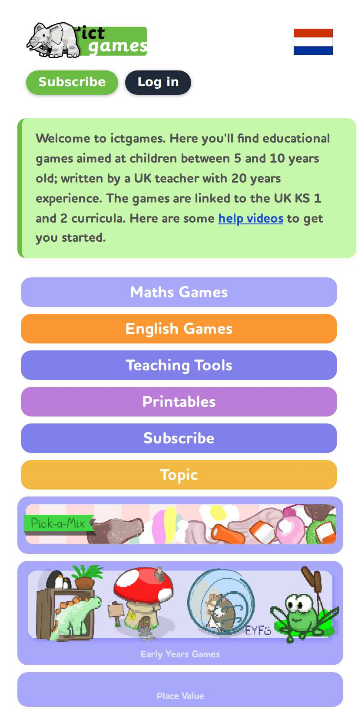

Tocáveis (amostra):

- `a.` 200×67 · "" · eventos: —
- `a.` 45×30 · "" · eventos: —
- `a.ictgames-ctl` 106×28 · "Subscribe" · eventos: —
- `a.ictgames-ctl` 76×28 · "Log in" · eventos: —
- `a.` 75×20 · "help videos" · eventos: —

Clique: 0 mutações no 1º s · som media/webaudio 0/0
Arrasto: deslocou 3 px · 0 mutações após soltar · som 0/0
Escutas no document/window: DOMContentLoaded:1 __playwright_global_listeners_check__:1 mousemove:1 pointerdown:1 pointerup:1 touchstart:1 touchend:1 touchcancel:1 mousedown:1 mouseup:1

---

### ictgames-valor-posicional-2

`https://ictgames.com/` — ictgames - Home Page

     

Tocáveis (amostra):

- `a.` 200×67 · "" · eventos: —
- `a.` 45×30 · "" · eventos: —
- `a.ictgames-ctl` 106×28 · "Subscribe" · eventos: —
- `a.ictgames-ctl` 76×28 · "Log in" · eventos: —
- `a.` 75×20 · "help videos" · eventos: —

Clique: 0 mutações no 1º s · som media/webaudio 0/0
Arrasto: deslocou 3 px · 0 mutações após soltar · som 0/0
Escutas no document/window: __playwright_global_listeners_check__:1 mousemove:1 pointerdown:1 pointerup:1 touchstart:1 touchend:1 touchcancel:1 mousedown:1 mouseup:1 click:1

---

### ictgames-shark-numbers

`https://ictgames.com/sharkNumbers/mobile/index.html` — Shark Numbers || To know what each digit in a 3-digit number represents - mobile friendly

  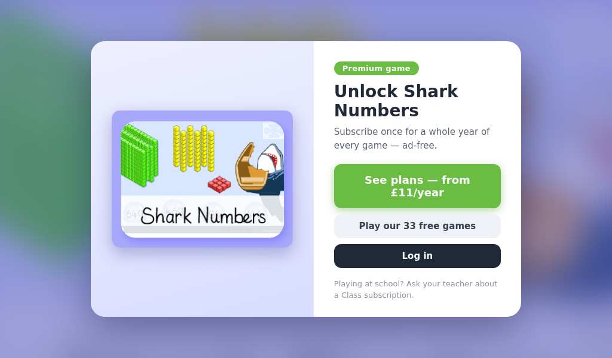   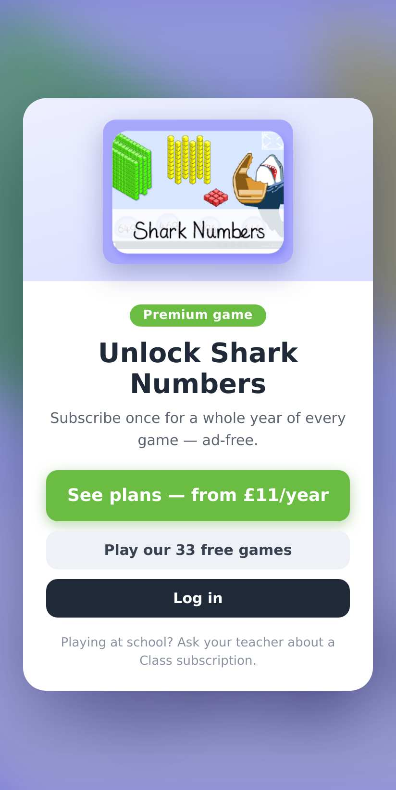

Clique: 0 mutações no 1º s · som media/webaudio 0/0
Arrasto: deslocou 362 px · 0 mutações após soltar · som 0/0
Escutas no document/window: mouseup:5 mousemove:5 keydown:4 DOMContentLoaded:3 contextmenu:3 keyup:3 wheel:3 mousedown:3 resize:2 fullscreenchange:2

---

### ictgames-shark-numbers-2

`https://ictgames.com/mobilePage/nl/sharkNumbers/index.html` — Haai Nummers - mobile friendly

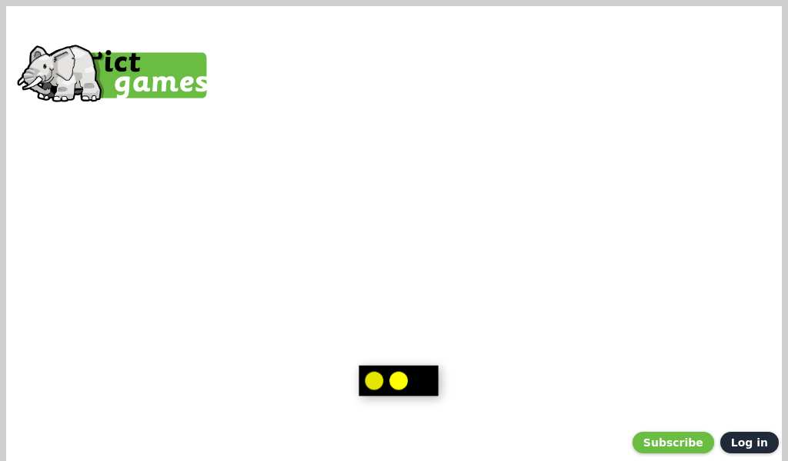 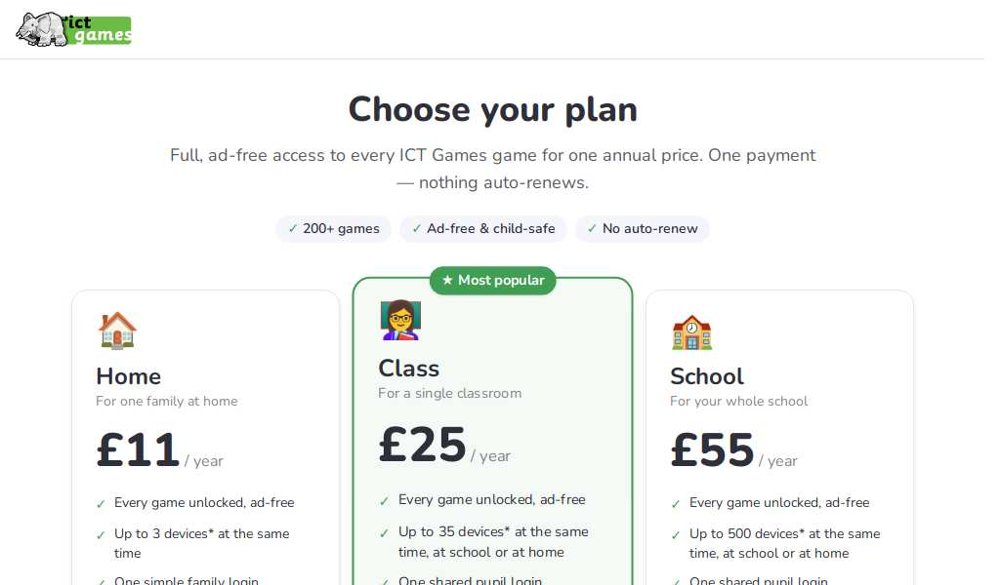 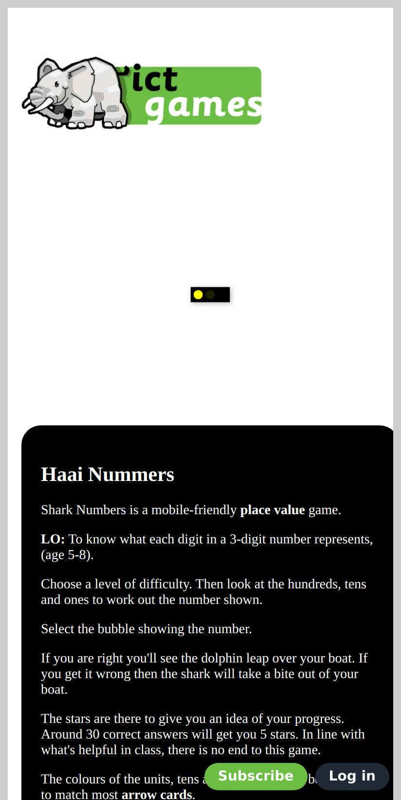 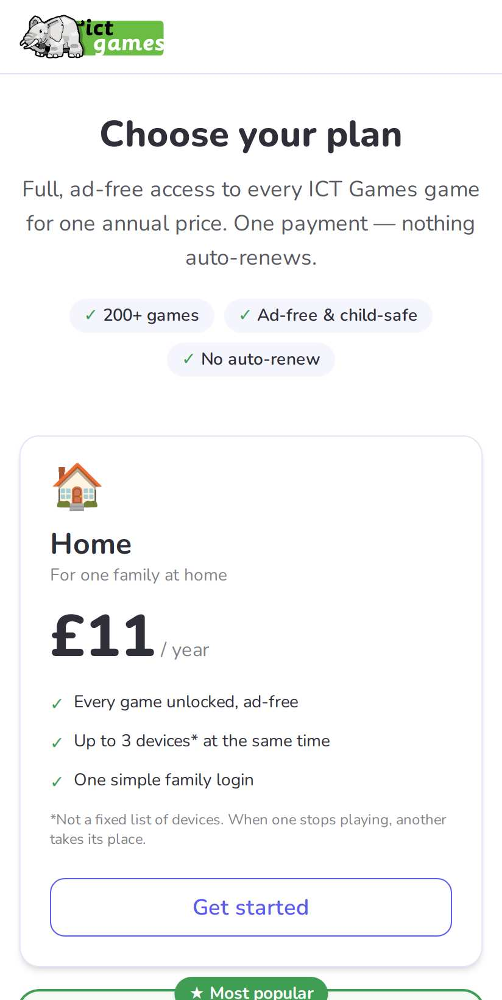

Tocáveis (amostra):

- `a.shrink-0` 119×36 · "" · eventos: —
- `a.btn.btn-lg.mt-auto` 225×48 · "Get started" · eventos: —
- `a.btn.btn-lg.mt-auto` 234×50 · "Get started" · eventos: —
- `a.btn.btn-lg.mt-auto` 225×48 · "Get started" · eventos: —
- `a.link.link-primary` 46×16 · "Email us" · eventos: —

Clique: 0 mutações no 1º s · som media/webaudio 0/-2
Escutas no document/window: submit:1 pageshow:1

---
